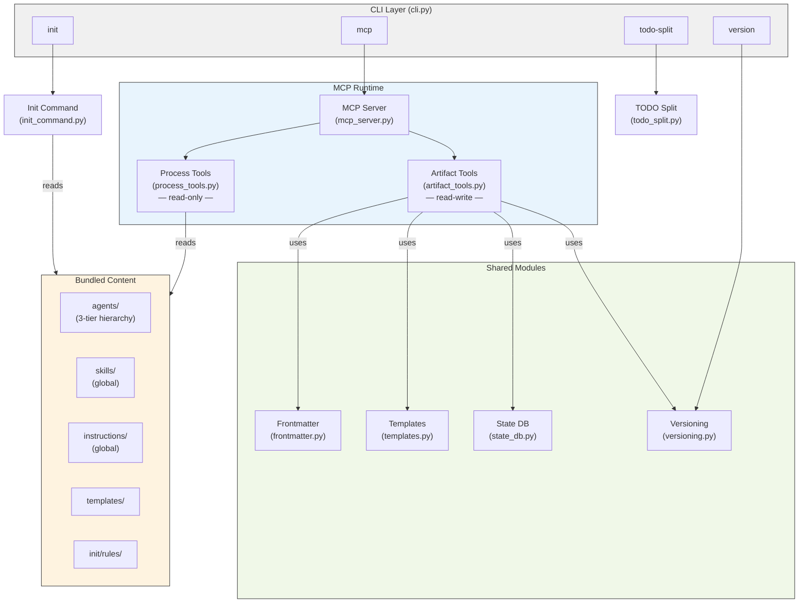
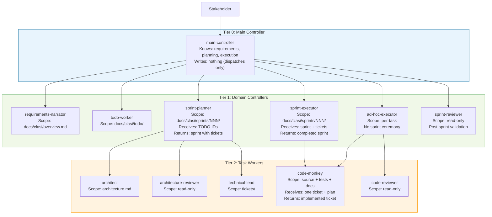
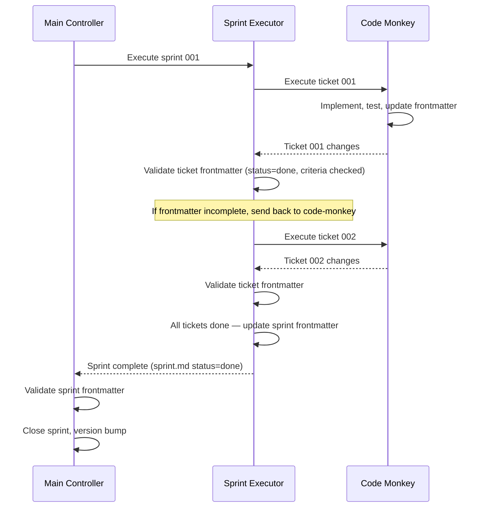
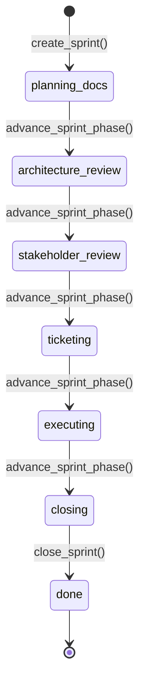

<!-- CLASI: Before changing code or making plans, review the SE process in CLAUDE.md -->

# Architecture 001: CLASI System

This document describes the CLASI system architecture as it will exist
at the end of sprint 001.

## Architecture Overview

CLASI is a pip-installable Python package that provides a structured
software engineering process for AI coding agents. The fundamental
design insight is that **LLM agents do not reliably follow behavioral
instructions alone** — 12 documented process failures confirm this.
CLASI responds with layered enforcement: a SQLite state machine for
lifecycle gates, path-scoped rules for decision-point reminders, and
a three-tier agent hierarchy with scoped dispatch.

The system has four top-level responsibilities:

1. **Process Content Delivery** — Serving SE process definitions
   (agents, skills, instructions) to AI agents at runtime via MCP tools.
2. **Project Artifact Management** — Creating and maintaining planning
   artifacts (sprints, tickets, TODOs, architecture docs) in a project's
   repository, enforced by a lifecycle state machine.
3. **Project Initialization** — Installing the CLASI SE process into a
   new repository: MCP config, skill stubs, rules, and hooks.
4. **Process Compliance Enforcement** — Layered mechanisms that prevent
   agents from bypassing the process at different points in the workflow.



## Agent Hierarchy

CLASI agents are organized in three tiers. Each tier delegates downward
and validates upward. No tier reaches past its immediate children.

For detailed design rationale, coverage analysis, and enforcement
specifics, see `pc-architecture.md`.

### Hierarchy Diagram



### Tier Descriptions

| Tier | Agent | Receives | Returns | Write Scope | Delegates to |
|------|-------|----------|---------|-------------|-------------|
| 0 | **main-controller** | Stakeholder input | Status reports | None | T1 agents. Validates sprint frontmatter on return. |
| 1 | **requirements-narrator** | Stakeholder narrative | Overview doc | `docs/clasi/overview.md` | None |
| 1 | **todo-worker** | Ideas, GitHub issues | TODO files | `docs/clasi/todo/` | None |
| 1 | **sprint-planner** | TODO IDs, goals | Sprint with tickets | `docs/clasi/sprints/NNN/` | architect, arch-reviewer, technical-lead |
| 1 | **sprint-executor** | Sprint + ticket list | Completed sprint | `docs/clasi/sprints/NNN/` | code-monkey. Validates ticket frontmatter after each return. Updates sprint frontmatter when all tickets complete. |
| 1 | **ad-hoc-executor** | Change request | Completed change | Per-task | code-monkey, code-reviewer |
| 1 | **sprint-reviewer** | Completed sprint | Review verdict | Read-only | None |
| 2 | **architect** | Sprint goals, prev arch | Updated architecture.md | `architecture.md` | None |
| 2 | **architecture-reviewer** | Architecture doc | Review verdict | Read-only | None |
| 2 | **technical-lead** | Architecture, use cases | Numbered tickets | `tickets/` | None |
| 2 | **code-monkey** | One ticket + plan | Implemented code, updated ticket frontmatter | Source + tests + docs | None. Gets language-specific instructions per project. |
| 2 | **code-reviewer** | Changed files, ticket | Pass/fail verdict | Read-only | None |

### Validation Chain

The sprint-executor validates each ticket after the code-monkey returns,
and the main controller validates the sprint after the executor returns:



### Subagent Dispatch and Scope

When dispatching a subagent, the controller:

1. **Curates context** — selects only relevant files and instructions
2. **Declares scope** — specifies the directory the subagent may write to
3. **Logs the dispatch** — writes the full prompt to the log directory

Scope enforcement is **prompt-level + rule-level**. The subagent prompt
states the directory constraint. Path-scoped rules reinforce it when
the subagent accesses files. Post-hoc validation is deferred to future
work (may use OS-level file watching).

### Agent Directory Layout

The code directory structure mirrors the hierarchy:

```
agents/
├── main-controller/
│   └── main-controller/
│       ├── agent.md
│       ├── next.md
│       └── project-status.md
├── domain-controllers/
│   ├── requirements-narrator/
│   │   ├── agent.md
│   │   ├── elicit-requirements.md
│   │   └── project-initiation.md
│   ├── todo-worker/
│   │   ├── agent.md
│   │   ├── todo.md
│   │   └── gh-import.md
│   ├── sprint-planner/
│   │   ├── agent.md
│   │   ├── plan-sprint.md
│   │   └── create-tickets.md
│   ├── sprint-executor/
│   │   ├── agent.md
│   │   ├── execute-ticket.md
│   │   └── close-sprint.md
│   ├── ad-hoc-executor/
│   │   ├── agent.md
│   │   └── oop.md
│   └── sprint-reviewer/
│       └── agent.md
└── task-workers/
    ├── architect/
    │   ├── agent.md
    │   └── architectural-quality.md
    ├── architecture-reviewer/
    │   └── agent.md
    ├── technical-lead/
    │   └── agent.md
    ├── code-monkey/
    │   ├── agent.md
    │   ├── tdd-cycle.md
    │   ├── systematic-debugging.md
    │   └── python-code-review.md
    └── code-reviewer/
        └── agent.md
```

Agent-specific skills and instructions live alongside `agent.md`.
Global content (cross-cutting skills, instructions, language standards)
remains at the top level. See `pc-architecture.md` § "Agent Directory
Structure" for the full migration table.

## Process Compliance Enforcement

Four layers of enforcement, from weakest to strongest:

### Layer 1: Instructional (session start)

CLAUDE.md, AGENTS.md, skill definitions, instruction files. Loaded at
session start. Fades from active context as the session progresses.

### Layer 2: Contextual — Path-Scoped Rules (new in sprint 001)

`.claude/rules/*.md` files with `paths` frontmatter. Claude Code loads
these **on demand** when the agent accesses files matching the path
pattern. Short, actionable, re-injected after context compaction.

| Rule file | Path pattern | Fires when |
|-----------|-------------|------------|
| `clasi-artifacts.md` | `docs/clasi/**` | Touching planning artifacts |
| `source-code.md` | `claude_agent_skills/**`, `tests/**` | Modifying source or tests |
| `todo-dir.md` | `docs/clasi/todo/**` | Working in TODO directory |
| `git-commits.md` | `**/*.py`, `**/*.md` | Touching any code or docs |

See `pc-architecture.md` § "Path-Scoped Rules" for rule content and
coverage matrix.

### Layer 3: Mechanical — State Machine (existing)

SQLite state database with phase transitions, review gates, and
execution locks. MCP tools reject invalid operations.

### Layer 4: Validation — Post-Hoc Checks (existing)

Sprint review MCP tools. Subagent scope validation deferred to future
(may use OS-level file watching).

## Dispatch Logging

Every subagent dispatch is logged with YAML frontmatter for structured
metadata and the full prompt text as the body.

```
docs/clasi/log/
├── sprints/<sprint-name>/
│   ├── sprint-planner-NNN.md
│   └── ticket-NNN-NNN.md
└── adhoc/
    └── NNN.md
```

See `pc-architecture.md` § "Context Logging" for the full log format
and routing rules.

## Technology Stack

| Attribute | Value | Justification |
|-----------|-------|---------------|
| Language | Python >=3.10 | Target users are Claude Code / AI agent environments |
| CLI framework | Click >=8.0 | Lightweight, composable subcommands |
| MCP framework | FastMCP (mcp >=1.0) | Standard protocol for AI agent tool access |
| YAML parsing | PyYAML >=6.0 | Frontmatter I/O for markdown artifacts |
| State storage | SQLite (stdlib) | Zero-dependency, file-based, embedded |
| Version format | Configurable via `settings.yaml` | Default `X+.YYYYMMDD.R+` |
| Test framework | pytest | 356 tests |

## Module Design

### CLI (`cli.py`)

**Subcommands**: `init`, `mcp`, `todo-split`, `version`, `version bump`.

### Init Command (`init_command.py`)

**Outputs** (written to target project):
- `CLAUDE.md` — CLASI process block inline
- `.claude/skills/se/SKILL.md` — `/se` dispatcher skill
- `.claude/rules/*.md` — Path-scoped compliance rules
- `.claude/settings.json` — Session-start hook
- `.claude/settings.local.json` — MCP permission allowlist
- `.mcp.json` + `.vscode/mcp.json` — MCP server configuration

### Process Tools (`process_tools.py`)

Updated to walk the three-tier agent directory tree. New
`get_agent_context(name)` tool returns agent.md plus sibling files.

### Bundled Content

Organized in the three-tier agent hierarchy (see Agent Directory Layout
above), plus:
- **Global skills**: se, dispatch-subagent, auto-approve, self-reflect,
  parallel-execution, report, ghtodo, generate-documentation
- **Global instructions**: software-engineering, coding-standards,
  git-workflow, testing, subagent-protocol, worktree-protocol,
  dotconfig, rundbat, languages/
- **Templates**: sprint, ticket, overview, architecture, review-checklist
- **Rules templates**: init/rules/ — installed by `clasi init`

## Data Model

### Sprint Lifecycle (SQLite)



### Markdown Artifacts

| Artifact | Location | Key Metadata |
|----------|----------|-------------|
| Sprint | `docs/clasi/sprints/NNN-slug/sprint.md` | id, title, status, branch, use-cases |
| Architecture | `docs/clasi/sprints/NNN-slug/architecture.md` | version, status, sprint |
| Ticket | `docs/clasi/sprints/NNN-slug/tickets/NNN-slug.md` | id, title, status, depends-on, github-issue, todo |
| TODO | `docs/clasi/todo/name.md` | status, sprint, github-issue |
| Settings | `docs/clasi/settings.yaml` | version_format, version_trigger, version_source, version_sync |
| Dispatch Log | `docs/clasi/log/sprints/...` or `log/adhoc/...` | timestamp, parent, child, scope, result |

## Security Considerations

- MCP server runs as local subprocess over stdio — no network exposure.
- State database is a local SQLite file (`.clasi.db`), gitignored.
- `init_command` preserves existing content outside CLASI sections.
- GitHub operations use `gh` CLI (user's auth), never store tokens.
- All subprocess calls use list-form arguments (no `shell=True`).

## Design Rationale

### DR-001 through DR-005

(Unchanged from architecture 021.)

### DR-006: Path-Scoped Rules over Subdirectory CLAUDE.md

Use `.claude/rules/*.md` with path frontmatter. Centralized, path-scoped,
installed by `clasi init`.

### DR-007: Directory Scope as Prompt + Rules

Directory scoping is prompt-level + rule-level enforcement. Post-hoc
validation deferred — the three-tier hierarchy with prompt constraints
and path-scoped rules provides sufficient guidance. OS-level file
watching may provide mechanical enforcement in the future.

### DR-008: Three-Tier Agent Hierarchy

**Decision**: Organize agents into main-controller, domain-controllers,
and task-workers with matching directory structure.

**Context**: The flat agent model had project-manager doing everything.
No isolation between planning and execution, no clear delegation
boundaries.

**Why three tiers**: Main controller knows the process but not
implementation. Domain controllers own lifecycles (sprint planning,
sprint execution, TODO management). Task workers do the actual work
(code, review, architecture). Each tier validates the output of its
children before passing results up.

### DR-009: Code Monkey as Language-Agnostic Implementer

**Decision**: Replace python-expert with code-monkey. Absorb
documentation-expert. Language-agnostic by default, gets per-project
language instructions.

**Context**: python-expert had no Python-specific behavior.
Documentation is part of ticket implementation, not a separate step.

## Open Questions

None.

## Sprint Changes

Changes planned for sprint 001:

### New Components

**Agent directory hierarchy** — Three-tier structure under `agents/`
with per-agent directories containing agent.md + agent-specific content.

**New agent definitions** — sprint-planner, sprint-executor,
ad-hoc-executor, todo-worker, sprint-reviewer (5 new).

**Refactored agents** — main-controller (pure dispatcher), code-monkey
(language-agnostic, absorbs python-expert + documentation-expert).

**Path-scoped rules** (`.claude/rules/`) — Four rule files.

**Log directory** (`docs/clasi/log/`) — Dispatch logging with full
prompt text.

### Changed Components

**Init Command** — New `_create_rules()` function.

**Process Tools** — Walk nested agent directories. New
`get_agent_context()` tool.

**Skill: `dispatch-subagent`** — scope_directory + logging.

**Instruction: `subagent-protocol`** — Directory Scope section.

### Migration Concerns

Non-breaking for external projects (rules are additive, init is
idempotent). Internal migration requires moving 34 files per the
migration table in `pc-architecture.md`.
