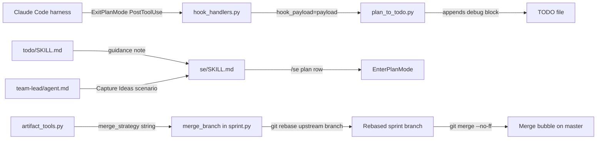

<!-- CLASI: Before changing code or making plans, review the SE process in CLAUDE.md -->

# Architecture Update -- Sprint 005: Process Improvements and Debug Tooling

## What Changed

### 1. `plan_to_todo()` Gains an Optional `hook_payload` Parameter (`plan_to_todo.py`)

The `plan_to_todo(plans_dir, todo_dir)` function gains a third optional parameter:

```
hook_payload: Optional[dict] = None
```

When `hook_payload` is provided (non-None), the function appends a `## Hook Debug Info`
section to the TODO file content before writing. The section contains a fenced JSON block
with:

- `hook_payload` — the raw dict received from Claude Code's PostToolUse event
- `env` — a snapshot of relevant environment variables (`TOOL_INPUT`, `TOOL_NAME`,
  `SESSION_ID`, `CLASI_AGENT_TIER`, `CLASI_AGENT_NAME`, `CLAUDE_PROJECT_DIR`, `PWD`, `CWD`)
- `plans_dir` — the resolved path that was searched
- `plan_file` — the specific file that was converted
- `cwd` — `os.getcwd()` at invocation time

When `hook_payload` is `None` (the default), behavior is identical to Sprint 004.
Existing callers require no changes.

### 2. `handle_plan_to_todo()` Passes Payload Through (`hook_handlers.py`)

`handle_plan_to_todo(payload: dict)` already receives the full PostToolUse payload from
`handle_hook()`. This sprint adds the `hook_payload=payload` keyword argument to its
`plan_to_todo()` call. No other changes to this handler.

### 3. `/se plan` Command and Guidance Added (Skill and Agent Markdown)

Three markdown files gain new content. No Python changes.

**`clasi/plugin/skills/se/SKILL.md`**: A new `/se plan` row is added to the command
table. A "When to use /se todo vs /se plan" section is added explaining the two
idea-capture paths.

**`clasi/plugin/skills/todo/SKILL.md`**: A "When to use this skill vs plan mode" note
is appended, directing users to plan mode when discussion is needed before capture.

**`clasi/plugin/agents/team-lead/agent.md`**: A "Capture Ideas and Plans" scenario is
added to the Process section. It describes both paths (quick capture and discussed
planning) and provides heuristics for choosing between them.

All three source files are mirrored to their `.claude/` counterparts so the live session
picks up the changes immediately without requiring a `clasi init` run by the developer.
(Running `clasi init` also installs the updated files, as before.)

### 4. `merge_branch()` Adds Rebase Step Before `--no-ff` Merge (`sprint.py`)

The `merge_branch(main_branch)` method in `clasi/sprint.py` gains a rebase step
inserted before the existing checkout-and-merge sequence:

```
[existing] check branch_exists
[existing] check is_ancestor (idempotency guard)
[NEW]      git rebase main_branch branch_name
[NEW]      on failure: git rebase --abort; raise RuntimeError
[existing] git checkout main_branch
[existing] git merge --no-ff branch_name
```

The rebase runs while on whatever branch is currently checked out. Git's rebase command
accepts the branch to rebase as an argument; it does not require being on that branch
first. After rebase, the sprint commits sit linearly on top of `main_branch`, and the
subsequent `--no-ff` merge creates a clean merge bubble.

### 5. `merge_strategy` String Updated (`artifact_tools.py`)

`clasi/tools/artifact_tools.py` reports the merge strategy in the sprint close artifact.
The string changes from `"--no-ff"` to `"rebase + --no-ff"` to accurately reflect the
new two-step process.

### 6. New Unit Test for Rebase Behavior (`tests/unit/test_sprint.py`)

A new test is added that:
1. Creates a git repository with an initial commit on master
2. Creates the sprint branch from that commit
3. Adds a new commit on master after branching (simulating divergence during planning)
4. Calls `merge_branch()` on the Sprint object
5. Asserts that `git log --oneline` on master shows linear history: the sprint commit
   sits between the initial commit and the merge commit (no "criss-cross" layout)

## Why

- **SUC-001 (Hook payload debug)**: `handle_plan_to_todo` currently ignores the payload.
  The PostToolUse payload from Claude Code may contain session ID, project directory, or
  other context that would allow the hook to target the correct plan file — but we don't
  know what fields are present until we observe them. Appending the payload to the TODO
  is the lowest-friction way to collect this data without adding external logging infrastructure.

- **SUC-002 (/se plan and guidance)**: There are two idea-capture paths and neither is
  documented relative to the other. The model must guess when to use `/se todo` vs. plan
  mode. Making the choice explicit reduces incorrect captures (creating TODOs from
  discussion that needed exploration, or entering plan mode for a one-liner).

- **SUC-003 (Rebase before merge)**: Sprint branches are short-lived and single-user.
  The execution lock prevents concurrent sprints, but master can advance during planning
  via OOP fixes and version bumps. Without a rebase, the sprint commits appear as a
  "side branch" inside the merge bubble rather than sitting cleanly on top of master.
  Rebase-then-no-ff is the correct pattern for this workflow.

## Impact on Existing Components



| Component | Change |
|---|---|
| `clasi/plan_to_todo.py` | Add `hook_payload: Optional[dict] = None` parameter; append debug block when provided |
| `clasi/hook_handlers.py` | Pass `hook_payload=payload` in `handle_plan_to_todo()` call |
| `clasi/plugin/skills/se/SKILL.md` | Add `/se plan` row and "When to use" section |
| `clasi/plugin/skills/todo/SKILL.md` | Add "When to use this skill vs plan mode" note |
| `clasi/plugin/agents/team-lead/agent.md` | Add "Capture Ideas and Plans" scenario |
| `.claude/skills/se/SKILL.md` | Mirror of plugin source |
| `.claude/skills/todo/SKILL.md` | Mirror of plugin source |
| `.claude/agents/team-lead/agent.md` | Mirror of plugin source |
| `clasi/sprint.py` | `merge_branch()`: insert rebase step before checkout+merge |
| `clasi/tools/artifact_tools.py` | Update `merge_strategy` to `"rebase + --no-ff"` |
| `tests/unit/test_sprint.py` | Add rebase behavior test |

## Migration Concerns

- **No breaking changes**: `plan_to_todo()` signature change is backward-compatible
  (optional parameter with `None` default). No existing tests require modification for
  TODOs 1 and 2.
- **`merge_branch()` behavior change**: Existing tests for `merge_branch()` may need
  updates if they mock subprocess calls — the new rebase call is an additional
  `subprocess.run` invocation before the existing ones. The ticket notes this explicitly.
- **No data migration**: No DB schemas, MCP state, or artifact formats change.
- **Live session pickup**: The `.claude/` file copies ensure the model running in the
  current session sees the new skill/agent definitions immediately after the ticket is
  executed, without a session restart.

## Design Rationale

### Decision: Append debug info to the TODO file vs. write a separate log file

**Context**: We need to capture hook payload data. We could write a separate debug log
file, send to stdout, or embed in the TODO itself.

**Alternatives considered**:
1. Write a separate `docs/clasi/log/hook-debug.json` file.
2. Print to stdout (visible in terminal but not persisted).
3. Embed in the TODO file as a section after the plan content.

**Why this choice**: The TODO file is exactly where the developer will look after
exiting plan mode. There is no extra step to find the data. The debug block is visually
distinct (horizontal rule + heading) and comes after the plan content, so it doesn't
interfere with the TODO body. The optional parameter means this is trivially removable
once the real fix is in place.

**Consequences**: TODO files created in this period will have a debug section at the
bottom. It can be stripped when the fix is implemented and the parameter removed.

### Decision: Mirror plugin files to `.claude/` in the same ticket vs. running `clasi init`

**Context**: The plugin source files (`clasi/plugin/`) are the source of truth. The
`.claude/` copies are installed by `clasi init`. Changes to plugin files only take effect
in the live session after `clasi init` is run again.

**Why this choice**: Mirroring is done in the same ticket because the guidance is useless
if the live session doesn't pick it up immediately. Adding a "run clasi init" step
would add ceremony and a potential failure point. Six files is a contained, explicit change.

**Consequences**: The programmer must update both locations. This is called out in the
ticket's implementation plan.

### Decision: `git rebase main_branch branch_name` vs. checking out branch first

**Context**: We could either check out the sprint branch and run `git rebase main_branch`,
or pass both arguments to `git rebase` without a checkout.

**Why this choice**: `git rebase <upstream> <branch>` is a documented form that avoids
an extra checkout step. It keeps `HEAD` on whatever branch `merge_branch()` was called
from, simplifying the overall sequence. If the rebase fails and we abort, there is no
extra checkout to undo.

**Consequences**: The two-argument rebase form is less commonly seen. The implementation
should include a comment explaining the idiom.

## Open Questions

None — all design decisions are resolvable from the existing codebase and TODOs.
