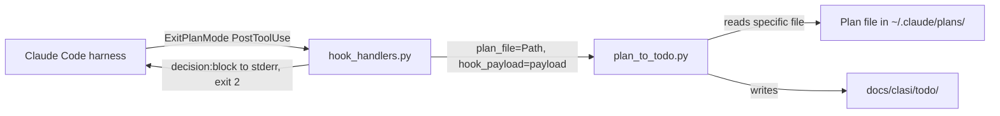

<!-- CLASI: Before changing code or making plans, review the SE process in CLAUDE.md -->

# Architecture Update -- Sprint 006: Hook Fix and Cleanup

## What Changed

### 1. `plan_to_todo()` Gains an Optional `plan_file` Parameter (`plan_to_todo.py`)

The `plan_to_todo(plans_dir, todo_dir, hook_payload)` function gains a fourth optional parameter:

```
plan_file: Optional[Path] = None
```

When `plan_file` is provided and points to an existing file, the function uses it directly instead of scanning `plans_dir` for the newest `.md` file. The mtime heuristic remains as the fallback when `plan_file` is `None` (backward compatibility).

All other behavior -- frontmatter stripping, title extraction, slug generation, debug block appending, file deletion -- is unchanged.

### 2. `handle_plan_to_todo()` Extracts `planFilePath` and Uses Exit 2 (`hook_handlers.py`)

`handle_plan_to_todo(payload: dict)` gains two changes:

**Payload path extraction**: Before calling `plan_to_todo()`, the handler extracts:
```
plan_file_str = payload.get("tool_input", {}).get("planFilePath")
plan_file = Path(plan_file_str) if plan_file_str else None
```
This path is passed as the `plan_file` keyword argument.

**Stop message via stderr + exit 2**: When `plan_to_todo()` returns a path (TODO created), the handler writes a JSON block to stderr and exits with code 2:
```
{"decision": "block", "reason": "CLASI: Plan saved as TODO: <path>. Do NOT implement..."}
```
When `plan_to_todo()` returns None (no plan file), the handler exits with code 0 and no output (unchanged).

## Why

- **SUC-001 (Block model after plan capture)**: The previous implementation used `print()` to stdout and `sys.exit(0)`. Claude Code only shows PostToolUse hook output to the model when the hook writes to stderr with exit code 2. With stdout + exit 0, the stop message was silently discarded and the model proceeded to implement the plan.

- **SUC-002 (Use payload path)**: The hook payload from Sprint 005 debug data shows that `tool_input.planFilePath` contains the exact path of the plan file just saved. Using this path is more reliable than scanning by mtime: it is immune to race conditions with plan files from other projects or other sessions, and it matches the exact file the user just approved.

## Impact on Existing Components



| Component | Change |
|---|---|
| `clasi/plan_to_todo.py` | Add `plan_file: Optional[Path] = None` parameter; use it directly when provided |
| `clasi/hook_handlers.py` | Extract `planFilePath` from payload; pass as `plan_file`; stderr JSON + exit 2 on success |
| `tests/unit/test_hook_handlers.py` | Update exit-code assertions (2 on success, 0 on no-file); check stderr not stdout |
| `tests/unit/test_plan_to_todo.py` | Add tests for `plan_file` parameter: direct use, fallback, deletion |

No other components change. `sprint.py`, `artifact_tools.py`, and all MCP tools are unaffected.

## Migration Concerns

- **Backward compatibility**: The `plan_file` parameter defaults to `None`, preserving the mtime-heuristic behavior for any caller that does not pass it. No existing call sites (other than `handle_plan_to_todo`) need updating.
- **Exit code change**: `handle_plan_to_todo` now exits 2 (not 0) when a TODO is created. This is an intentional behavior change, not a compatibility concern -- the previous exit-0 behavior was the bug. Tests must be updated to assert the new codes.
- **No data migration**: No DB schemas, MCP state, or artifact formats change.

## Design Rationale

### Decision: JSON block to stderr vs. plain text

**Context**: Claude Code's hook protocol recognizes two formats for exit-2 responses: plain text (treated as an error message) and a JSON object with `decision` and `reason` fields. The JSON format allows the harness to distinguish "block with explanation" from "error", and the `reason` text is what gets shown to the model.

**Alternatives considered**:
1. Plain text to stderr, exit 2.
2. JSON `{"decision": "block", "reason": "..."}` to stderr, exit 2.

**Why this choice**: The JSON format is the documented PostToolUse block protocol. Using `decision: block` signals intentional blocking rather than an error condition, making the model's response more predictable.

**Consequences**: The output is slightly more verbose but machine-readable. Tests must deserialize or substring-match the stderr JSON.

### Decision: Pass `plan_file` as explicit argument vs. always scan by mtime

**Context**: Two options for `plan_to_todo()` to know which file to use: (a) always scan by mtime, (b) accept an explicit path and fall back to scan.

**Why this choice**: The explicit path option is strictly better when the path is available: it eliminates ambiguity and is O(1) rather than O(n). The fallback preserves backward compatibility for callers without a payload path.

**Consequences**: The `plan_to_todo()` function signature grows by one optional parameter. Callers that pass `plan_file` must ensure the file exists -- the function returns None if the path does not exist (same as no-plans-dir behavior).

## Open Questions

None -- all decisions are informed by the existing codebase and the Sprint 005 debug payload data.
