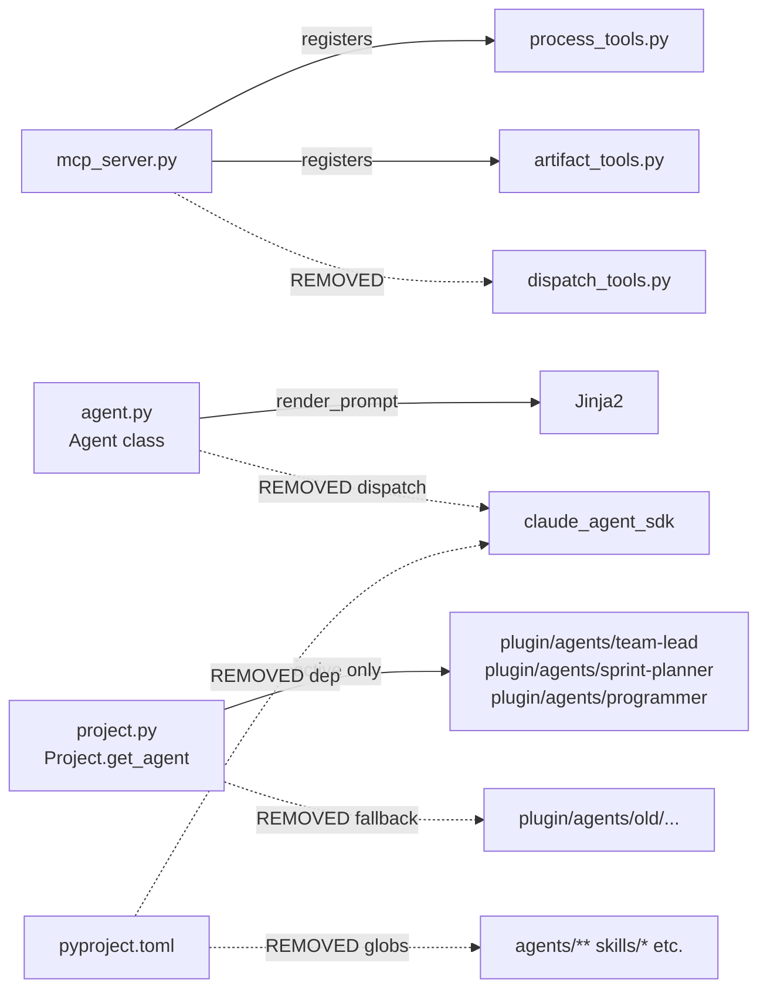

<!-- CLASI: Before changing code or making plans, review the SE process in CLAUDE.md -->

# Architecture Update -- Sprint 008: Remove Dormant Claude SDK and Align Active Agent Model

## What Changed

### 1. `dispatch_tools.py` deleted

`clasi/tools/dispatch_tools.py` is removed entirely. The twelve `dispatch_to_X` functions
it contained are no longer part of the MCP server's tool surface. The import in
`mcp_server.py` (`import clasi.tools.dispatch_tools`) is also removed.

### 2. `Agent.dispatch()` and SDK behavior removed from `agent.py`

`clasi/agent.py` retains only the read-only content layer:

- **Removed**: `dispatch()`, `_build_role_guard_hooks()`, `_build_retry_prompt()`
- **Retained**: `name`, `tier`, `model`, `definition`, `contract`, `allowed_tools`,
  `delegates_to`, `has_dispatch_template`, `render_prompt()`
- **Retained**: `MainController`, `DomainController`, `TaskWorker` subclasses (tier
  constants still useful for contract introspection)

No other `agent.py` behavior changes. The class hierarchy stands; it is now a pure
content-loading and template-rendering module with no SDK dependency.

### 3. `claude-agent-sdk` dependency removed from `pyproject.toml`

`claude-agent-sdk>=0.1` is removed from `[project.dependencies]`. No runtime module
in the package imports `claude_agent_sdk` after this sprint.

### 4. `Project.get_agent()` old fallback removed

`clasi/project.py` `get_agent()` no longer searches `clasi/plugin/agents/old/`. The
fallback block (lines 193-195) is deleted. `list_agents()` already excluded `old/`; no
change needed there.

The `old/` directory itself is left on disk as an archive. Nothing loads from it.

### 5. Stale `pyproject.toml` package-data globs removed

The following globs are removed because the corresponding top-level directories
(`clasi/agents/`, `clasi/skills/`, `clasi/instructions/`, `clasi/rules/`) do not exist:

```
"agents/**/*.md"
"agents/**/*.md.j2"
"agents/**/*.yaml"
"skills/*.md"
"instructions/*.md"
"instructions/languages/*.md"
"rules/*.md"
```

The `"plugin/**/*"` glob (which covers all active plugin content) is retained.

### 6. Active agent contracts and instructions refreshed

References to the old agent roster in active plugin files are replaced with the
current 3-agent model. Specifically:

- `team-lead/contract.yaml`: `delegates_to` lists updated to reference only
  `sprint-planner` and `programmer`; any entry for `project-manager`, `sprint-executor`,
  `ad-hoc-executor`, `todo-worker`, `project-architect` that is not backed by an active
  agent directory is removed or corrected.
- `team-lead/agent.md`: Dispatch instructions that name old agent targets updated.
- `sprint-planner/contract.yaml` and `sprint-planner/agent.md`: References to
  `architect`, `architecture-reviewer`, `technical-lead` as dispatch targets removed
  (the sprint-planner now handles those roles inline).

### 7. `test_dispatch_tools.py` removed; `test_agent.py` slimmed; guard test added

- `tests/unit/test_dispatch_tools.py` is deleted (the module it tests is gone).
- `tests/unit/test_agent.py` tests that mock `claude_agent_sdk` (approximately 15
  `patch.dict(sys.modules, {"claude_agent_sdk": ...})` call sites) are removed.
  Tests of read-only `Agent` properties are retained.
- A new `tests/unit/test_no_sdk_import.py` asserts that importing `clasi.mcp_server`,
  `clasi.agent`, `clasi.project`, and `clasi.tools.artifact_tools` does not transitively
  import `claude_agent_sdk`.

### 8. README updated

References to GitHub Copilot mirroring and the old agent architecture diagram are
removed or updated to describe the current 3-agent model.

---

## Why

- **SUC-001**: The `dispatch_tools` import pulled `claude_agent_sdk` into the server's
  import graph even when no dispatch was ever called. Removing it makes the server
  installable without the SDK, reduces the startup surface, and eliminates a dependency
  that the current skill-based execution model does not use.

- **SUC-002**: `Agent.dispatch()` was the bridge to the SDK. With dispatch removed, the
  `Agent` class reverts to a clean content-loader role (definition text, contract YAML,
  template rendering). Removing the dead methods reduces class complexity and eliminates
  all SDK imports from `agent.py`.

- **SUC-003**: The `old/` fallback in `Project.get_agent()` was a transitional shim
  that allowed old agent names to resolve while new agents were being written. That
  transition is complete; the fallback is now a hazard that can silently serve stale
  agent definitions.

- **SUC-004**: Active plugin instructions that still name `code-monkey`, `sprint-executor`,
  etc. mislead the team-lead and sprint-planner at runtime. Correcting them ensures
  agents route to real, active counterparts.

- **SUC-005**: Stale `package-data` globs cause `setuptools` to issue warnings and
  package builds are not reproducible if paths appear and disappear. Removing them
  is hygiene.

---

## Impact on Existing Components



| Component | Change |
|---|---|
| `clasi/tools/dispatch_tools.py` | **Deleted** |
| `clasi/mcp_server.py` | Remove `import clasi.tools.dispatch_tools` line |
| `clasi/agent.py` | Remove `dispatch()`, `_build_role_guard_hooks()`, `_build_retry_prompt()`; retain all read-only properties |
| `clasi/project.py` | Remove `old/` fallback in `get_agent()` |
| `pyproject.toml` | Remove `claude-agent-sdk` dep; remove 7 stale package-data globs |
| `clasi/plugin/agents/team-lead/contract.yaml` | Update `delegates_to` to active agents only |
| `clasi/plugin/agents/team-lead/agent.md` | Remove old agent dispatch references |
| `clasi/plugin/agents/sprint-planner/contract.yaml` | Remove old delegation entries |
| `clasi/plugin/agents/sprint-planner/agent.md` | Remove old agent references |
| `tests/unit/test_dispatch_tools.py` | **Deleted** |
| `tests/unit/test_agent.py` | Remove SDK mock tests; retain property tests |
| `tests/unit/test_no_sdk_import.py` | **New**: import guard test |
| `README.md` | Remove Copilot mirror section; update agent architecture description |

Components unaffected: `artifact_tools.py`, `process_tools.py`, `sprint.py`, `ticket.py`,
`todo.py`, `state_db.py`, `dispatch_log.py`, `hook_handlers.py`, `plan_to_todo.py`,
`init_command.py`, all active agent `agent.md` / `contract.yaml` files except those
listed above.

---

## Migration Concerns

- **No data migration**: No DB schema, MCP state, or artifact format changes.
- **No API breakage**: The MCP tool surface (process_tools, artifact_tools) is unchanged.
  Dispatch tools were never part of the documented public MCP API.
- **`claude-agent-sdk` removal**: Any environment that currently calls `Agent.dispatch()`
  directly (outside MCP tools) will break. No known callers exist in this codebase; the
  dispatch path was only wired through `dispatch_tools.py`. After this sprint it is gone.
- **`old/` agents**: Files in `clasi/plugin/agents/old/` remain on disk. Any external
  script that calls `project.get_agent("architect")` expecting the `old/architect`
  fallback will receive a `ValueError`. No known callers.
- **Backward compatibility for tests**: `test_dispatch_tools.py` and the SDK mock tests
  in `test_agent.py` are deleted, not migrated. This is safe because the behavior they
  tested is being removed.

---

## Design Rationale

### Decision: Remove `Agent.dispatch()` rather than stub it

**Context**: The dispatch method was the bridge to `claude_agent_sdk.query()`. Without
the SDK, it returned an error dict. We could leave the method as a no-op stub.

**Alternatives considered**:
1. Leave `dispatch()` as a stub that raises `NotImplementedError`.
2. Remove `dispatch()` entirely.

**Why this choice**: A stub invites future callers to add the SDK back by implementing
around it. Removing the method makes the boundary explicit — the `Agent` class is a
content loader, not an executor. Any future dispatch mechanism should be a separate
module, not a method on `Agent`.

**Consequences**: Any caller of `Agent.dispatch()` gets an `AttributeError` rather than
a graceful error message. This is acceptable because no callers remain in the codebase.

### Decision: Leave `old/` directory on disk

**Context**: The `old/` agents are historical artifacts. We could delete them.

**Alternatives considered**:
1. Delete `clasi/plugin/agents/old/` entirely.
2. Leave in place but stop loading from it.

**Why this choice**: The files represent design history and may be reference material
for future agents. Stopping the fallback in `get_agent()` achieves the goal (no stale
agents loaded at runtime) without destroying the record. A future sprint can decide to
delete them explicitly if desired.

**Consequences**: Disk contains unreferenced files. This is acceptable; they are small.

### Decision: Remove stale package-data globs rather than create stub directories

**Context**: The globs `agents/**/*.md`, `skills/*.md`, etc. point to paths that don't
exist under `clasi/`. We could create empty directories to satisfy them.

**Why this choice**: Empty directories serve no purpose and would bloat the package. The
`plugin/**/*` glob already covers all active content. Removing the stale globs is
correct.

**Consequences**: `setuptools` no longer warns about missing source paths.

---

## Open Questions

None. All removal decisions are informed by the current codebase state. The `old/`
directory should be revisited if a future sprint needs to officially retire or archive
those files formally.
