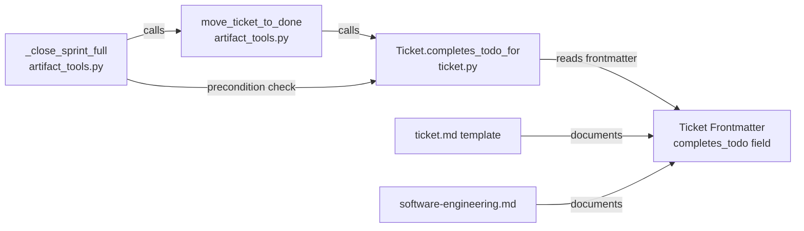

<!-- CLASI: Before changing code or making plans, review the SE process in CLAUDE.md -->

# Architecture Update -- Sprint 009: Multi-Sprint TODO Bug Fix in close_sprint

## What Changed

### 1. `completes_todo` field added to ticket frontmatter schema

A new optional frontmatter field is introduced on ticket files:

```
completes_todo: true | false | {filename: bool, ...}
```

**Semantics**:
- Absent or `true` (scalar): all linked TODOs are archived when all referencing tickets are done. This is the current default behavior.
- `false` (scalar): archival is suppressed for all linked TODOs on this ticket.
- Map form `{filename.md: false, other.md: true}`: per-filename control. Only the filenames explicitly set to `false` are suppressed; all others default to `true`.

The map form is the recommended representation for tickets that link to both single-sprint and multi-sprint TODOs simultaneously.

### 2. `move_ticket_to_done` updated to respect the flag

`move_ticket_to_done` in `clasi/tools/artifact_tools.py` gains a per-filename archival guard. After confirming all referencing tickets are done for a given TODO, it now additionally checks whether any of those tickets carries `completes_todo: false` for that filename. If any do, archival is skipped for that TODO.

The check is localized to the existing TODO-completion block; no other code in the function changes.

### 3. `close_sprint` precondition check updated

`_close_sprint_full` in `clasi/tools/artifact_tools.py` has a precondition check (step 1b) that blocks the sprint if any in-progress TODO is still associated with it. This check is updated to recognize the deferred-archival pattern: if a TODO is still in-progress because at least one linked ticket on the sprint has `completes_todo: false`, the check does not raise an error — it treats the TODO as intentionally deferred and skips it.

`_close_sprint_legacy` has an analogous TODO block that receives the same guard.

### 4. `Ticket` class gains `completes_todo_for` helper

`clasi/ticket.py` gains a method:

```python
def completes_todo_for(self, filename: str) -> bool
```

This method encapsulates the resolution logic: absent → `True`, scalar `True` → `True`, scalar `False` → `False`, map → look up filename, default `True` if key absent. Both `artifact_tools.py` call sites use this method rather than inline frontmatter reads.

### 5. Ticket template updated

`clasi/templates/ticket.md` gains a commented `completes_todo` entry in its YAML frontmatter block, documenting the field and its default.

### 6. SE instruction updated

`clasi/plugin/instructions/software-engineering.md` documents the `completes_todo` field in the ticket-frontmatter reference section.

---

## Why

**SUC-002 / Bug**: `close_sprint` and `move_ticket_to_done` archived umbrella TODO files that span multiple sprints, forcing stakeholders to manually restore them from `done/` after every sprint close. This broke TODO-to-ticket traceability and produced noise commits.

**SUC-001 / Backward compat**: The fix must not change behavior for the common single-sprint case. The default (`true`) preserves the existing code path exactly.

**Option #1 from the TODO** was chosen: a per-ticket frontmatter flag. The decision lives with the ticket author, who already knows at planning time whether a TODO spans multiple sprints. This avoids cross-sprint heuristics and requires no changes to TODO file format.

---

## Subsystem and Module Responsibilities

### `Ticket.completes_todo_for(filename)` (new method, `clasi/ticket.py`)

**Purpose**: Resolve whether a specific linked TODO filename should be archived when this ticket is moved to done.  
**Boundary**: Reads only the `completes_todo` frontmatter field of this ticket; no file I/O, no cross-ticket awareness.  
**Use cases served**: SUC-002, SUC-003, SUC-004.

### `move_ticket_to_done` (modified, `clasi/tools/artifact_tools.py`)

**Purpose**: Move a ticket to `tickets/done/` and conditionally archive its linked TODOs.  
**Boundary**: Delegates archival decision for each TODO to `Ticket.completes_todo_for`; does not read other tickets' frontmatter directly.  
**Use cases served**: SUC-001, SUC-002, SUC-003, SUC-004.

### `_close_sprint_full` / `_close_sprint_legacy` (modified, `clasi/tools/artifact_tools.py`)

**Purpose**: Close a sprint after verifying preconditions; the precondition check must allow intentionally deferred TODOs.  
**Boundary**: Checks whether an in-progress TODO is deferred by inspecting tickets in the sprint; delegates to `Ticket.completes_todo_for`.  
**Use cases served**: SUC-002.

---

## Component Diagram



---

## `completes_todo` Field Design Rationale

### Decision: Per-ticket-per-filename map, not a per-ticket scalar only

**Context**: The bug surfaces when a single ticket links to both a single-sprint TODO and a multi-sprint umbrella TODO. A scalar `completes_todo: false` on the ticket would suppress archival of all linked TODOs — including the single-sprint one that should be archived.

**Alternatives considered**:
1. Scalar only: `completes_todo: true | false` applies uniformly to all linked TODOs. Simple, but causes SUC-003 to fail — a ticket cannot archive one linked TODO while deferring another.
2. Per-TODO frontmatter flag (`multi_sprint: true` on the TODO file): puts the decision with the TODO author. But the TODO author may not know at TODO creation time which sprints will partially consume it. The ticket author always knows at ticket creation time.
3. Explicit TODO-close step (option #3 from the bug report): largest behavior change, requires stakeholder workflow changes.

**Why the map form with scalar fallback**: The map form handles SUC-003 exactly. The scalar fallback (`true`/`false` for all linked filenames) handles the common cases without verbosity. The absent-field default (`true`) ensures backward compatibility with zero migration (SUC-004).

**Consequences**: The resolution logic has one more layer (check scalar vs map vs absent). Encapsulated in `Ticket.completes_todo_for`, so neither call site is burdened with it. Ticket authors writing a map must know the exact TODO filename — the same filename already appears in the `todo` frontmatter field, so this is not new information.

---

## Impact on Existing Components

| Component | Change |
|---|---|
| `clasi/ticket.py` | Add `completes_todo_for(filename: str) -> bool` method |
| `clasi/tools/artifact_tools.py` | Update `move_ticket_to_done` TODO-archival guard; update `_close_sprint_full` and `_close_sprint_legacy` precondition check |
| `clasi/templates/ticket.md` | Add `completes_todo` field (commented, default `true`) |
| `clasi/plugin/instructions/software-engineering.md` | Document `completes_todo` field in ticket frontmatter reference |
| Tests | New tests covering SUC-001 regression, SUC-002 new behavior, SUC-003 per-filename behavior, SUC-004 default behavior |

No other components change. The MCP tool signatures are unchanged. The state DB schema is unchanged. No TODO file format changes.

---

## Migration Concerns

None. The `completes_todo` field defaults to `true` when absent, preserving current behavior for all existing ticket files. No file updates, no data migration, no deployment sequencing required.

---

## Open Questions

None. The stakeholder's preferred option (#1) is clear and the field semantics are unambiguous given the existing `todo` frontmatter pattern.
