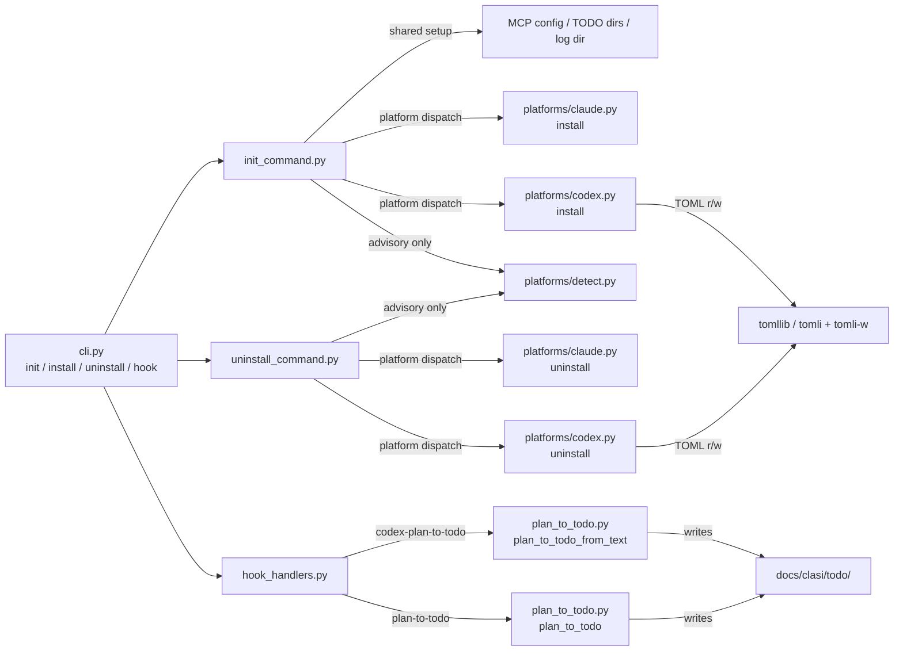

<!-- CLASI: Before changing code or making plans, review the SE process in CLAUDE.md -->

# Architecture Update -- Sprint 010: Add Codex Support to CLASI Init and Plan Capture

## What Changed

### 1. `clasi/platforms/` package introduced

A new `clasi/platforms/` package abstracts platform-specific install and uninstall
operations. It contains three modules:

- **`clasi/platforms/__init__.py`**: Re-exports the public installer/uninstaller interfaces.
- **`clasi/platforms/claude.py`**: Claude platform installer and uninstaller. Contains all
  logic extracted from the current `init_command.py` that is Claude-specific: writing
  `CLAUDE.md`, installing `.claude/rules/`, `.claude/skills/`, `.claude/agents/`,
  updating `.claude/settings.json` hooks, and updating `.claude/settings.local.json`
  MCP permissions.
- **`clasi/platforms/codex.py`**: Codex platform installer and uninstaller. New module.
  Writes `AGENTS.md` (marker-managed CLASI section), `.codex/config.toml` (TOML),
  `.codex/hooks.json`, and `.agents/skills/se/SKILL.md`.

Both `claude.py` and `codex.py` expose a uniform interface:

```
install(target: Path) -> None
uninstall(target: Path) -> None
```

Neither module imports the other. Dependencies flow only from `init_command.py` and
`uninstall_command.py` inward to the platform modules.

### 2. `clasi/platforms/detect.py` introduced

A new module that inspects advisory platform signals and returns a recommendation.
Never makes irreversible decisions and never reads environment variable values. Signals:

- Project files: `.claude/`, `CLAUDE.md`, `.codex/`, `.agents/skills/`, `AGENTS.md`.
- Installed commands: `claude`, `codex` (via `shutil.which`).
- User config directories: `~/.claude`, `~/.codex`.
- Environment variable names only: `ANTHROPIC_API_KEY`, `CLAUDE_*`, `OPENAI_API_KEY`,
  `CODEX_*`.

Returns a `PlatformSignals` dataclass with `claude_score` and `codex_score` integers and
a `recommendation` field (`"claude"`, `"codex"`, or `"both"`).

### 3. `init_command.py` refactored

`run_init` is refactored to act as a thin dispatcher:

- Shared setup (MCP server detection, TODO directories, log `.gitignore`) stays in
  `init_command.py`.
- Claude-specific steps are delegated to `clasi.platforms.claude.install(target)`.
- When `--codex` is supplied, delegates to `clasi.platforms.codex.install(target)`.
- Interactive detection and platform prompt are handled inline by calling
  `clasi.platforms.detect.detect_platforms(target)`.

All existing behavior is preserved when no flag is supplied in non-interactive mode.

### 4. `clasi/uninstall_command.py` added

A new top-level module implementing `clasi uninstall`. Mirrors the structure of
`init_command.py`:

- Accepts `--claude` and/or `--codex` flags.
- Delegates to `clasi.platforms.claude.uninstall(target)` or
  `clasi.platforms.codex.uninstall(target)` for the selected platform(s).
- Interactive mode: calls `detect_platforms` to determine what is installed and presents
  a prompt.
- Non-interactive mode with no flag: exits with an error requiring an explicit flag.

### 5. `cli.py` updated

- `clasi init` gains `--claude` and `--codex` boolean flags.
- `clasi install` is registered as a command alias for `clasi init` (same callback,
  same options).
- `clasi uninstall` is added as a new command group.
- `clasi hook` gains `codex-plan-to-todo` as a valid event choice.

### 6. `clasi/hook_handlers.py` updated

A new handler `handle_codex_plan_to_todo` is added. It:

- Reads `last_assistant_message` from the stdin JSON payload.
- Extracts content inside `<proposed_plan>...</proposed_plan>` via regex.
- If no plan found, exits 0 (no-op).
- Calls `plan_to_todo_from_text()` in `clasi/plan_to_todo.py` with the extracted text.
- The handler does not block (always exits 0), unlike the Claude plan-to-todo handler
  which exits 2.

The routing table is updated to include `"codex-plan-to-todo": handle_codex_plan_to_todo`.

### 7. `clasi/plan_to_todo.py` updated

Two additions:

- `plan_to_todo_from_text(text: str, todo_dir: Path) -> Optional[Path]`: new function
  that accepts raw plan text (rather than a file path) and writes a pending TODO with
  `source: codex-plan` and `source_hash: <sha256>` frontmatter.
- `_content_hash(text: str) -> str`: helper that returns a hex SHA-256 digest.
- `plan_to_todo_from_text` de-dupes by scanning existing TODOs in `todo_dir` for a
  matching `source_hash` frontmatter field. If found, returns `None` (no duplicate written).

The existing `plan_to_todo()` function is unchanged.

### 8. TOML dependency added

`pyproject.toml`:

- `tomli>=2.0` is added as a conditional dependency:
  `tomli>=2.0; python_version < "3.11"`.
- `tomli-w>=1.0` is added unconditionally.

A module-level shim in `clasi/platforms/codex.py` imports the correct TOML reader:

```python
try:
    import tomllib
except ImportError:
    import tomli as tomllib  # type: ignore[no-redef]
import tomli_w
```

### 9. TODO frontmatter schema extended (optional fields)

`clasi/plan_to_todo.py` and `clasi/templates/todo.md` (if present) document two new
optional frontmatter fields:

- `source: codex-plan` — identifies the origin of the TODO.
- `source_hash: <hex>` — SHA-256 of the plan text, used for de-duplication.

These fields are optional. Existing TODOs without them are unaffected. No schema
validation is added; the fields are advisory metadata only.

---

## Why

- **SUC-001 / SUC-002**: Preserving the default `clasi init` behavior while adding
  `--claude` and `--codex` requires each platform's install path to be independently
  invocable. The platform module abstraction makes this clean: the dispatcher calls
  whichever installer is needed.

- **SUC-003**: Codex install has its own distinct file targets (TOML config, `AGENTS.md`,
  `.agents/skills/`) with no overlap with Claude targets. A separate `codex.py` module
  prevents accidental cross-contamination and makes each installer independently testable.

- **SUC-004**: The combined install case is trivially handled by calling both installers
  in sequence. Because they share no state, order is irrelevant.

- **SUC-005**: CLI aliases are a one-line addition to `cli.py`; no logic duplication.

- **SUC-006**: Platform detection is advisory only. Isolating it in `detect.py` prevents
  detection logic from leaking into install/uninstall paths, which must never silently
  choose a platform.

- **SUC-007 / SUC-008 / SUC-009**: Uninstall mirrors the install design — a thin
  dispatcher with platform-specific modules. Each platform's uninstaller knows exactly
  which files and sections it owns and removes only those.

- **SUC-010**: The Codex hook handler is a sibling of the existing Claude plan-to-todo
  handler. It uses a new `plan_to_todo_from_text()` entry point that accepts raw text
  (no intermediate plan file on disk) and writes the `source_hash` for de-duplication.

- **SUC-011**: The existing `plan_to_todo()` function is untouched. The new
  `plan_to_todo_from_text()` function is additive. All existing tests remain valid.

- **SUC-012**: Python's `tomllib` is stdlib only from 3.11. The `tomli` fallback is the
  accepted community pattern. Using `tomli-w` for writing is the only practical option
  since `tomllib` is read-only.

---

## Subsystem and Module Responsibilities

### `clasi/platforms/claude.py`

**Purpose**: Install and uninstall the Claude platform integration for a target project.
**Boundary**: Reads and writes only `.claude/`, `CLAUDE.md`, and related Claude files.
Does not know about Codex or shared scaffolding (TODO dirs, log dir, MCP JSON).
**Use cases served**: SUC-001, SUC-002, SUC-004, SUC-007, SUC-008.

### `clasi/platforms/codex.py`

**Purpose**: Install and uninstall the Codex platform integration for a target project.
**Boundary**: Reads and writes only `AGENTS.md`, `.codex/`, and `.agents/skills/`.
Does not know about Claude or shared scaffolding.
**Use cases served**: SUC-003, SUC-004, SUC-007, SUC-008, SUC-012.

### `clasi/platforms/detect.py`

**Purpose**: Inspect advisory platform signals and return a recommendation without
making irreversible decisions or reading environment variable values.
**Boundary**: Read-only. Inspects file presence, `shutil.which`, home dirs, and env var
names. Returns a `PlatformSignals` value object. No side effects.
**Use cases served**: SUC-006, SUC-009.

### `clasi/init_command.py` (refactored)

**Purpose**: Orchestrate the `clasi init` / `clasi install` command — shared scaffolding
plus dispatch to selected platform installers.
**Boundary**: Owns shared setup (MCP server config, TODO dirs, log dir) and the shared
`_detect_mcp_command()` helper (used by both Claude and Codex installers, which receive
the resolved command dict as an argument rather than detecting it themselves). Delegates
platform-specific write operations to `clasi.platforms.*`. Calls `detect` only when
interactive and no flag is set.
**Use cases served**: SUC-001, SUC-002, SUC-003, SUC-004, SUC-005, SUC-006.

### `clasi/uninstall_command.py` (new)

**Purpose**: Orchestrate the `clasi uninstall` command — dispatch to selected platform
uninstallers.
**Boundary**: Owns the CLI flag parsing logic for `--claude`/`--codex` in uninstall
context. Delegates to `clasi.platforms.claude.uninstall` or
`clasi.platforms.codex.uninstall`. Does not touch shared artifacts.
**Use cases served**: SUC-007, SUC-008, SUC-009.

### `clasi/plan_to_todo.py` (extended)

**Purpose**: Convert plan text (from file or raw string) to CLASI TODO files with
optional source metadata and de-duplication.
**Boundary**: Reads and writes `docs/clasi/todo/`. Does not call hooks or CLI. The
existing `plan_to_todo()` function is unchanged; `plan_to_todo_from_text()` is additive.
**Use cases served**: SUC-010, SUC-011.

### `clasi/hook_handlers.py` (extended)

**Purpose**: Dispatch hook events to handlers; `handle_codex_plan_to_todo` handles the
new Codex Stop hook.
**Boundary**: Thin dispatcher. Reads stdin payload. Delegates logic to
`plan_to_todo_from_text`. Does not implement plan parsing inline.
**Use cases served**: SUC-010, SUC-011.

---

## Component Diagram



---

## Entity Relationship: TODO Frontmatter (extended)

```
TODO File
├── status: pending | in-progress | done  (existing)
├── source: codex-plan                    (new, optional)
└── source_hash: <sha256-hex>             (new, optional)
```

No other TODO schema changes. The new fields are advisory metadata; no validation is
enforced. Existing TODO files without these fields are unaffected.

---

## Impact on Existing Components

| Component | Change |
|---|---|
| `clasi/platforms/__init__.py` | **New** — empty init, re-exports |
| `clasi/platforms/claude.py` | **New** — extracted Claude install/uninstall from `init_command.py` |
| `clasi/platforms/codex.py` | **New** — Codex install/uninstall |
| `clasi/platforms/detect.py` | **New** — advisory platform detection |
| `clasi/uninstall_command.py` | **New** — `clasi uninstall` command implementation |
| `clasi/init_command.py` | **Refactored** — delegates Claude steps to `platforms/claude.py`; adds `--codex` dispatch; keeps shared scaffolding |
| `clasi/plan_to_todo.py` | **Extended** — adds `plan_to_todo_from_text()` and `_content_hash()` |
| `clasi/hook_handlers.py` | **Extended** — adds `handle_codex_plan_to_todo`; updates routing table |
| `clasi/cli.py` | **Extended** — adds `--claude`/`--codex` to `init`; adds `install` alias; adds `uninstall` command; adds `codex-plan-to-todo` to `hook` choices |
| `pyproject.toml` | **Extended** — adds `tomli` (conditional) and `tomli-w` dependencies |
| Tests | **New/extended** — see test plan below |

Components unaffected: `artifact_tools.py`, `process_tools.py`, `sprint.py`, `ticket.py`,
`todo.py`, `state_db.py`, `state_db_class.py`, `dispatch_log.py`, `agent.py`,
`project.py`, `mcp_server.py`, `versioning.py`, `templates.py`, `frontmatter.py`,
`contracts.py`.

---

## Migration Concerns

- **Backward compatibility for `init_command.run_init`**: The function signature gains
  `claude: bool = True`, `codex: bool = False` parameters. The existing default
  (`claude=True`, `codex=False`) preserves current behavior exactly. No callers outside
  `cli.py` need updating.

- **No data migration**: No DB schema, MCP state, or artifact format changes. The new
  TODO `source`/`source_hash` fields are optional and absent from existing files.

- **TOML dependency**: `tomli` and `tomli-w` are new runtime dependencies. Environments
  running Python 3.11+ only need `tomli-w`; `tomli` is a conditional dep. Existing
  installs must run `pip install clasi --upgrade` or `uv sync` after this sprint.

- **`clasi install` synonym**: Because it is a new CLI command registered alongside
  `clasi init`, there is no conflict. Any script using `clasi init` continues to work.

- **`clasi uninstall` is new**: No existing workflow calls it. No migration needed.

---

## Design Rationale

### Decision: `clasi/platforms/` package with one module per platform

**Context**: We need Claude-specific and Codex-specific install/uninstall paths that can
be invoked independently or together. The alternatives were: (a) two large if/else blocks
in `init_command.py`, or (b) a separate module per platform.

**Alternatives considered**:
1. In-line branching in `init_command.py` — simple for one sprint but grows unwieldy if
   a third platform (e.g. Gemini, Cursor) is ever added.
2. A single `platforms.py` with platform-keyed dispatch functions.
3. A package with one module per platform (chosen).

**Why this choice**: Each platform has distinct file targets, TOML vs JSON config, and
marker syntax. Separate modules enforce the boundary: `codex.py` never accidentally
calls `_write_claude_md` and `claude.py` never writes TOML. The interface contract
(`install(target)` / `uninstall(target)`) is narrow and consistent. Adding a third
platform requires only a new module, not editing existing ones.

**Consequences**: Import path changes for callers of `init_command._write_claude_md` etc.
All such callers are currently internal to `init_command.py`, so the refactor is
self-contained.

### Decision: `detect.py` is advisory-only and read-only

**Context**: Platform detection could range from "inspect env vars" to "run `claude auth
status`". The stakeholder spec requires advisory signals only — never silently decide.

**Why this choice**: A read-only, side-effect-free detection module can be called safely
before any install/uninstall action without risk. Running interactive login checks or
reading secret values would violate the spec and could cause unexpected side effects in
CI or shared environments.

**Consequences**: Detection accuracy is bounded by observable file system and env var
presence. Users on systems without any signals (fresh machine, no API keys exported)
will get a neutral recommendation and must choose explicitly. This is correct behavior.

### Decision: `handle_codex_plan_to_todo` exits 0, not 2

**Context**: The Claude `handle_plan_to_todo` exits 2 (block) to prevent Claude from
proceeding with implementation after a plan is captured. Codex hooks have a different
execution model — a `Stop` hook runs after the session has already ended; there is
nothing to block.

**Why this choice**: Exiting 2 from a Stop hook has no effect on implementation (the
session is over), but it may be interpreted by Codex as an error. Exiting 0 is the
correct semantic for "hook ran, no error".

**Consequences**: The asymmetry between Claude and Codex plan-to-todo handlers is
intentional and documented. Implementers must not unify them.

### Decision: De-duplication by content hash, not by title or slug

**Context**: If Codex fires the Stop hook multiple times (e.g., network retry, repeated
session), we must not create duplicate TODO files for the same plan.

**Alternatives considered**:
1. Slug-based dedup (check if a file with the same slug exists).
2. Title-based dedup (check `# Heading` match).
3. Content hash (SHA-256 of extracted plan text).

**Why hash**: Slug collisions can occur across different plans (two plans with similar
titles). Content hash is collision-resistant and self-describing — the hash in
frontmatter is the definitive proof of identity.

**Consequences**: Two plans with identical content but different titles will be de-duped
(same hash). This is the correct behavior: if Codex proposes the same plan twice, we
want one TODO, not two.

---

## Open Questions

1. **AGENTS.md CLASI section content**: The spec says "CLASI section" but does not
   specify the exact body text for Codex-oriented project guidance. The implementer
   should mirror the `CLAUDE.md` structure (one paragraph pointing to `.agents/skills/se/SKILL.md`).
   Stakeholder confirmation not required — a sensible default is fine.

2. **`.codex/config.toml` schema**: Codex TOML config format is assumed based on the
   spec (`[mcp_servers.clasi]`, `codex_hooks = true`). If the actual Codex release uses
   a different schema, the implementer should adjust `codex.py` accordingly. This is a
   low risk: the spec is explicit and Codex TOML format is stable.

3. **`tomli` Python version boundary**: The spec says "Python 3.10 fallback". Python
   3.11 introduced `tomllib` in stdlib. The conditional dep `tomli; python_version < "3.11"`
   is the standard pattern. Confirm this matches the project's minimum Python version
   in `pyproject.toml`.
