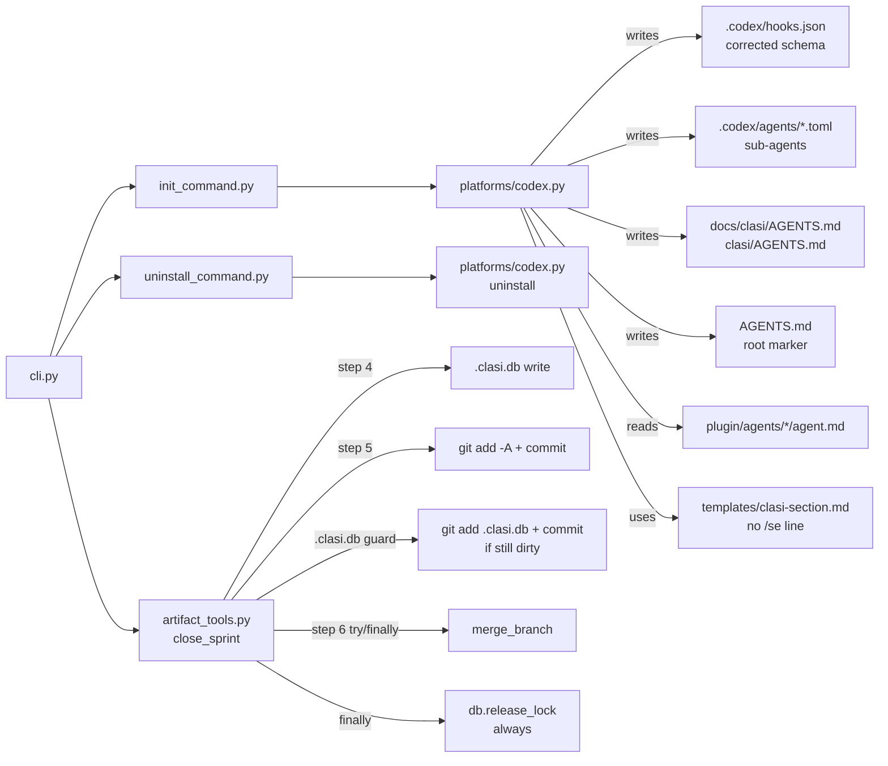

<!-- CLASI: Before changing code or making plans, review the SE process in CLAUDE.md -->

# Architecture Update -- Sprint 011: close_sprint dirty-tree fix and Codex installer correctness

## What Changed

### Track A: close_sprint lifecycle — dirty-tree fix and lock-release guarantee

#### A1. `clasi/tools/artifact_tools.py` — `_close_sprint_full` function

Two changes to the lifecycle orchestration function:

**Change 1 — Commit .clasi.db before merge**: The `version_bump` step (step 5) already
runs `git add -A` and `git commit` when versioning is active. This sprint extends the
commit to also cover the case where versioning is inactive or skipped: after `db_update`
(step 4), the function checks whether `.clasi.db` is dirty and, if so, stages and commits
it on the sprint branch with message `"chore: update .clasi.db"` before the merge step
proceeds. This guarantees the tree is clean before `git rebase` regardless of version
trigger configuration.

The `version_bump` step's `git add -A` already catches `.clasi.db` when versioning is
active, so the guard is conditioned on the tree still being dirty after `version_bump`.
The implementation uses `git status --porcelain docs/clasi/.clasi.db` to detect
dirtiness; if the output is non-empty, it performs a targeted `git add` and commit.

**Change 2 — Release lock in finally block**: The merge step (step 6) is wrapped in a
try/finally. The finally block calls `db.release_lock(sprint_id)` if the lock is still
held at that point. This ensures the lock is released regardless of whether the merge
raises `RuntimeError`, `MergeConflictError`, or succeeds. The existing success path
already releases the lock inside `db_update`, so the finally block is a no-op in the
happy path (release is idempotent).

No new modules, no new dependencies, no interface changes. The fix is localized entirely
to `_close_sprint_full` in `artifact_tools.py`.

---

### Track B: Codex installer — four correctness additions

#### B1. `clasi/platforms/codex.py` — hooks.json schema fix

The `_CLASI_STOP_HOOK` constant and `_write_codex_hooks` function are rewritten to emit
the correct Codex hooks.json wrapper structure:

```
{
  "hooks": {
    "Stop": [
      {
        "hooks": [
          {
            "type": "command",
            "command": "clasi hook codex-plan-to-todo",
            "timeout": 30
          }
        ]
      }
    ]
  }
}
```

The `Stop` array now contains wrapper objects (one per matcher/condition group). Each
wrapper object has a `"hooks"` list of handler objects with `type`, `command`, and
`timeout`. This matches the Codex hooks specification at
https://developers.openai.com/codex/hooks.

The merge logic in `_write_codex_hooks` is updated for backward compatibility: when
reading an existing hooks.json, any entry in the `Stop` array that matches the old flat
format `{"command": "clasi", "args": [...]}` is removed and replaced with the new wrapper
entry. The presence check (`if new_hook not in stop_list`) compares against the new
wrapper shape so no duplication occurs on repeated install.

The uninstall path in `codex.uninstall()` is updated symmetrically: it removes any entry
from the `Stop` array that matches the new wrapper shape (old-format entries would already
be absent after a re-install).

Note on repo-local vs. global hooks: GitHub issue openai/codex#17532 reports that
repo-local `.codex/hooks.json` may not fire in interactive Codex sessions; only
`~/.codex/hooks.json` does. This sprint fixes the schema and documents the limitation.
Installing to `~/.codex/hooks.json` is out of scope (changes install to write outside the
project root). The README update (ticket 007) documents the limitation and the workaround
(manual copy to `~/.codex/hooks.json`).

#### B2. `clasi/platforms/codex.py` — sub-agent TOML install

A new `_install_agents(target: Path)` function is added to `codex.py`. It:

- Enumerates agent directories under `clasi/plugin/agents/` matching the active set:
  `team-lead`, `sprint-planner`, `programmer`.
- For each, reads `agent.md`, strips the YAML frontmatter block (lines between the first
  `---` pair), and uses the remaining body as `developer_instructions`.
- Extracts `name` and `description` from the frontmatter (`title` and `description` fields
  if present; falls back to the directory name and an empty string).
- Writes `.codex/agents/<name>.toml` using `tomli_w.dumps({...})`.

A corresponding `_uninstall_agents(target: Path)` function removes the TOML files and
prunes empty directories.

The `install()` and `uninstall()` public functions are updated to call these helpers.

The `developer_instructions` content is the agent.md body verbatim. This is a known
limitation: some Claude-Code-specific phrasing (e.g., "dispatch via Agent tool") does not
apply on Codex. A translation layer is deferred to a future sprint.

#### B3. `clasi/templates/clasi-section.md` — drop misleading /se line

The line `"Available skills: run `/se` for a list."` is removed from the template. The
CLASI section retains the single entry-point sentence. This change affects both the Claude
(`CLAUDE.md`) and Codex (`AGENTS.md`) install outputs, since both use the same template
via `clasi.platforms._markers.write_section`.

#### B4. `clasi/platforms/codex.py` — nested AGENTS.md rule files

A new `_install_rules(target: Path)` function writes nested `AGENTS.md` files at
subdirectory roots:

- `docs/clasi/AGENTS.md` — SE process rules: confirms an MCP server is needed,
  references sprint/ticket artifact operations, emphasizes using CLASI MCP tools.
- `clasi/AGENTS.md` — source-code rules: requires a ticket in `in-progress` status
  before modifying source, references the execute-ticket skill.

Each file is a plain prose instruction file (no marker blocks — these are full files
owned entirely by the Codex installer, not marker-managed sections). The uninstaller
removes them by exact path if they exist.

**Rationale for nested AGENTS.md over SE-skill embedding**: Embedding rules in the SE
skill body would mean every agent that loads the SE skill also receives rule content that
may not be relevant to its task. Nested `AGENTS.md` files trigger only for agents
operating in those directories, which matches the intent of path-scoped rules. The
downside is that agents not in those directories won't see them — but this matches how
Claude's `rules/` path-scoping works. The approach is also the stated Codex-native
recommendation from the confirmed research.

---

## Why

- **SUC-001**: `close_sprint` must not fail on its own side effects. The dirty-tree bug
  blocks every `close_sprint` call in projects where `.clasi.db` is git-tracked.
- **SUC-002**: Lock leakage forces manual recovery after every failed `close_sprint`. A
  finally-block guarantee eliminates this.
- **SUC-003**: The hook schema bug means `codex-plan-to-todo` never fires — the entire
  Codex plan capture feature (sprint 010's main output) is dead end-to-end.
- **SUC-004, SUC-005**: Sub-agents are a first-class Codex feature. Installing them makes
  CLASI agents accessible as Codex sub-agents, which is the primary collaboration model
  on Codex.
- **SUC-006**: The `/se` line misdirects agents. Removing it reduces confusion.
- **SUC-007**: Rule content has no Codex-native path-scoped equivalent. Nested AGENTS.md
  is the closest alternative that actually works.
- **SUC-008**: End-to-end install tests prevent regression across all the above fixes.

---

## Subsystem and Module Responsibilities

### `clasi/tools/artifact_tools._close_sprint_full` (modified)

**Purpose**: Orchestrate the full close_sprint lifecycle with guaranteed lock release and
a clean tree before merge.
**Boundary**: Orchestrates git, archive, DB, and versioning steps. Does not implement
platform-specific logic. The `.clasi.db` commit is a git operation scoped to the sprint
branch.
**Use cases served**: SUC-001, SUC-002.

### `clasi/platforms/codex.py` (extended)

**Purpose**: Install and uninstall the complete Codex platform integration, including
correct hooks, sub-agent TOML files, and nested rule AGENTS.md files.
**Boundary**: Reads and writes only `.codex/`, `.agents/skills/`, `AGENTS.md`, and the
two nested `AGENTS.md` rule files. Does not know about Claude or shared scaffolding.
**Use cases served**: SUC-003, SUC-004, SUC-005, SUC-007.

### `clasi/templates/clasi-section.md` (modified)

**Purpose**: Provide the CLASI entry-point sentence for both Claude and Codex AGENTS.md /
CLAUDE.md sections.
**Boundary**: Template text only; rendered by `_markers.write_section`.
**Use cases served**: SUC-006.

---

## Component Diagram



---

## Impact on Existing Components

| Component | Change |
|---|---|
| `clasi/tools/artifact_tools.py` | Modified — `_close_sprint_full` adds DB commit guard and finally-based lock release |
| `clasi/platforms/codex.py` | Extended — corrected hooks schema, `_install_agents`, `_uninstall_agents`, `_install_rules`, `_uninstall_rules` |
| `clasi/templates/clasi-section.md` | Modified — `/se` line removed |
| `tests/unit/test_platform_codex.py` | Modified — update hooks shape assertions; add agent TOML and rules assertions |
| `tests/unit/test_init_command.py` | Modified — assert `/se` line absent in CLASI section |
| `tests/unit/test_close_sprint.py` (new or existing) | New/extended — dirty-tree and lock-release scenarios |
| `docs/README.md` | Modified — document corrected Codex footprint |

Components unaffected: `clasi/platforms/claude.py`, `clasi/platforms/detect.py`,
`clasi/platforms/_markers.py`, `clasi/plan_to_todo.py`, `clasi/hook_handlers.py`,
`clasi/sprint.py`, `clasi/ticket.py`, `clasi/state_db.py`, `clasi/mcp_server.py`.

---

## Migration Concerns

- **Existing Codex installs**: Projects that ran `clasi install --codex` before this fix
  have a wrong-schema `hooks.json`. Re-running `clasi install --codex` after the fix will
  replace the old flat entry with the correct wrapper entry (backward-compat merge).
  No manual file editing required.

- **Existing `.clasi.db` in gitignore**: Projects where `.clasi.db` is gitignored are not
  affected by the dirty-tree fix — git will not track the file and `git status` will show
  it as untracked (not modified). The guard only commits if the file appears as
  `modified` in `git status --porcelain`.

- **`clasi-section.md` template change**: Affects both Claude and Codex new installs.
  Existing `CLAUDE.md` and `AGENTS.md` files are not retroactively updated (the template
  is used only on install/re-install). The `/se` line in already-installed files is
  harmless; a re-install will replace the CLASI section with the updated template.

- **Agent TOML and nested AGENTS.md**: These are new files. No conflict with existing
  installs. Uninstall removes them cleanly.

---

## Design Rationale

### Decision: commit .clasi.db as a targeted git operation before merge (not stash, not move-to-last)

**Context**: The TODO listed three fix approaches: (1) commit `.clasi.db` after
`db_update`, (2) stash/pop around the merge, (3) move the DB write to after merge.

**Alternatives considered**:
1. Stash/pop: introduces risk of losing in-flight changes; stash pop can conflict;
   complex to test.
2. Move DB write to after merge: the DB write happens to the SQLite file that tracks
   sprint state — doing it post-merge means the sprint branch never has the final state
   in the DB, which is unintuitive and makes recovery harder.
3. Commit `.clasi.db` before merge (chosen): clean tree, no risk of losing data, the
   committed state ends up on main via the merge, matches the existing pattern where
   `version_bump` commits the version file.

**Why this choice**: The commit approach is the most coherent semantically: the sprint's
final DB state belongs on the sprint branch as part of its history. It is also the
simplest code change — a targeted `git add` and `git commit` before the rebase call.

**Consequences**: Projects where `.clasi.db` is gitignored are unaffected. Projects where
it is tracked get the correct final state committed on the sprint branch and merged to
main. The commit message `"chore: update .clasi.db"` is intentionally low-noise.

### Decision: try/finally for lock release (not a recovery flag)

**Context**: The TODO mentioned either a recovery flag or ensuring `release_execution_lock`
always runs.

**Why finally**: A finally block is unconditional, explicit, and requires no caller
awareness. A recovery flag would require callers to remember to pass it, and would not
help agents that call `close_sprint` without knowing to check the flag.

**Consequences**: On success, the lock is released in `db_update` and the finally block's
release attempt is a no-op (idempotent). On failure, the finally block is the only
release point.

### Decision: nested AGENTS.md for rule content (not SE-skill embedding)

**Context**: Codex has no path-scoped rule equivalent. Two options: embed rule content in
the SE skill body, or write nested `AGENTS.md` files at relevant directories.

**Alternatives considered**:
1. Embed in SE skill: simpler (one file), but applies to all agents loading the SE skill
   regardless of directory, and bloats the skill with process-enforcement content.
2. Nested AGENTS.md (chosen): closest to Claude's path-scoped rules; only applies to
   agents in those directories; removable on uninstall.

**Why nested AGENTS.md**: Matches the stated intent of rule files — apply only in context.
The approach is also supported by every tool in the AGENTS.md ecosystem.

**Consequences**: Agents not operating in `docs/clasi/` or `clasi/` directories will not
see the nested rules. This is acceptable — those rules are most relevant in those
directories.

### Decision: use agent.md body verbatim for developer_instructions (no translation layer)

**Context**: Agent Markdown files contain Claude-Code-specific phrasing. Two options:
verbatim body, or a translation pass.

**Why verbatim**: A translation layer adds complexity and a new abstraction. The verbatim
body is readable on Codex; Claude-specific calls like "dispatch via Agent tool" are
ignored rather than harmful. A translation layer is deferred to a future sprint.

**Consequences**: Codex sub-agents receive instructions that reference Claude-specific
constructs. This is a known limitation, documented in ticket 004.

---

## Open Questions

1. **Repo-local hooks.json firing**: GitHub issue openai/codex#17532 indicates repo-local
   `.codex/hooks.json` may not fire in interactive Codex sessions. Ticket 002 should
   verify this empirically. If confirmed non-functional, the README should document the
   workaround (copy to `~/.codex/hooks.json` manually). Installing to `~/.codex/` is out
   of scope for this sprint.

2. **`.clasi.db` dirty-tree guard branch context**: The guard commits on whichever branch
   is currently checked out. Since `close_sprint` operates on the sprint branch (the
   rebase runs against the sprint branch), the commit lands on the sprint branch as
   intended. If for any reason `HEAD` is not the sprint branch at that point, the commit
   would land on the wrong branch. The implementation should assert `HEAD` is the sprint
   branch before committing. This is a low-risk edge case worth a guard in the code.

3. **Agent TOML `description` field sourcing**: `agent.md` frontmatter may or may not have
   a `description` field. Implementers should fall back to the agent name if `description`
   is absent. This is trivial but worth noting in the ticket AC.
