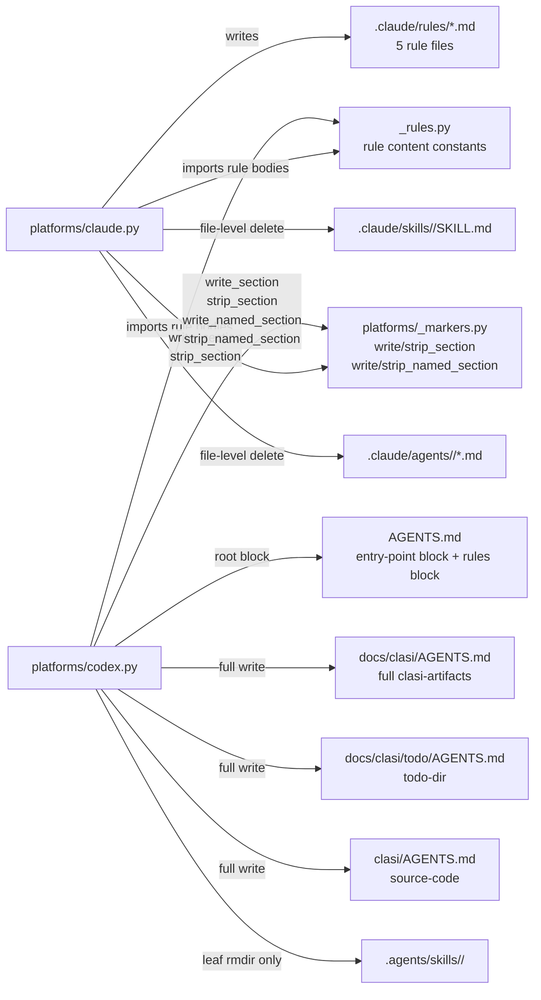
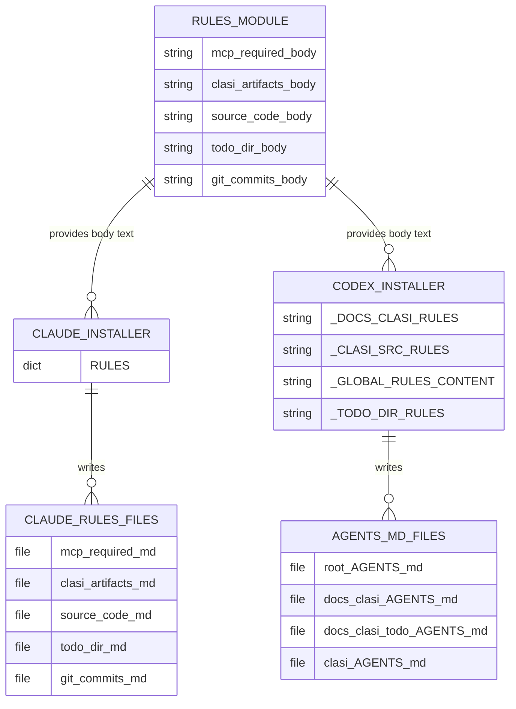
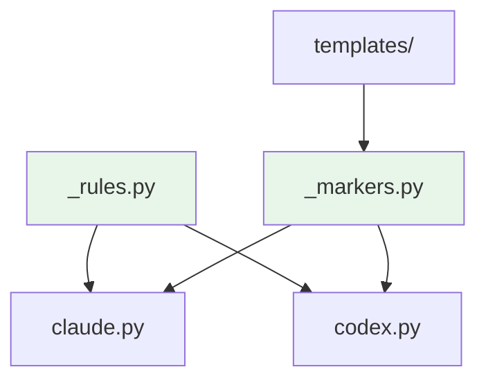

<!-- CLASI: Before changing code or making plans, review the SE process in CLAUDE.md -->

# Architecture Update -- Sprint 012: Codex rules-coverage parity and uninstall precision

## What Changed

### Track A — Codex rules-coverage parity

#### A1. New module: `clasi/platforms/_rules.py`

A new shared module holds the canonical rule content for all five CLASI path-scoped
rules. The module exports constants grouped by rule identity, each providing the rule
body (prose instruction) and its target scope metadata (used for rendering to the
appropriate format by each platform installer).

This module is the single source of truth for rule content. Both `claude.py` and
`codex.py` import from it. Neither platform hardcodes rule strings of its own.

**Boundary**: `_rules.py` contains only data (string constants and a structured
representation). It has no I/O, no side effects, and no imports from other CLASI modules.
It is a leaf node in the dependency graph.

**Use cases served**: SUC-004.

---

#### A2. Modified module: `clasi/platforms/claude.py`

The `RULES` dict is refactored to compose its values from `_rules.py` constants. Each
entry in `RULES` is rebuilt as the same YAML-frontmatter + body structure it had before,
but the body text is now imported from `_rules.py` rather than hardcoded inline.

No behavioral change. The `RULES` dict shape, key names, and `paths:` frontmatter are
unchanged. This is a pure refactor — the installed `.claude/rules/*.md` files are
byte-for-byte identical before and after.

**Use cases served**: SUC-004.

---

#### A3. Modified module: `clasi/platforms/_markers.py`

The existing `write_section` / `strip_section` pair operates on a single named block
(`<!-- CLASI:START --> ... <!-- CLASI:END -->`). This sprint extends `_markers.py` to
support multiple independently named marker blocks in the same file.

The extension adds:
- `write_named_section(file_path, block_name, content)` — writes or replaces a block
  identified by `<!-- CLASI:{block_name}:START --> ... <!-- CLASI:{block_name}:END -->`.
- `strip_named_section(file_path, block_name)` — removes the named block, preserving
  everything else (including the original CLASI:START/END block and user content).

The existing `write_section` / `strip_section` functions are unchanged and continue to
operate on the `CLASI:START/END` block. They are not aliases of the new functions —
they keep their existing call signatures for backward compatibility.

Round-trip invariant: given a file with two named blocks and user content, any
combination of writes and strips must leave user content and the other block intact.

**Boundary**: `_markers.py` handles only string manipulation and file I/O on a single
markdown file. It does not know about platforms, rules, or sprint state.

**Use cases served**: SUC-001, SUC-008.

---

#### A4. Modified module: `clasi/platforms/codex.py`

Four changes to the Codex installer:

**A4a. Global-rules block on root AGENTS.md**

A new `_install_global_rules(target)` function writes the two global-scope rules
(`mcp-required`, `git-commits`) into a named marker block on the root `AGENTS.md` using
`_markers.write_named_section(target / "AGENTS.md", "RULES", content)`. The content is
sourced from `_rules.py`.

The corresponding `_uninstall_global_rules(target)` function calls
`_markers.strip_named_section(target / "AGENTS.md", "RULES")`.

**A4b. Full clasi-artifacts content in `docs/clasi/AGENTS.md`**

`_DOCS_CLASI_RULES` is updated to contain the full `clasi-artifacts` rule content
(active-sprint check, sprint-phase check, MCP-tools-only instruction) sourced from
`_rules.py`. Previously this constant contained a partial mirror. No structural change
to how the file is written (still a full-file write, not marker-managed).

**A4c. New `docs/clasi/todo/AGENTS.md` for todo-dir rule**

`_install_rules(target)` gains a third write target: `docs/clasi/todo/AGENTS.md`,
sourced from the `todo-dir` rule constant in `_rules.py`. The directory is created if
absent.

`_uninstall_rules(target)` gains a corresponding unlink for this path.

**A4d. `clasi/AGENTS.md` content sourced from `_rules.py`**

`_CLASI_SRC_RULES` is updated to import from `_rules.py` (the `source-code` rule
body). No content change — this is alignment with the shared module.

**Boundary**: `codex.py` reads from `_rules.py` and writes to the project's file system
under the target root. It remains ignorant of `claude.py` and does not call `_markers`
functions for the nested AGENTS.md files (those remain full-file writes).

**Use cases served**: SUC-001, SUC-002, SUC-003, SUC-004, SUC-008.

---

### Track B — Uninstall precision

#### B1. Modified: `clasi/platforms/claude.py` — skill uninstall

`shutil.rmtree(target_skill)` is replaced with a per-file deletion loop mirroring the
install logic:

1. For each skill in `plugin/skills/`, find `target_skill = .claude/skills/<name>/`.
2. Remove `target_skill / "SKILL.md"` if it exists (this is the only file install copies).
3. If the directory is now empty, `rmdir` it and report removal.
4. If the directory is non-empty (user files present), report partial removal with a
   note that user files are preserved.

`import shutil` is removed from the uninstall function body (no longer needed).

**Use cases served**: SUC-005.

---

#### B2. Modified: `clasi/platforms/claude.py` — agent uninstall

`shutil.rmtree(target_agent)` is replaced with a per-file deletion loop mirroring the
install logic:

1. For each agent in `plugin/agents/`, find `target_agent = .claude/agents/<name>/`.
2. Glob `plugin/agents/<name>/*.md` to identify which files install copied.
3. For each such file, remove `target_agent / <filename>` if it exists.
4. If `target_agent` is now empty, `rmdir` it. Otherwise report partial removal.

**Use cases served**: SUC-006.

---

#### B3. Modified: `clasi/platforms/codex.py` — drop cascading parent rmdir

Lines ~516–523 that cascade `rmdir` upward from `.agents/skills/` to `.agents/` are
removed. The per-skill leaf `rmdir-if-empty` at lines ~510–513 is preserved.

Result: after a clean Codex uninstall, `.agents/skills/` and `.agents/` may remain as
empty directories. This is the correct trade-off — CLASI must not delete a shared root.

**Use cases served**: SUC-007.

---

## Why

- **SUC-001**: A Codex agent doing git operations currently has no knowledge of the
  `git-commits` rule (run tests, check sprint lock, bump version). The rule is absent
  from the Codex install entirely. A second named block on root AGENTS.md fills this gap.
- **SUC-002**: `docs/clasi/AGENTS.md` has a partial mirror of `clasi-artifacts` — it
  omits the active-sprint check and phase check. Agents modifying sprint artifacts
  could skip these guards.
- **SUC-003**: `docs/clasi/todo/AGENTS.md` does not exist. Agents working in the todo
  directory receive no instruction to use CLASI tooling.
- **SUC-004**: Rule content is duplicated between `claude.py` and `codex.py`. Any
  wording update requires editing two files and risks divergence.
- **SUC-005, SUC-006**: `shutil.rmtree` is unconditionally destructive. User-added files
  in skill and agent subdirs are silently lost on uninstall.
- **SUC-007**: `.agents/` is the cross-tool standard root shared by Codex, Cursor,
  Gemini, Copilot, and Windsurf. Deleting it on CLASI uninstall can break other tools.
- **SUC-008**: Two marker blocks in the same file require that each can be independently
  written and stripped without interfering with the other.

---

## Subsystem and Module Responsibilities

### `clasi/platforms/_rules.py` (new)

**Purpose**: Provide canonical rule content for all five CLASI path-scoped rules.
**Boundary**: Data-only module. No I/O, no imports from CLASI. Leaf in dependency graph.
**Use cases**: SUC-004.

### `clasi/platforms/_markers.py` (extended)

**Purpose**: Write and strip named marker blocks in markdown files, supporting multiple
independent blocks per file.
**Boundary**: String manipulation and file I/O on a single file. No platform knowledge.
**Use cases**: SUC-001, SUC-008.

### `clasi/platforms/claude.py` (modified)

**Purpose**: Install and uninstall the Claude platform integration with precise,
non-destructive file operations.
**Boundary**: Reads from `_rules.py` and `plugin/`; writes to `.claude/` subdirectory.
No knowledge of Codex paths.
**Use cases**: SUC-004, SUC-005, SUC-006.

### `clasi/platforms/codex.py` (modified)

**Purpose**: Install and uninstall the complete Codex platform integration, including
full rules coverage across all relevant nested AGENTS.md scopes.
**Boundary**: Reads from `_rules.py` and `plugin/`; writes to `.codex/`, `.agents/`,
`AGENTS.md`, and nested AGENTS.md files. No knowledge of `.claude/`.
**Use cases**: SUC-001, SUC-002, SUC-003, SUC-004, SUC-007, SUC-008.

---

## Component Diagram

---

## Entity-Relationship: Rule Content Flow

---

## Dependency Graph

No cycles. Dependency direction: platform installers depend on shared infrastructure
(`_rules.py`, `_markers.py`). Infrastructure has no upward dependencies.

---

## Impact on Existing Components

| Component | Change |
|---|---|
| `clasi/platforms/_rules.py` | New — canonical rule content module |
| `clasi/platforms/_markers.py` | Extended — `write_named_section`, `strip_named_section` added |
| `clasi/platforms/claude.py` | Modified — `RULES` dict sources from `_rules.py`; rmtree replaced in skill+agent uninstall |
| `clasi/platforms/codex.py` | Modified — `_DOCS_CLASI_RULES`, `_CLASI_SRC_RULES` from `_rules.py`; new `_install_global_rules`, `_uninstall_global_rules`; `docs/clasi/todo/AGENTS.md` added; cascading rmdir removed |
| `tests/unit/test_init_command.py` | Extended — two new uninstall precision tests (skill dir, agent dir) |
| `tests/unit/test_platform_codex.py` | Extended — two new uninstall precision tests (`.agents/` survival); one new end-to-end install correctness test |
| `tests/unit/test_markers.py` (new or existing) | Extended/new — named block round-trip tests |

Components unaffected: `clasi/tools/artifact_tools.py`, `clasi/platforms/detect.py`,
`clasi/plan_to_todo.py`, `clasi/hook_handlers.py`, `clasi/sprint.py`, `clasi/ticket.py`,
`clasi/state_db.py`, `clasi/mcp_server.py`, `clasi/templates/`.

---

## Migration Concerns

- **Existing Claude installs**: Rule file content in `.claude/rules/` is not
  retroactively changed. Re-running `clasi init --claude` after this sprint replaces the
  rule files with content sourced from `_rules.py`. Since the rule bodies are intentionally
  unchanged (pure refactor), the installed files will be identical before and after
  re-install.

- **Existing Codex installs**: `docs/clasi/AGENTS.md` will get updated content (adds
  active-sprint check and phase check). `docs/clasi/todo/AGENTS.md` is a new file.
  Root `AGENTS.md` gains a second named block. None of these changes break existing
  installs — they only add or update content. Re-running `clasi init --codex` is the
  migration path.

- **No database migration**: No schema changes to `.clasi.db`. No TOML/JSON format
  changes.

- **rmtree removal**: Projects that previously relied on uninstall to clean an entire
  skill or agent subdirectory now get per-file deletion. If a user ran `clasi init` and
  later ran `clasi uninstall`, they previously got a full rmtree. After this sprint they
  get per-file deletion. This is strictly safer — no user content can be lost — but the
  leaf directory may remain if user files are present.

---

## Design Rationale

### Decision: Extend `_markers.py` with named blocks (not a new module or convention)

**Context**: The root AGENTS.md needs to carry two independent CLASI-managed blocks:
the existing entry-point block and a new rules block. Three options:
1. Extend `_markers.py` with a named-block API.
2. Create a parallel `_named_markers.py` module.
3. Use a naming convention (e.g., a comment prefix) without a formal API.

**Why named blocks in `_markers.py`**: Option 1 keeps the marker logic in one place.
The existing `write_section`/`strip_section` pair already owns the pattern; extending
it with a `block_name` parameter generalizes the same proven approach. A parallel module
(option 2) would require callers to know which module to import. A convention (option 3)
provides no round-trip guarantees and is fragile.

**Consequences**: `_markers.py` grows two new public functions. The existing functions
are unchanged. The extension is backward compatible.

---

### Decision: Full-file writes for nested AGENTS.md (not marker-managed)

**Context**: The nested AGENTS.md files (`docs/clasi/AGENTS.md`, `docs/clasi/todo/AGENTS.md`,
`clasi/AGENTS.md`) are written as plain files owned entirely by the Codex installer, not
as marker-managed sections. This was the sprint 011 decision and is unchanged here.

**Why**: These files exist only because of the Codex install. There is no user content
to preserve inside them (the user would not normally edit these Codex-infrastructure
files). Full-file write and unlink-on-uninstall is simpler and more predictable.

**Consequences**: If a user edits one of these nested AGENTS.md files, a re-install
will overwrite it. This is documented as expected behavior.

---

### Decision: Leaf rmdir-if-empty for skills/agents, no cascading parent rmdir

**Context**: The uninstall precision TODO proposed mirroring the codex skills pattern
(file-level delete + leaf rmdir-if-empty) on the Claude side, and dropping the
cascading parent rmdir on the Codex side.

**Why**: The `.agents/` directory is explicitly called out in the TODO as a cross-tool
shared root. Deleting it on CLASI uninstall is an over-broad side effect. The
"rmdir-if-empty" pattern on leaf directories is already established in the Codex skills
uninstall and is the correct scoping: CLASI owns the leaf but not its ancestors.

**Consequences**: After a clean uninstall, empty parent directories (`.agents/skills/`,
`.agents/`) may remain. This is the intended trade-off.

---

### Decision: `_rules.py` as a data-only module (no rendering logic)

**Context**: Both `claude.py` and `codex.py` need the rule content, but they render it
differently. `claude.py` wraps it in YAML frontmatter with `paths:`. `codex.py` embeds
it in nested AGENTS.md prose. Three options:
1. `_rules.py` exports raw body strings; each installer adds its own wrapper.
2. `_rules.py` exports fully rendered content for each platform.
3. `_rules.py` exports a structured object with `render(platform)` method.

**Why option 1**: Simplest. Each platform already owns its output format. A rendering
function or structured object in `_rules.py` would require `_rules.py` to know about
platforms — violating the dependency direction. Raw body strings are the most stable
and reusable unit.

**Consequences**: Each installer is responsible for wrapping the body in its native
format. This is a single-line addition in each installer and is easy to audit.

---

## Open Questions

1. **`git-commits` scope**: In `claude.py`, `git-commits.md` has `paths: ["**/*.py",
   "**/*.md"]` — not truly global (`paths: ["**"]`). The TODO groups it with
   `mcp-required` as a global-scope rule. For the Codex root AGENTS.md, both rules
   should appear together. Implementer should verify whether the slightly narrower Claude
   scope is intentional or incidental, and document the decision in the ticket AC.
   (Best assumption: treat it as effectively global for Codex purposes — root AGENTS.md
   is the right home regardless.)

2. **`_markers.py` backward compatibility**: The new `write_named_section` API takes a
   `block_name` parameter. The existing `write_section`/`strip_section` pair could be
   refactored as `write_named_section(path, "CLASI", ...)` internally. This refactor is
   optional and should only be done if it does not break existing callers or tests.
   Implementer should decide during ticket 002 execution.

3. **Test file for `_markers.py`**: It is not clear if `tests/unit/test_markers.py`
   exists. If not, ticket 002 should create it. If it exists, it should be extended.
   Implementer should check before writing.
