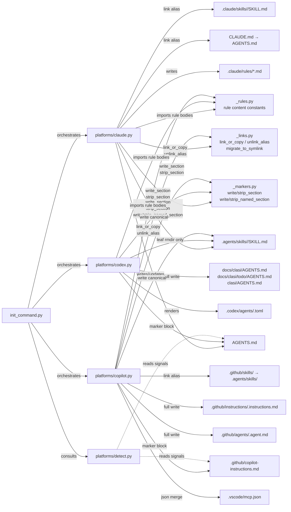
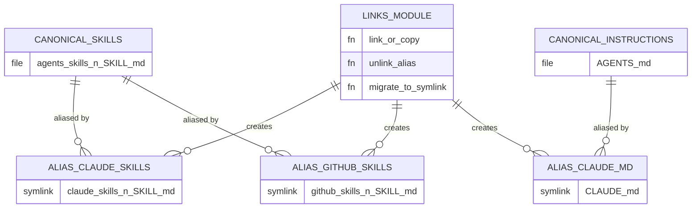
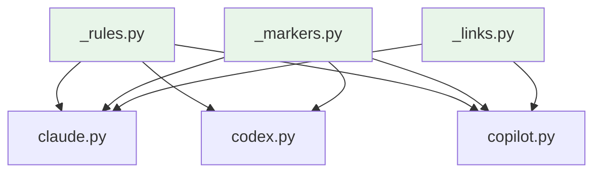

<!-- CLASI: Before changing code or making plans, review the SE process in CLAUDE.md -->

# Architecture Update — Sprint 013: Cross-platform shared install: canonicalize, symlink, and add Copilot

## What Changed

### Track A — Canonicalize and symlink (existing platforms)

#### A1. New module: `clasi/platforms/_links.py`

A new shared helper module provides the "symlink-with-copy-fallback" primitive
used by all platform installers. The module exports a single public function:

```
link_or_copy(canonical: Path, alias: Path, copy: bool = False) -> str
```

Behavior:
- If `copy=False` (default): attempt `os.symlink(canonical, alias)`. On failure
  (OSError, e.g., Windows without dev mode), fall back to `shutil.copy2` and emit
  a warning.
- If `copy=True`: skip the symlink attempt; use `shutil.copy2` directly.
- Returns `"symlink"` or `"copy"` to indicate which path was taken, for use in
  install summaries.
- Creates the alias parent directory if it does not exist.

The module also provides a mirror uninstall helper:

```
unlink_alias(alias: Path) -> bool
```

- Removes the symlink or copy at `alias`. Does not touch the canonical.
- Returns `True` if removed, `False` if the path did not exist.

**Boundary**: `_links.py` performs only file I/O. It has no platform knowledge, no
imports from other CLASI modules, and no side effects beyond the target filesystem.
It is a leaf node in the dependency graph.

**Use cases served**: SUC-001, SUC-002, SUC-003, SUC-007.

---

#### A2. Modified module: `clasi/platforms/claude.py` — skills canonicalization

The `_install_content` function's skill copy loop is refactored:

- **Before**: `shutil.copy2(src_skill_md, dest_dir / "SKILL.md")` — direct copy into
  `.claude/skills/<n>/SKILL.md`.
- **After**: 
  1. Write canonical to `.agents/skills/<n>/SKILL.md` via `_links.link_or_copy`
     (canonical path, no alias — this is the write step).
  2. Create alias `.claude/skills/<n>/SKILL.md` → `.agents/skills/<n>/SKILL.md` via
     `_links.link_or_copy`.

The canonical write happens regardless of whether `--codex` is also active, so
`clasi init --claude`-only installs always establish `.agents/skills/` as the
canonical. This matches the community pattern (`.agents/skills/` is universal; it is
not Codex-specific).

The uninstall loop is updated to call `_links.unlink_alias` for the `.claude/skills/`
alias. The canonical `.agents/skills/<n>/SKILL.md` is only removed if `--codex` is
also being uninstalled (Codex owns canonical uninstall).

**Use cases served**: SUC-001, SUC-007.

---

#### A3. Modified module: `clasi/platforms/claude.py` — CLAUDE.md symlink

The `_write_claude_md` function is refactored:

- **Before**: `write_section(target / "CLAUDE.md", entry_point=body)` — direct marker-
  managed write to `CLAUDE.md`.
- **After**:
  1. Write the entry-point + CLASI marker block into `AGENTS.md` (via `write_section`,
     same as Codex does). `AGENTS.md` becomes the authoritative instruction file.
  2. Create `CLAUDE.md` → `AGENTS.md` via `_links.link_or_copy`.

If `AGENTS.md` was already written by the Codex installer (in a combined install), the
Claude installer does not overwrite it — it calls `write_section` idempotently (the
marker block is either already present or merged in).

The uninstall path removes the `CLAUDE.md` symlink/copy via `_links.unlink_alias`.
`AGENTS.md` is never removed by the Claude uninstaller (it is the canonical; the Codex
uninstaller removes it if appropriate).

**Open question (deferred to implementer)**: When `--claude` is run without `--codex`,
the Claude installer now writes `AGENTS.md`. Should the Claude installer strip its
block from `AGENTS.md` on uninstall (mirror of `strip_section` on `CLAUDE.md`)? This
is safe only if no other platform has also written to `AGENTS.md`. Implementer should
use `strip_section` on `AGENTS.md` under `--claude`-only uninstall, and add a guard
that skips the strip if Codex is still installed (detectable via `.codex/` presence).

**Use cases served**: SUC-002, SUC-007.

---

#### A4. Modified module: `clasi/init_command.py` — `--copy` flag

The `clasi init` command gains a new `--copy` / `--no-copy` boolean flag (default:
`False`). The flag is threaded through to `claude.install(target, mcp_config, copy=copy)`,
`codex.install(target, mcp_config, copy=copy)`, and `copilot.install(target,
mcp_config, copy=copy)`. All three installers pass `copy` to every `_links.link_or_copy`
call.

The `clasi uninstall` command gains the same `--copy` flag (for uninstall, `copy=True`
suppresses any symlink-removal logic that differs from regular-file removal — in practice
`_links.unlink_alias` handles both the same way, but the flag is surfaced for parity).

**Use cases served**: SUC-003.

---

#### A5. New function: migration logic in `clasi/platforms/_links.py`

The module exports a secondary function for migrating legacy direct-copy installs:

```
migrate_to_symlink(canonical: Path, alias: Path) -> str
```

Behavior:
- If `alias` is already a symlink pointing at `canonical`: no-op, return `"already-symlink"`.
- If `alias` is a regular file with content matching `canonical` byte-for-byte: remove
  `alias` and create symlink; return `"migrated"`.
- If `alias` is a regular file with content NOT matching `canonical`: return `"conflict"`
  (caller decides whether to error or skip).
- If `alias` does not exist: return `"not-found"`.

Called by the installers when `--migrate` is passed on the CLI. The `--migrate` flag is
added to `clasi init` (does not conflict with `--copy`; `--migrate` converts legacy
copies to symlinks while `--copy` converts new installs to copies).

**Use cases served**: SUC-001, SUC-002.

---

### Track B — Add Copilot platform

#### B1. New module: `clasi/platforms/copilot.py`

A new platform installer for GitHub Copilot, mirroring the shape of `claude.py` and
`codex.py`:

```
install(target: Path, mcp_config: dict, copy: bool = False) -> None
uninstall(target: Path) -> None
```

The module is structured with private helpers for each install target, analogous to the
existing installers:
- `_install_global_instructions(target, copy)` — `.github/copilot-instructions.md`
- `_install_path_rules(target)` — `.github/instructions/<n>.instructions.md`
- `_install_agents(target, copy)` — `.github/agents/<n>.agent.md`
- `_install_vscode_mcp(target, mcp_config)` — `.vscode/mcp.json`
- `_install_skills(target, copy)` — `.github/skills/` symlink to `.agents/skills/`
- `_print_cloud_mcp_notice(mcp_config)` — post-install stdout message

The module imports from `_rules.py` (rule body content), `_markers.py` (marker-block
writes for `copilot-instructions.md`), and `_links.py` (symlink/copy for skills alias
and optionally for agent files).

**Boundary**: `copilot.py` writes only to `.github/`, `.vscode/`, and (via `_links.py`)
to `.agents/skills/` canonical and `.github/skills/` alias. It does not write to
`.claude/` or `.codex/`.

**Use cases served**: SUC-005, SUC-006, SUC-007, SUC-008.

---

#### B2. `.github/copilot-instructions.md` writer

`_install_global_instructions` writes or updates `.github/copilot-instructions.md`
using `_markers.write_section` (existing unnamed CLASI block). Content: the entry-point
sentence pointing at `.github/agents/team-lead.agent.md`, plus the global-scope rules
(`mcp-required` body and `git-commits` body from `_rules.py`).

The composition mirrors Codex's root `AGENTS.md` entry-point + rules block pattern,
but uses the Copilot-appropriate agent path.

User content outside the CLASI marker block is preserved on re-install.

**Use cases served**: SUC-005.

---

#### B3. `.github/instructions/<n>.instructions.md` writer

`_install_path_rules` writes one file per path-scoped rule:
- `clasi-artifacts.instructions.md` — `applyTo: "docs/clasi/**"`
- `todo-dir.instructions.md` — `applyTo: "docs/clasi/todo/**"`
- `source-code.instructions.md` — `applyTo: "clasi/**"`

Plus the global-scope rules (`mcp-required`, `git-commits`) with `applyTo: "**"`.

Each file has YAML frontmatter (`applyTo:` field) followed by the rule body from
`_rules.py`. This is the closest Copilot equivalent of Claude's `.claude/rules/<n>.md`
with `paths:` frontmatter.

Files are written as full-file writes (not marker-managed). Uninstall removes them by
name — same pattern as Codex TOML agents.

**Use cases served**: SUC-005.

---

#### B4. `.github/agents/<n>.agent.md` writer

`_install_agents` writes one file per active CLASI agent (team-lead, sprint-planner,
programmer). Each file:
- YAML frontmatter: `description` (required, from agent `agent.md` frontmatter),
  optionally `name`, `model`, `tools`.
- Body: Markdown content from `plugin/agents/<name>/agent.md`.

The body is a near-passthrough of the Claude agent Markdown. The only transform is
rewriting the frontmatter to the Copilot schema (dropping Claude-specific fields;
adding `description` if absent). Body content phrasing (e.g., "dispatch via Agent
tool") is left to the implementer's judgment per established precedent — no forced
translation pass.

Uninstall removes the files by name; parent directory `rmdir`-if-empty.

**Use cases served**: SUC-005.

---

#### B5. `.vscode/mcp.json` JSON-merge writer

`_install_vscode_mcp` merges the CLASI server entry into `.vscode/mcp.json`. The
merge strategy mirrors `_update_mcp_json` in `init_command.py`:
- If `.vscode/mcp.json` does not exist: create it with `{"servers": {"clasi": {...}}}`.
- If it exists: parse as JSON, merge `servers.clasi` key, write back.
- If parse fails (corrupt JSON): log an error and skip — never overwrite user content.

Uninstall removes the `servers.clasi` key from `.vscode/mcp.json` using the same
key-targeted removal pattern as `.mcp.json` uninstall.

**Use cases served**: SUC-005, SUC-007.

---

#### B6. `clasi/platforms/detect.py` — Copilot signal recognition

`detect.py` is extended to recognize Copilot signals:
- File signals: `.github/copilot-instructions.md` exists, `.github/agents/` exists,
  `.github/instructions/` exists.
- Binary signals (advisory, not hard requirements): `code`, `codium`, or `gh` on PATH.

A new `PlatformSignals` field (or equivalent) is added for `copilot`. The existing
recommendation logic in `init_command.py` is updated to surface `"copilot"` as a
detected platform.

**Use cases served**: SUC-006.

---

#### B7. `clasi/init_command.py` — `--copilot` flag and interactive prompt update

The `clasi init` command gains `--copilot` / `--no-copilot` (default: False). The
interactive prompt is updated to offer Copilot as a fourth option:
`[1] Claude  [2] Codex  [3] Copilot  [4] All three` (or similar).

The `clasi uninstall` command gains the same flag, wired to `copilot.uninstall(target)`.

**Use cases served**: SUC-005, SUC-006.

---

### Track C — Verification and docs

#### C1. End-to-end three-platform install correctness test

A new test function (`test_three_platform_install_end_to_end` or similar) in
`tests/unit/test_init_command.py` (or a new `test_platform_copilot.py`):
- Runs `clasi init --claude --codex --copilot` against a tmp directory.
- Asserts all canonical and alias files are present.
- Asserts symlinks resolve correctly.
- Round-trip parses all YAML frontmatter files (instruction files, agent files).
- Round-trip parses `.vscode/mcp.json`.
- Asserts no duplicate SKILL.md content on disk.

**Use cases served**: SUC-006.

---

#### C2. CI drift verifier

A new test function (and optionally a standalone script) that:
- Given a CLASI-installed directory, collects all `(canonical, alias)` pairs.
- Asserts each alias is a symlink to the canonical or has identical byte content.
- Reports mismatches clearly.

Pairs covered: `.agents/skills/<n>/SKILL.md` ↔ `.claude/skills/<n>/SKILL.md`;
`.agents/skills/<n>/SKILL.md` ↔ `.github/skills/<n>/SKILL.md`; `AGENTS.md` ↔
`CLAUDE.md`.

**Use cases served**: SUC-004.

---

## Why

- **SUC-001**: `.claude/skills/` currently holds duplicate copies of SKILL.md files
  already written to `.agents/skills/` by the Codex installer. Independent copies drift
  when edited. The community pattern (canonicalize + symlink) eliminates drift at zero
  additional disk cost.
- **SUC-002**: `CLAUDE.md` is only needed as a shim for Claude Code's inability to read
  `AGENTS.md` natively. ~60k public repos use a `CLAUDE.md` → `AGENTS.md` symlink; this
  is the established pattern.
- **SUC-003**: Windows without Developer Mode and some CI sandboxes cannot create
  symlinks. A `--copy` fallback ensures cross-platform operability.
- **SUC-004**: Once copies exist (from `--copy` mode or manual edits), drift is silent.
  A verifier catches it in CI before content diverges in production.
- **SUC-005, SUC-006**: Copilot is the third major platform. Its skills and main
  instructions are already on disk after a Codex or Claude install; only Copilot-unique
  files remain. Adding Copilot under the new canonical model avoids the "render twice
  then refactor" cost.
- **SUC-007**: Precision uninstall established in sprint 012 must extend to symlink/copy
  aliases — removing the alias but never the canonical is the correct semantic.
- **SUC-008**: Cloud-agent MCP cannot be committed; a clear post-install message
  prevents silent misconfiguration.

---

## Subsystem and Module Responsibilities

### `clasi/platforms/_links.py` (new)

**Purpose**: Provide the symlink-with-copy-fallback primitive and migration helper for
cross-platform alias management.
**Boundary**: File I/O only. No platform knowledge. No CLASI imports. Leaf node.
**Use cases**: SUC-001, SUC-002, SUC-003, SUC-004, SUC-007.

### `clasi/platforms/claude.py` (modified)

**Purpose**: Install and uninstall the Claude platform integration. Skills and CLAUDE.md
now use `_links.py` for alias management rather than direct writes.
**Boundary**: Writes canonical `.agents/skills/` (shared) and aliases `.claude/skills/`,
`CLAUDE.md` → `AGENTS.md`. No knowledge of Codex or Copilot paths.
**Use cases**: SUC-001, SUC-002, SUC-003, SUC-007.

### `clasi/platforms/codex.py` (unchanged in structure)

**Purpose**: Install and uninstall the complete Codex platform integration.
**Note**: Canonical `.agents/skills/` write is already present. This sprint verifies
the canonical ownership invariant and adjusts the uninstall to defer skill-canonical
removal to the `_links.py` layer.
**Boundary**: Unchanged from sprint 012.
**Use cases**: (existing SUC set from 012; no new use cases this sprint).

### `clasi/platforms/copilot.py` (new)

**Purpose**: Install and uninstall the GitHub Copilot platform integration (all three
variants: Cloud Coding Agent, IDE Copilot, Workspaces).
**Boundary**: Writes `.github/`, `.vscode/`, and `.agents/skills/` (canonical, via
`_links.py`). Symlinks `.github/skills/` to `.agents/skills/`.
**Use cases**: SUC-005, SUC-006, SUC-007, SUC-008.

### `clasi/platforms/detect.py` (modified)

**Purpose**: Recognize platform signals from the filesystem and PATH to recommend
platforms to the interactive prompt.
**Boundary**: Read-only filesystem and PATH inspection. No installs.
**Use cases**: SUC-006.

### `clasi/init_command.py` (modified)

**Purpose**: Orchestrate platform installs and uninstalls. Thread `--copy` and
`--copilot` flags to platform modules.
**Boundary**: CLI entry point and orchestration only; no platform-specific file writes.
**Use cases**: SUC-003, SUC-005, SUC-006.

---

## Component Diagram



---

## Entity-Relationship: Canonical and Alias Content



---

## Dependency Graph



No cycles. Dependency direction: platform installers depend on shared infrastructure
(`_rules.py`, `_markers.py`, `_links.py`). Infrastructure modules have no upward
dependencies.

---

## Impact on Existing Components

| Component | Change |
|---|---|
| `clasi/platforms/_links.py` | New — symlink-with-copy-fallback, migration helper |
| `clasi/platforms/claude.py` | Modified — skills and CLAUDE.md use `_links.py`; canonical write added |
| `clasi/platforms/codex.py` | Minor — verify canonical ownership, adjust uninstall canonical guard |
| `clasi/platforms/copilot.py` | New — full Copilot installer/uninstaller |
| `clasi/platforms/detect.py` | Modified — Copilot signal recognition added |
| `clasi/init_command.py` | Modified — `--copy`, `--migrate`, `--copilot` flags; interactive prompt update |
| `clasi/uninstall_command.py` | Modified — `--copy`, `--copilot` flags |
| `tests/unit/test_platform_claude.py` | Extended — skills symlink tests, CLAUDE.md symlink tests |
| `tests/unit/test_platform_copilot.py` | New — full Copilot install/uninstall tests |
| `tests/unit/test_links.py` | New — `_links.py` unit tests (symlink + copy paths) |
| `tests/unit/test_init_command.py` | Extended — three-platform end-to-end, drift verifier |
| `tests/unit/test_platform_detect.py` | Extended — Copilot signal detection |

Components unaffected: `clasi/tools/artifact_tools.py`, `clasi/plan_to_todo.py`,
`clasi/hook_handlers.py`, `clasi/sprint.py`, `clasi/ticket.py`, `clasi/state_db.py`,
`clasi/mcp_server.py`, `clasi/templates/`, `clasi/platforms/_markers.py`,
`clasi/platforms/_rules.py`.

---

## Migration Concerns

**Existing Claude installs (pre-sprint 013)**:

After this sprint, `clasi init --claude` changes from writing a direct copy at
`.claude/skills/<n>/SKILL.md` to writing a symlink. If a project has a previous
direct-copy install, re-running `clasi init --claude` without `--migrate` will detect
the conflict and refuse with a clear error. Running with `--migrate` will content-match
and convert.

Existing `.claude/rules/` files and `.claude/agents/` files are unaffected — they are
platform-unique and continue to be written directly.

**Existing CLAUDE.md**:

If `CLAUDE.md` exists as a regular file (from any previous CLASI or non-CLASI source),
`clasi init --claude` will detect it and refuse if the content does not match `AGENTS.md`.
Running `--migrate` converts it to a symlink after content match. Running `--force`
(existing flag, if available) would overwrite — implementer should verify whether a
force path exists before adding one.

**Codex installs (no change)**:

Codex's canonical write of `.agents/skills/` is unchanged. The Codex installer does not
use `_links.py` for its own canonical writes (it is the canonical owner). A minor
adjustment ensures the Codex uninstaller does not remove canonicals that the Claude or
Copilot installers may also be using (guard: check for remaining alias consumers before
removing canonical).

**No database migration**: No schema changes to `.clasi.db`. No TOML/JSON format changes.

---

## Design Rationale

### Decision: `_links.py` as a new module, not an extension of `_markers.py` or `_rules.py`

**Context**: The symlink-with-copy-fallback concern is orthogonal to marker-block
manipulation (`_markers.py`) and rule content (`_rules.py`). Three options:
1. New `_links.py` module.
2. Add link helpers to `_markers.py`.
3. Add link helpers to `init_command.py`.

**Why option 1**: `_markers.py` has a single responsibility (string manipulation in
Markdown files). Adding filesystem symlink operations violates that boundary.
`init_command.py` is the CLI orchestrator and should not contain file-linking logic.
A dedicated `_links.py` is a leaf with one responsibility that all three platform
installers can import without coupling to each other.

**Consequences**: Four shared infrastructure modules (`_rules.py`, `_markers.py`,
`_links.py`, and `templates/`). Fan-out from each platform installer to infrastructure
is 2-3 modules — within the acceptable range.

---

### Decision: Canonical `.agents/skills/` write is platform-flag-agnostic

**Context**: When the user runs `clasi init --claude` without `--codex`, where does the
canonical `.agents/skills/<n>/SKILL.md` live? Two options:
1. Always write `.agents/skills/` regardless of flags; `--claude` symlinks in.
2. Only write `.agents/skills/` when `--codex` is active; `--claude`-only keeps
   `.claude/skills/` as a direct write.

**Why option 1**: `.agents/skills/` is a cross-tool standard, not a Codex-specific
path. The community pattern (agentskills.io, ai-rules-sync, agent-skill-creator) is
"canonical in `.agents/skills/`, symlinks elsewhere." Writing the canonical only when
Codex is active creates an ordering dependency and would regress to option 2's drift
risk if the user later adds Codex or Copilot. A clean invariant is simpler: the
canonical always lives at `.agents/skills/`.

**Consequences**: `clasi init --claude` now also writes `.agents/skills/`. This is
additive and non-breaking. Projects that only ever use Claude Code still benefit from
the cross-tool canonical (future-proof).

---

### Decision: Sub-agent format for Copilot — passthrough Markdown, no forced translation

**Context**: `.github/agents/<n>.agent.md` body can be written verbatim from
`plugin/agents/<name>/agent.md`, or translated to remove Claude-Code-specific phrasing
(e.g., "dispatch via Agent tool"). Same open question as Codex sub-agents was settled
in sprint 010 by deferring to the implementer.

**Why defer**: The established precedent (sprint 010 decision) is that sub-agent body
translation is ambiguous and low-risk to get wrong — a suboptimal phrasing in the agent
body does not break functionality. The implementer is better positioned to judge once
they see how Copilot actually surfaces the body text. Forcing a translation layer in
the architecture would add complexity for uncertain benefit.

**Consequences**: Implementer decides during ticket execution. No architecture lock-in
either way. If translation is needed, it can be added as a simple string transform in
`_install_agents`.

---

### Decision: `.github/skills/` as a symlink directory, not per-file symlinks

**Context**: Copilot reads the entire `.github/skills/` directory. Two options:
1. Symlink the directory: `.github/skills/ -> .agents/skills/`.
2. Create per-file symlinks: `.github/skills/<n>/SKILL.md -> .agents/skills/<n>/SKILL.md`
   (same as Claude's per-file approach).

**Why option 1 (directory symlink)**: Copilot reads all of `.github/skills/` and
`.agents/skills/` independently — it already picks up skills from `.agents/skills/`
without any Copilot-specific install. The `.github/skills/` path is only needed if
Copilot has a priority preference or the user wants explicit Copilot-scoped organization.
A directory-level symlink is the simplest expression: one `os.symlink` call, and any
new skills added to `.agents/skills/` are automatically visible at `.github/skills/`
without re-running `clasi init`. This is the pattern used by `ai-rules-sync` and the
Qt Company's agent-skills bundle.

**Consequences**: `clasi init --copilot` without `--codex` or `--claude` will write the
canonical `.agents/skills/` content (via `_links.py`) and symlink `.github/skills/` to
it. This is consistent with the platform-flag-agnostic canonical write decision above.

---

## Open Questions

1. **CLAUDE.md uninstall with mixed-platform installs**: When both `--claude` and
   `--codex` are installed, `AGENTS.md` is managed by both installers (Claude adds its
   entry-point block; Codex adds its entry-point and rules blocks). Uninstalling only
   `--claude` should strip the Claude marker block from `AGENTS.md` and remove the
   `CLAUDE.md` symlink, but leave the Codex blocks. The `_markers.py` named-block API
   from sprint 012 supports this; implementer should verify the block naming is
   consistent between claude.py and codex.py.

2. **Canonical ownership on uninstall**: If `.agents/skills/<n>/SKILL.md` was written
   by the `_links.py` layer (triggered by `--claude` without `--codex`), which
   uninstall command removes it? Proposed resolution: `_links.py` tracks a "canonical
   owner" flag per operation (e.g., in a sidecar manifest or inferred from which
   installer wrote it). Simpler alternative: always leave `.agents/skills/` on
   uninstall (it is a cross-tool standard root; the cost of leaving orphan files is low).
   Implementer should choose the simpler path and document the decision.

3. **Body translation for Copilot agents**: Addressed in design rationale (deferred to
   implementer). No architecture action required.

4. **`.codex/agents/<n>.toml` phrasing for Copilot vs Codex**: The Codex TOML render
   produces an agent description that says "dispatch via the codex sub-agent mechanism."
   This phrasing is Codex-specific and incorrect for Copilot. The Copilot agent Markdown
   body is separate and will not inherit this problem — but confirm that the two
   renderering paths do not share a single constant that would contaminate both.
