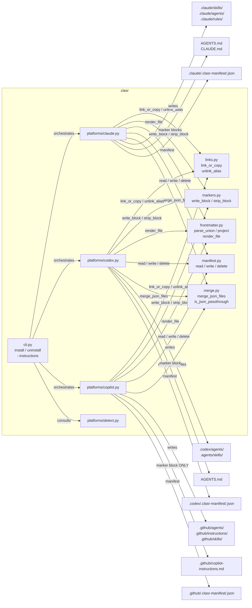
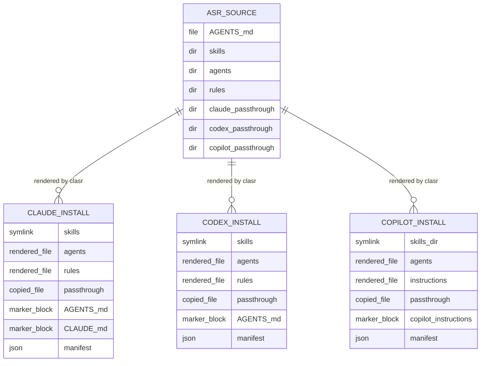
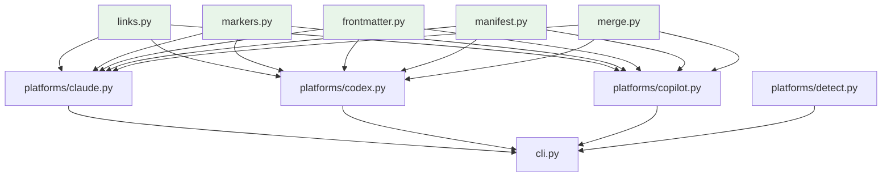

<!-- CLASI: Before changing code or making plans, review the SE process in CLAUDE.md -->

# Architecture Update — Sprint 014: clasr renderer — frontmatter engine, named marker blocks, manifests, three-platform install

## What Changed

### New top-level package: `clasr/`

A new Python package is added alongside `clasi/` in the same repository. The package
is registered in the existing `pyproject.toml` (no new distribution). A second
`console_scripts` entry `clasr = clasr.cli:main` is added. `pip install -e .` installs
both `clasi` and `clasr` CLIs.

The `clasr` package has a strict one-way dependency rule: it MUST NOT import from
`clasi`. (`clasi` may later import from `clasr`; that is a future sprint.)

### New module: `clasr/links.py`

A symlink-with-copy-fallback helper. Independent copy of the logic from
`clasi/platforms/_links.py` — the source module was analyzed and has no CLASI imports,
making a clean copy feasible without coupling. (`clasi/platforms/_links.py` is
unchanged.) The module exports:

```
link_or_copy(canonical: Path, alias: Path, copy: bool = False) -> str
unlink_alias(alias: Path) -> bool
```

`link_or_copy` attempts `os.symlink`; on `OSError`, falls back to `shutil.copy2` with a
warning. Returns `"symlink"` or `"copy"`. `unlink_alias` removes the alias (works for
both symlinks and regular files).

**Boundary**: File I/O only. No `clasr` or `clasi` imports. Leaf node.

**Use cases**: SUC-003, SUC-009.

---

### New module: `clasr/markers.py`

Named marker block writer and stripper using the `clasr` marker format:

```
<!-- BEGIN clasr:<provider> -->
...content...
<!-- END clasr:<provider> -->
```

This is a distinct format from the `CLASI:{name}:START/END` format used by
`clasi/platforms/_markers.py`. The two modules are independent; lifting `_markers.py`
was not feasible because (a) the marker format differs, and (b) `_markers.py` imports
from `clasi.templates`, which would violate the one-way dependency rule if shared.

The module exports:

```
write_block(file_path: Path, provider: str, content: str) -> bool
strip_block(file_path: Path, provider: str) -> bool
```

`write_block`: if the block for `provider` already exists in the file, replace it in
place; if the file has no such block, append it; if the file does not exist, create it.
Returns `True` if the file was written or changed.

`strip_block`: removes the named block for `provider`, preserving all other content
(including blocks from other providers). Deletes the file if it becomes empty after
stripping. Returns `True` if anything changed.

Multiple providers can have independent blocks in the same file. Operations on one
provider's block do not affect other providers' blocks.

**Boundary**: String manipulation + file I/O only. No other `clasr` imports. Leaf node.

**Use cases**: SUC-003, SUC-005, SUC-006.

---

### New module: `clasr/frontmatter.py`

Union frontmatter parser and per-platform projector. The union format allows a single
source file to carry frontmatter for all platforms:

```yaml
---
name: code-review
description: Review a pull request
claude:
  tools: [Read, Grep, Bash]
copilot:
  applyTo: "**/*.ts"
codex: {}
---
```

The projector:
1. Parses the full YAML frontmatter block from the source file.
2. Extracts the top-level shared keys (all keys except platform names `claude`, `codex`,
   `copilot`).
3. Extracts the target platform's nested dict (e.g. `claude: {...}`).
4. Merges: shared keys + platform-specific keys. Platform-specific keys override shared
   keys with the same name.
5. Drops all other platform keys.
6. Returns the projected frontmatter dict and the verbatim body.

The module exports:

```
parse_union(source: Path) -> tuple[dict, dict, str]
    Returns (shared_fm, full_fm, body)

project(full_fm: dict, body: str, platform: str) -> tuple[dict, str]
    Returns (projected_fm, body)

render_file(source: Path, platform: str) -> str
    Returns full rendered file content (frontmatter + body)
```

`render_file` is the high-level helper used by platform installers.

**Boundary**: YAML parsing + string assembly. Depends only on `pyyaml` (already a
project dependency). No file writes — returns strings. Leaf node.

**Use cases**: SUC-007.

---

### New module: `clasr/manifest.py`

Per-platform per-provider manifest reader and writer. Manifests live inside the platform
directory they describe:

- `.claude/.clasr-manifest/<provider>.json`
- `.codex/.clasr-manifest/<provider>.json`
- `.github/.clasr-manifest/<provider>.json`

This design is intentionally multi-tenant: multiple providers install into the same
platform directory, each with its own manifest. `clasr uninstall --provider X` reads
only `X`'s manifest and touches only what that manifest records.

Manifest schema:

```json
{
  "version": 1,
  "provider": "myprovider",
  "platform": "claude",
  "source": "/abs/path/to/asr",
  "entries": [
    {"path": ".claude/skills/foo/SKILL.md", "kind": "symlink", "target": "<source>/skills/foo/SKILL.md"},
    {"path": ".claude/agents/code-review.md", "kind": "rendered", "from": "<source>/agents/code-review.md"},
    {"path": ".claude/settings.json", "kind": "copy", "from": "<source>/claude/settings.json"},
    {"path": "AGENTS.md", "kind": "marker-block", "block": "clasr:myprovider"},
    {"path": "CLAUDE.md", "kind": "marker-block", "block": "clasr:myprovider"},
    {"path": ".claude/settings.json", "kind": "json-merged", "from": "<source>/claude/settings.json", "keys": ["mcpServers"]}
  ]
}
```

**Entry kinds:**

| kind | Description |
|------|-------------|
| `"symlink"` | A symlink (or copy fallback). Uninstall calls `unlink_alias`. |
| `"copy"` | A plain file copy. Uninstall deletes the file. |
| `"rendered"` | Frontmatter-projected markdown file. Uninstall deletes the file. |
| `"marker-block"` | A named provider block written into a shared file. Uninstall calls `strip_block`. |
| `"json-merged"` | Keys merged into a shared JSON file. `"keys"` lists the top-level keys this provider contributed. Uninstall removes only those keys; deletes the file if empty after removal. |

Atomic write: serialize to `<file>.tmp`, then `os.replace` to the final path. Partial
writes are impossible.

The module exports:

```
read_manifest(platform_dir: Path, provider: str) -> dict | None
write_manifest(platform_dir: Path, provider: str, manifest: dict) -> None
delete_manifest(platform_dir: Path, provider: str) -> bool
manifest_path(platform_dir: Path, provider: str) -> Path
```

**Boundary**: JSON I/O + `os.replace`. No `clasr` business logic. Leaf node.

**Use cases**: SUC-003, SUC-004, SUC-005, SUC-008.

---

### New module: `clasr/merge.py`

JSON deep-merge helper for the multi-provider passthrough collision case. When two
providers both ship a JSON passthrough file to the same target path (e.g.
`asr/claude/settings.json` from provider A and provider B both targeting
`.claude/settings.json`), the second install merges its keys into the existing file
rather than overwriting or erroring.

**Merge rules:**

- Applies only to JSON files (`.json` extension): `settings.json`, `settings.local.json`,
  `mcp.json`, and any other `.json` passthrough file.
- Deep-merges dicts: later provider's keys win on conflict.
- For each conflicting top-level key (same key present in both), emits a WARNING to
  `stderr` naming both providers and the key, so collisions are visible and not silent.
- Returns the merged dict and the set of top-level keys the caller contributed (used to
  populate `"keys"` in the manifest `json-merged` entry).
- Non-JSON passthrough files (`commands/foo.md`, hook scripts, etc.) do NOT merge:
  if the destination already exists and was not written by the current provider's existing
  manifest, installation errors with a clear message naming both providers.

The module exports:

```
merge_json_files(existing: Path, incoming: dict, provider: str, other_provider: str) -> tuple[dict, list[str]]
    Reads existing JSON, deep-merges incoming dict, emits warnings for conflicts.
    Returns (merged_dict, keys_contributed_by_incoming).

is_json_passthrough(path: Path) -> bool
    Returns True if path has a .json extension (and therefore qualifies for merge).
```

**Boundary**: JSON parsing + dict merging + stderr warnings. No file writes — callers
(platform installers) handle writing the merged result. Leaf node.

**Use cases**: SUC-006, SUC-010.

---

### New module: `clasr/cli.py`

CLI entry point implementing two subcommands:

```
clasr install --source <path> --provider <name> [--claude] [--codex] [--copilot] [--copy]
clasr uninstall --provider <name> [--claude] [--codex] [--copilot]
clasr --instructions
```

`--instructions` is a top-level flag (not a subcommand) that prints `instructions.md`
loaded via `importlib.resources` and exits.

`install` orchestrates: for each requested platform, call the platform module's
`install(source, target, provider, copy)` function.

`uninstall` orchestrates: for each requested platform, read the manifest, call
`platform.uninstall(target, provider)`.

The CLI is implemented with `argparse` (no `click` dependency — `clasr` must not import
from `clasi`, which uses `click`).

**Boundary**: Argument parsing and orchestration only. No file writes directly.

**Use cases**: SUC-001, SUC-002, SUC-003, SUC-004, SUC-005.

---

### New module: `clasr/platforms/claude.py`

Claude platform installer. Installs to `.claude/` in the target directory.

`install(source: Path, target: Path, provider: str, copy: bool = False) -> None`:
1. Skills: for each `source/skills/<n>/SKILL.md`, call `links.link_or_copy` to create
   `.claude/skills/<n>/SKILL.md` symlink (or copy). Record `kind: "symlink"` or
   `kind: "copy"` in manifest.
2. Agents: for each `source/agents/<n>.md`, call `frontmatter.render_file(path, "claude")`
   and write to `.claude/agents/<n>.md`. Record `kind: "rendered"`.
3. Rules: for each `source/rules/<n>.md`, render and write to `.claude/rules/<n>.md`.
   Record `kind: "rendered"`.
4. Passthrough: for each file under `source/claude/`, copy to `.claude/` preserving
   directory structure.
   - JSON files (`.json` extension): if the destination already exists, call
     `merge.merge_json_files` and write the merged result; record `kind: "json-merged"`
     with `"keys"` set to the list returned by `merge_json_files`.
   - Non-JSON files: if the destination already exists and is NOT listed in the current
     provider's existing manifest, error with a clear message naming both providers.
     Otherwise overwrite. Record `kind: "copy"`.
5. Marker blocks: write `source/AGENTS.md` content as `<!-- BEGIN clasr:<provider> -->`
   block into both `AGENTS.md` and `CLAUDE.md`. Record both as `kind: "marker-block"`.
6. Write manifest to `.claude/.clasr-manifest/<provider>.json`.

`uninstall(target: Path, provider: str) -> None`:
- Read manifest from `.claude/.clasr-manifest/<provider>.json`.
- For each entry: `unlink_alias` for symlink/copy; delete for rendered; `strip_block` for
  marker-block; for `json-merged`, remove only the provider's contributed keys from the
  shared JSON file, then delete the file if it becomes empty (or contains only `{}`).
- Delete the manifest file.

**Boundary**: Writes only to `.claude/`, `AGENTS.md`, and `CLAUDE.md` in the target.
Uses `links`, `markers`, `frontmatter`, `manifest`, `merge`. No Codex or Copilot knowledge.

**Use cases**: SUC-003, SUC-004, SUC-005, SUC-006, SUC-007, SUC-009, SUC-010.

---

### New module: `clasr/platforms/codex.py`

Codex platform installer. Installs to `.codex/` and `.agents/` in the target directory.

`install(source: Path, target: Path, provider: str, copy: bool = False) -> None`:
1. Skills: symlink (or copy) each `source/skills/<n>/SKILL.md` to
   `.agents/skills/<n>/SKILL.md`. Record in manifest.
2. Agents: render each `source/agents/<n>.md` with `platform="codex"` frontmatter
   projection and write to `.codex/agents/<n>.md`. Record `kind: "rendered"`.
3. Rules: Codex has no native path-scoped rule mechanism. Rules are rendered with
   `platform="codex"`. If the projected frontmatter has an `applyTo` or `paths` field,
   write the rendered body as a nested `AGENTS.md` at the corresponding subdirectory root
   (e.g. `applyTo: "docs/clasi/**"` → `target/docs/clasi/AGENTS.md`). If `applyTo` is
   absent (unscoped rule), inject the rule body directly into the root `AGENTS.md` marker
   block for this provider (i.e. include it in the content passed to `markers.write_block`
   alongside the `source/AGENTS.md` content). Record `kind: "rendered"` for subdirectory
   files; root-AGENTS.md content is tracked via the `kind: "marker-block"` entry.
4. Passthrough: for each file under `source/codex/`, copy to `.codex/` preserving
   directory structure. JSON files: merge via `merge.merge_json_files` if destination
   exists; record `kind: "json-merged"`. Non-JSON: error on collision with another
   provider. Record `kind: "copy"`.
5. Marker blocks: write `source/AGENTS.md` content (plus any unscoped rules) as named
   block into `AGENTS.md` (root). Record `kind: "marker-block"`.
6. Write manifest to `.codex/.clasr-manifest/<provider>.json`.

`uninstall(target: Path, provider: str) -> None`: mirror of install. For `json-merged`
entries, remove only the provider's contributed keys; delete file if empty.

**Boundary**: Writes to `.codex/`, `.agents/`, `AGENTS.md`. Uses `links`, `markers`,
`frontmatter`, `manifest`, `merge`. No knowledge of Claude or Copilot paths.

**Use cases**: SUC-003, SUC-004, SUC-005, SUC-006, SUC-007, SUC-009, SUC-010.

---

### New module: `clasr/platforms/copilot.py`

Copilot platform installer. Installs to `.github/` in the target.

`install(source: Path, target: Path, provider: str, copy: bool = False) -> None`:
1. Skills: create `.github/skills/` as a directory-level symlink to `.agents/skills/`
   (or directory copy if `--copy`). Record in manifest.
2. Agents: render each `source/agents/<n>.md` with `platform="copilot"` and write to
   `.github/agents/<n>.agent.md`. Record `kind: "rendered"`.
3. Rules: render each `source/rules/<n>.md` and write to
   `.github/instructions/<n>.instructions.md`. The `applyTo:` field from the projected
   frontmatter is preserved. Record `kind: "rendered"`.
4. Passthrough: for each file under `source/copilot/`, copy to `.github/` preserving
   directory structure. JSON files (e.g. `asr/copilot/.vscode/mcp.json`): merge via
   `merge.merge_json_files` if destination exists; record `kind: "json-merged"`. Non-JSON:
   error on collision with another provider. Record `kind: "copy"`.
5. Marker blocks: write `source/AGENTS.md` as named block into
   `.github/copilot-instructions.md` ONLY. Copilot reads its own global instructions
   file; there is no write to root `AGENTS.md` for the Copilot platform. Record
   `kind: "marker-block"` with path `.github/copilot-instructions.md`.
6. Write manifest to `.github/.clasr-manifest/<provider>.json`.

`uninstall(target: Path, provider: str) -> None`: mirror of install. For `json-merged`
entries, remove only the provider's contributed keys; delete file if empty.

**Boundary**: Writes to `.github/` only. Does NOT write to root `AGENTS.md`. Uses
`links`, `markers`, `frontmatter`, `manifest`, `merge`. No Claude or Codex knowledge.

**Use cases**: SUC-003, SUC-004, SUC-005, SUC-006, SUC-007, SUC-009, SUC-010.

---

### New module: `clasr/platforms/detect.py`

Read-only platform detection. Given a target directory, returns which `clasr`-managed
platforms appear installed based on filesystem signals:
- Claude: `.claude/.clasr-manifest/` directory exists (any manifest file)
- Codex: `.codex/.clasr-manifest/` directory exists
- Copilot: `.github/.clasr-manifest/` directory exists

Also lists provider names (manifest file stems) for each platform.

```
detect(target: Path) -> dict[str, list[str]]
    Returns {"claude": ["prov_a"], "codex": [], "copilot": ["prov_a", "prov_b"]}
```

**Boundary**: Read-only filesystem inspection. No writes.

**Use cases**: SUC-004.

---

### New Markdown data files in `clasr/`

- `clasr/instructions.md`: agent-targeted how-to-use-clasr doc explaining the `asr/`
  directory layout, the union frontmatter schema, and CLI usage. Loaded at runtime via
  `importlib.resources`; not inlined in Python source.
- `clasr/SCHEMA.md`: formal specification of the union frontmatter format for
  `agents/*.md` and `rules/*.md` files.
- `clasr/README.md`: package overview.

All three are shipped as package data via `pyproject.toml` additions.

---

### `pyproject.toml` changes

```toml
[project.scripts]
clasi = "clasi.cli:cli"
clasr = "clasr.cli:main"   # NEW

[tool.setuptools.packages.find]
include = ["clasi*", "clasr*"]   # clasr* added

[tool.setuptools.package-data]
clasr = ["*.md", "platforms/*.md"]   # NEW section

[tool.pytest.ini_options]
testpaths = ["tests"]   # tests/clasr/ covered by this

[tool.coverage.run]
source = ["clasi", "clasr"]   # clasr added (or --cov=clasr added)
```

---

### New test directory: `tests/clasr/`

```
tests/clasr/
  __init__.py
  test_links.py           — link_or_copy, unlink_alias, OSError fallback
  test_markers.py         — write_block/strip_block, multi-provider coexistence
  test_frontmatter.py     — union parse, project per platform, absent platform key
  test_manifest.py        — read/write/delete, atomic write, schema validation
  test_merge.py           — merge_json_files (deep merge, key conflict warnings, is_json_passthrough)
  test_platform_claude.py — install + uninstall + manifest, source-dir immutability
  test_platform_codex.py  — install + uninstall + manifest
  test_platform_copilot.py — install + uninstall + manifest, copilot-instructions.md ONLY
  test_three_platform_roundtrip.py — full install, uninstall one, verify others intact
  test_multi_tenant.py    — two providers, coexistence, JSON-merge install/uninstall, uninstall one
```

---

## Why

- **SUC-001**: Multiple tools (clasi, curik, future consumers) need a generic way to
  render their own `asr/` source directories into platform agent-config installs without
  coupling to each other or to CLASI internals.
- **SUC-002**: Agents and human operators need discoverable guidance on how to structure
  `asr/` directories; bundled documentation eliminates the need to navigate source code.
- **SUC-003–005**: CLASI's current `clasi init` hard-codes CLASI-specific content into
  platform installers. `clasr` provides a generic, provider-namespaced install mechanism
  that any tool can use.
- **SUC-006**: Multi-tenant is the baseline assumption — users will run both `clasi init`
  and other `clasr`-driven tools in the same project. Manifests and named marker blocks
  isolate each provider's writes for clean coexistence and independent uninstall.
- **SUC-007**: Union frontmatter lets a single source file carry platform-specific
  schemas without duplication; the renderer projects to the correct target format.
- **SUC-008**: Atomic manifest writes prevent partial/corrupt state on crash or interrupt.
- **SUC-009**: Windows and sandboxed CI environments cannot create symlinks; fallback-to-
  copy is a hard requirement for cross-platform operability.
- **SUC-010**: Platform-private files (settings.json, hooks.json) have no cross-platform
  equivalent; passthrough-copy from `asr/<platform>/` is the cleanest model.

---

## Subsystem and Module Responsibilities

### `clasr/links.py`

**Purpose**: Provide symlink-with-copy-fallback for all platform installers.
**Boundary**: File I/O only. No `clasr` or `clasi` imports. Leaf.
**Use cases**: SUC-003, SUC-009.

### `clasr/markers.py`

**Purpose**: Write and strip named provider-scoped marker blocks in Markdown files.
**Boundary**: String manipulation + file I/O. No other `clasr` imports. Leaf.
**Use cases**: SUC-003, SUC-005, SUC-006.

### `clasr/frontmatter.py`

**Purpose**: Parse union frontmatter; project to per-platform output.
**Boundary**: YAML parsing + string assembly. Returns strings; no file writes. Leaf.
**Use cases**: SUC-007.

### `clasr/manifest.py`

**Purpose**: Read/write per-platform per-provider manifests atomically.
**Boundary**: JSON I/O + `os.replace`. Leaf.
**Use cases**: SUC-003, SUC-004, SUC-005, SUC-008.

### `clasr/merge.py`

**Purpose**: Deep-merge JSON passthrough files when multiple providers write to the same
destination; emit warnings for key conflicts; determine which keys a provider contributed.
**Boundary**: JSON parsing + dict merging + stderr warnings. No file writes. Leaf.
**Use cases**: SUC-006, SUC-010.

### `clasr/platforms/claude.py`

**Purpose**: Install and uninstall the Claude platform from an `asr/` source.
**Boundary**: Writes `.claude/`, `AGENTS.md`, `CLAUDE.md`. Uses `links`, `markers`,
`frontmatter`, `manifest`, `merge`. No Codex or Copilot knowledge.
**Use cases**: SUC-003, SUC-004, SUC-005, SUC-006, SUC-007, SUC-009, SUC-010.

### `clasr/platforms/codex.py`

**Purpose**: Install and uninstall the Codex platform from an `asr/` source.
**Boundary**: Writes `.codex/`, `.agents/`, `AGENTS.md`. Uses `links`, `markers`,
`frontmatter`, `manifest`, `merge`. No Claude or Copilot knowledge.
**Use cases**: SUC-003, SUC-004, SUC-005, SUC-006, SUC-007, SUC-009, SUC-010.

### `clasr/platforms/copilot.py`

**Purpose**: Install and uninstall the Copilot platform from an `asr/` source.
**Boundary**: Writes `.github/` only. Does NOT write to root `AGENTS.md`. Uses `links`,
`markers`, `frontmatter`, `manifest`, `merge`. No Claude or Codex knowledge.
**Use cases**: SUC-003, SUC-004, SUC-005, SUC-006, SUC-007, SUC-009, SUC-010.

### `clasr/platforms/detect.py`

**Purpose**: Read-only detection of which `clasr` platforms and providers are installed.
**Boundary**: Read-only filesystem. No writes.
**Use cases**: SUC-004.

### `clasr/cli.py`

**Purpose**: Argument parsing and orchestration of install/uninstall across platforms.
**Boundary**: Orchestration only. Delegates all file work to platform modules.
**Use cases**: SUC-001, SUC-002, SUC-003, SUC-004, SUC-005.

---

## Component Diagram



---

## Entity-Relationship: asr/ Source to Platform Targets



---

## Dependency Graph



No cycles. Infrastructure modules (links, markers, frontmatter, manifest, merge) are leaf
nodes with no `clasr` or `clasi` imports. Platform modules depend on infrastructure only.
`cli.py` is the only module that imports platform modules. Dependency direction is
consistent from presentation (cli) → domain (platforms) → infrastructure (primitives).
Fan-out from each platform module is now 5 (links, markers, frontmatter, manifest, merge)
— at the upper end of the acceptable range; justified because each dependency is a
distinct, cohesive primitive with no overlap.

---

## Impact on Existing Components

| Component | Change |
|-----------|--------|
| `pyproject.toml` | Add `clasr = clasr.cli:main` entry point; add `clasr*` to `packages.find`; add `clasr` package-data section; extend coverage source |
| `clasi/platforms/_links.py` | Unchanged |
| `clasi/platforms/_markers.py` | Unchanged |
| `clasi/platforms/claude.py` | Unchanged |
| `clasi/platforms/codex.py` | Unchanged |
| `clasi/platforms/copilot.py` | Unchanged |
| All existing `tests/unit/` tests | Unchanged; must continue to pass |
| `clasr/` package | New — all new files including `clasr/merge.py` |
| `tests/clasr/` directory | New — all new test files including `test_merge.py` |

`clasr` is a net-additive sprint. No existing code is modified (other than
`pyproject.toml`). The one-way dependency constraint means `clasi` can later import from
`clasr` without circular dependency risk.

---

## Migration Concerns

None for existing installs. This sprint adds a new capability; it does not modify or
supersede any existing CLASI install mechanism. Users who have run `clasi init` are
unaffected. `clasr install` manages only what it installs (tracked in its own manifests);
it does not touch files written by `clasi init`.

---

## Design Rationale

### Decision: Option B — fresh copy for `links.py`; new module for `markers.py`

**Context**: `clasi/platforms/_links.py` and `clasi/platforms/_markers.py` already
implement similar functionality. Two options were considered:
- **(A) Lift**: move `_links.py` into `clasr/links.py` and update `clasi/platforms/` to
  import from `clasr`. Forces the package boundary to be real from the start.
- **(B) Fresh copy**: write independent `clasr/` implementations; leave `clasi/platforms/`
  alone.

**Analysis**:
- `_links.py` has no CLASI imports; lifting is technically feasible. However, it would
  change import paths in `clasi/platforms/claude.py` and `copilot.py` mid-sprint, risking
  silent test failures in the existing sprint 013 test suite.
- `_markers.py` imports from `clasi.templates` (CLASI_SECTION_TEMPLATE) and uses the
  `CLASI:{name}:START/END` marker format. The `clasr` marker format is
  `<!-- BEGIN clasr:<provider> -->` / `<!-- END clasr:<provider> -->` — a different
  convention. Lifting `_markers.py` would either require changing the format (breaking
  sprint 013 tests) or having two different formats in one module (confusing). The lift
  is not feasible without breaking changes.

**Why Option B**: Faster, zero sprint 013 regression risk. The `links.py` modules are
small (130 lines each) and diverge only in naming; converging them is a clean future
sprint. For `markers.py`, convergence would require agreeing on a unified marker format
— a design decision worth a separate sprint, not a side effect of this one.

**Consequences**: Two independent `link_or_copy` implementations exist temporarily. A
follow-up TODO will be added to converge `clasr/links.py` and `clasi/platforms/_links.py`
in a future sprint by lifting `links.py` into `clasr/` and having `clasi/platforms/`
import from it.

---

### Decision: `clasr` uses `argparse`, not `click`

**Context**: `clasi` uses `click` for its CLI. Should `clasr` also use `click`?

**Why `argparse`**: The one-way dependency rule forbids `clasr` from importing `clasi`.
`click` is a `clasi` dependency, not a `clasr` dependency. While `clasr` could import
`click` directly (it is in the shared virtualenv), doing so would create an implicit
coupling to the CLASI dependency set. If `clasr` is later split into its own package, a
`click` dependency would need to be added explicitly. `argparse` is stdlib; it introduces
no packaging dependency and keeps `clasr`'s dependency surface minimal.

**Consequences**: `clasr/cli.py` uses `argparse`. The CLI UX is slightly less polished
(no automatic help formatting, no color), but the functionality is equivalent for the
current scope.

---

### Decision: Named marker format `<!-- BEGIN clasr:<provider> -->`

**Context**: Sprint 012 added named-block support to `clasi/platforms/_markers.py` using
`<!-- CLASI:{name}:START -->` / `<!-- CLASI:{name}:END -->`. `clasr` needs per-provider
named blocks. Two options:
- Reuse the CLASI format with `provider` as the `block_name`.
- Use a distinct format: `<!-- BEGIN clasr:<provider> -->` / `<!-- END clasr:<provider> -->`.

**Why distinct format**: The CLASI format is tightly coupled to `_markers.py` and
`clasi.templates`. Reusing it from `clasr` would require importing from `clasi` (violating
the one-way rule) or duplicating the CLASI format string in `clasr` (creating a format
compatibility obligation). The `BEGIN/END` format is also more widely readable and
recognizable as a standard comment-block convention. The formats are different enough to
coexist in the same file without ambiguity (a file can have both `CLASI:START` blocks and
`BEGIN clasr:X` blocks simultaneously).

**Consequences**: Two independent marker formats in the codebase. Documents that have
both `clasi init`-managed blocks and `clasr install`-managed blocks will have both
formats. This is acceptable during the transition period. A future sprint can unify the
formats once `clasi` migrates to using `clasr`.

---

### Decision: JSON passthrough files merge; non-JSON passthrough files error on collision

**Context**: When two providers both ship a passthrough file to the same destination
(e.g. `asr/claude/settings.json` from both provider A and provider B targeting
`.claude/settings.json`), three behaviors are possible: last-write-wins, error, or merge.

**Why merge for JSON, error for non-JSON**: Structured JSON files (settings, MCP configs)
are designed as keyed containers; merging by key is semantically correct and preserves
both providers' contributions without data loss. Non-JSON files (shell scripts, Markdown
instructions) have no safe structural merge strategy — silently overwriting a hook script
is a footgun. Erroring loudly on non-JSON collision prompts the operator to resolve
ambiguity explicitly.

**Why a separate `merge.py` module**: The merge logic is non-trivial (deep-merge, conflict
detection, key tracking for per-provider uninstall) and needs independent unit tests. A
dedicated module keeps platform installers thin and avoids duplicating merge logic across
`claude.py`, `codex.py`, and `copilot.py`.

**Consequences**: Each platform installer must check `merge.is_json_passthrough(path)`
before writing passthrough files. Manifests grow a new entry kind (`"json-merged"`) and
each such entry carries a `"keys"` list. Uninstall must handle this kind. The `merge.py`
module is a leaf node (no `clasr` imports) and can be tested in complete isolation.

---

### Decision: Manifests live inside the platform directory they describe

**Context**: Where should `.clasr-manifest/<provider>.json` files live? Options:
- A central location (e.g. `.clasr/manifests/<platform>/<provider>.json`)
- Inside the platform directory (`.claude/.clasr-manifest/<provider>.json`)

**Why inside the platform directory**: The manifest describes the contents of its
containing directory. Co-locating the manifest with the managed content makes it
discoverable, easy to inspect, and avoids a global state directory. It also mirrors the
pattern used by other multi-tenant package managers (npm's `node_modules/.package-lock.json`,
pip's `site-packages/*.dist-info/`). The `.clasr-manifest/` subdirectory name makes it
clearly non-user-content and avoids collision with tool files.

**Consequences**: Three manifests for a three-platform install (one per platform
directory). Uninstall reads only the relevant manifest; no cross-platform manifest
scanning needed.

---

## Resolved Design Questions

The following questions were raised during architecture review and answered by the
stakeholder before ticketing was finalized.

**Q1 — Copilot marker block target (resolved):** Write to `.github/copilot-instructions.md`
ONLY. Do NOT write to root `AGENTS.md` for the Copilot platform. This matches sprint 013's
`copilot.py` behavior. The `copilot.py` module boundary and all Copilot acceptance criteria
reflect this decision.

**Q2 — Multi-provider passthrough collision on structured files (resolved):** JSON-merge,
NOT error, for `.json` passthrough files. When two providers both ship the same JSON file
to the same destination, the second install deep-merges its keys into the first's output.
Conflict warnings go to stderr (naming both providers and the conflicting key). The manifest
entry `kind` for merged files is `"json-merged"`; each provider's manifest records the keys
it contributed. Uninstall removes only those keys and deletes the file if it becomes empty.
For non-JSON passthrough files, collision is an error. A new `clasr/merge.py` module owns
this logic.

**Q3 — Codex rules with no scoping frontmatter (resolved):** Inject the rule body into the
root `AGENTS.md` marker block. If `applyTo`/`paths` is absent from the projected
frontmatter, the rule content is included in the content passed to `markers.write_block`
for the root `AGENTS.md`. Unscoped rules are tracked via the existing
`kind: "marker-block"` entry; no separate manifest entry is needed.
