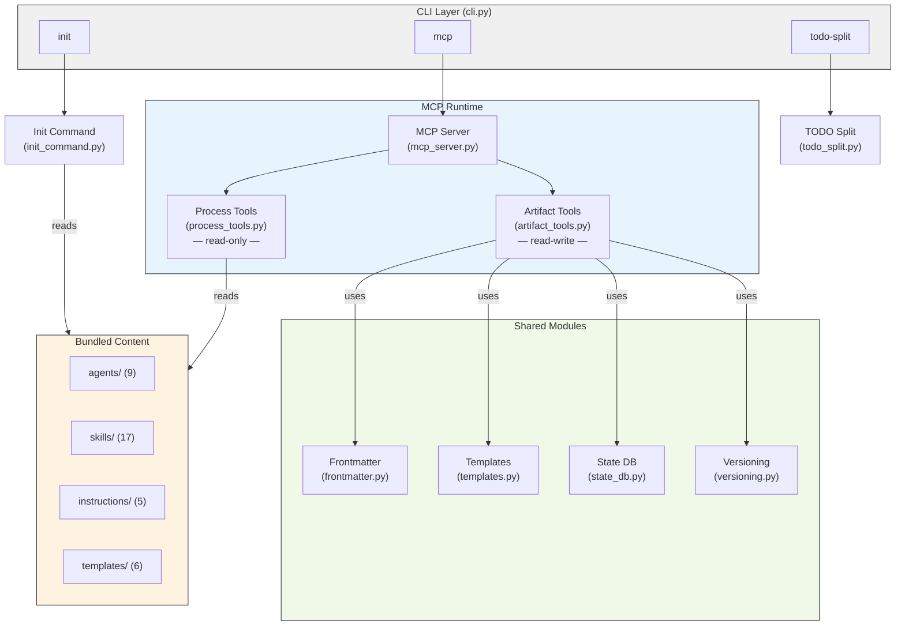
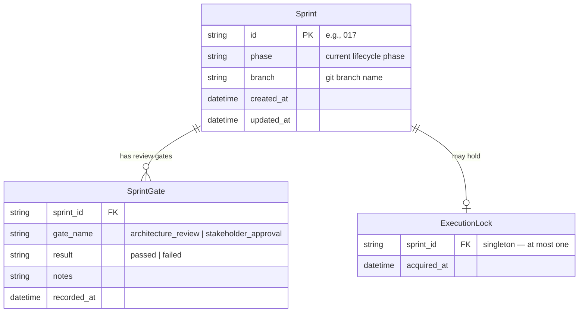
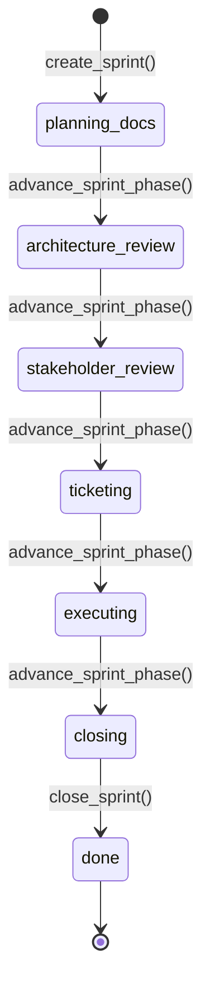
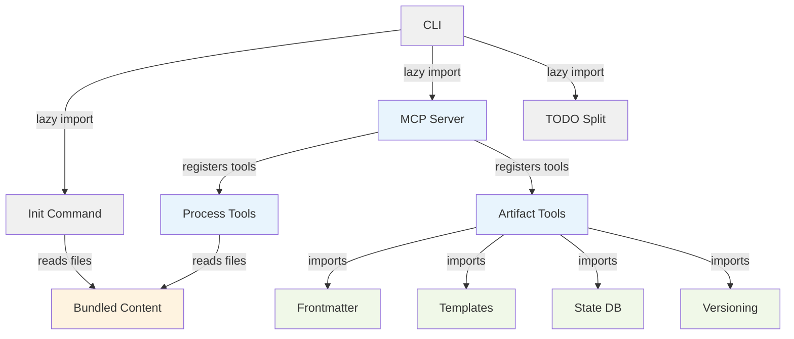

<!-- CLASI: Before changing code or making plans, review the SE process in CLAUDE.md -->

# Architecture 020: Commit Discipline

This document describes the CLASI (Claude Agent Skills Instructions) system
architecture as it exists at the end of sprint 017.

## Architecture Overview

CLASI is a pip-installable Python package (3,200 LOC, 11 modules) that
provides a structured software engineering process for AI coding agents.
The fundamental design insight is that **LLM agents do not reliably follow
behavioral instructions alone** — every documented process failure has been
categorized as `ignored-instruction`. CLASI responds by encoding process
steps into mechanical enforcement: a SQLite state machine with phase
transitions, review gates, and execution locks that physically prevent
agents from skipping steps.

The system has three top-level responsibilities:

1. **Process Content Delivery** — Serving SE process definitions (9 agents,
   17 skills, 5 instructions) to AI agents at runtime via MCP tools.
2. **Project Artifact Management** — Creating and maintaining planning
   artifacts (sprints, tickets, TODOs, architecture docs) in a project's
   repository, enforced by a lifecycle state machine.
3. **Project Initialization** — Installing the CLASI SE process into a new
   repository with minimal footprint (4 files).

The system is designed to be **upgradeable without re-running init** — SE
process content is served from the installed package, so `pip install
--upgrade` updates the process for all projects using it.

## Technology Stack

| Attribute | Value | Justification |
|-----------|-------|---------------|
| Language | Python >=3.10 | Target users are Claude Code / AI agent environments that have Python |
| CLI framework | Click >=8.0 | Lightweight, composable subcommands |
| MCP framework | FastMCP (mcp >=1.0) | Standard protocol for AI agent tool access |
| YAML parsing | PyYAML >=6.0 | Frontmatter I/O for markdown artifacts |
| State storage | SQLite (stdlib) | Zero-dependency, file-based, embedded in project |
| Build system | setuptools >=61.0 | Standard Python packaging |
| Version format | `<major>.<YYYYMMDD>.<build>` | Date-based, auto-incrementing |
| Test framework | pytest + pytest-cov | Standard, with 296 tests |

## Module Design

### CLI (`cli.py`, 61 LOC)

**Purpose**: Routes user commands to the appropriate subsystem.

**Boundary**: Accepts command-line arguments and delegates to implementation
modules. Contains no business logic. Three subcommands: `init`, `mcp`,
`todo-split`.

**Key invariant**: Lazy-loads implementation modules — importing `cli` does
not import MCP or database code.

### Init Command (`init_command.py`, 232 LOC)

**Purpose**: Installs the CLASI SE process into a target repository.

**Boundary**: Reads and writes files in the target directory only. Does not
interact with the MCP server or state database. Completely standalone — no
runtime dependencies on other CLASI modules.

**Outputs** (4 files written to target project):
- `CLAUDE.md` — CLASI process block inline (with `<!-- CLASI:START/END -->`
  markers for idempotent updates)
- `.claude/skills/se/SKILL.md` — `/se` dispatcher skill
- `.mcp.json` + `.vscode/mcp.json` — MCP server configuration
- `.claude/settings.local.json` — MCP permission allowlist

**Key invariant**: All operations are idempotent. Existing content outside
CLASI-delimited sections is preserved.

### MCP Server (`mcp_server.py`, 41 LOC)

**Purpose**: Hosts the FastMCP server instance and resolves paths to
bundled content.

**Boundary**: Owns the server singleton and content path resolution. Does
not define any tools itself — tool registration happens via import side
effects when `process_tools` and `artifact_tools` are imported at startup.

**Interactions**: Imported by Process Tools and Artifact Tools to register
tools against the server singleton via `@mcp_server.tool` decorators.

### Process Tools (`process_tools.py`, 357 LOC)

**Purpose**: Serves bundled SE process content to AI agents.

**Boundary**: Read-only access to the installed package's content
directories. Does not write to the filesystem or modify project state.

**Interface** (13 MCP tools):
- Content listing: `list_agents`, `list_skills`, `list_instructions`,
  `list_language_instructions`
- Content retrieval: `get_agent_definition`, `get_skill_definition`,
  `get_instruction`, `get_language_instruction`
- Composite: `get_se_overview`, `get_activity_guide`,
  `get_use_case_coverage`, `get_version`

### Artifact Tools (`artifact_tools.py`, 1681 LOC)

**Purpose**: Manages project planning artifacts — sprints, tickets, TODOs,
architecture documents, and the project overview.

**Boundary**: Reads and writes files under `docs/plans/` in the project
repository. Interacts with the State Database for lifecycle enforcement.
This is the largest module and the one most likely to need decomposition
in the future.

**Interface** (21 MCP tools):
- Sprint CRUD: `create_sprint`, `insert_sprint`, `list_sprints`,
  `get_sprint_status`, `close_sprint`
- Ticket CRUD: `create_ticket`, `list_tickets`, `update_ticket_status`,
  `move_ticket_to_done`, `reopen_ticket`
- Lifecycle: `get_sprint_phase`, `advance_sprint_phase`,
  `record_gate_result`, `acquire_execution_lock`, `release_execution_lock`
- Artifacts: `create_overview`, `read_artifact_frontmatter`,
  `write_artifact_frontmatter`
- TODO: `list_todos`, `move_todo_to_done`
- Review: `review_sprint_pre_execution`, `review_sprint_pre_close`,
  `review_sprint_post_close`
- Release: `tag_version`
- External: `create_github_issue`

### State Database (`state_db.py`, 454 LOC)

**Purpose**: Enforces the sprint lifecycle state machine.

**Boundary**: Pure data-access layer backed by a local SQLite file
(`.clasi.db`). No MCP decorators, no filesystem operations beyond the
database file.

**Key invariants**:
- Phase transitions are linear — phases cannot be skipped or reversed.
- Review gates must be recorded as `passed` before advancing past review
  phases.
- Only one sprint may hold the execution lock at a time.

### Frontmatter (`frontmatter.py`, 76 LOC)

**Purpose**: Reads and writes YAML frontmatter in markdown files.

**Boundary**: Operates on individual file paths. No knowledge of document
types, sprints, or project structure. Pure utility.

### Templates (`templates.py`, 42 LOC)

**Purpose**: Provides content templates for sprint, ticket, architecture,
and overview markdown files.

**Boundary**: Loads template files from `templates/` directory at import
time. Includes `slugify()` for filename generation. Templates use Python
`str.format()` placeholders.

**Templates** (6): sprint, sprint-brief, sprint-usecases,
sprint-architecture, ticket, overview.

### TODO Split (`todo_split.py`, 103 LOC)

**Purpose**: Splits multi-heading TODO files into individual files.

**Boundary**: Operates on a directory of markdown files. Standalone utility
with no dependencies on other CLASI modules.

### Versioning (`versioning.py`, 118 LOC)

**Purpose**: Computes date-based versions from git tags and updates version
files.

**Boundary**: Reads git tags via subprocess, writes to `pyproject.toml` or
`package.json`. Creates git tags.

### Bundled Content (`agents/`, `skills/`, `instructions/`)

Static markdown files shipped with the package that define the SE process:

- **9 agents**: architect, architecture-reviewer, code-reviewer,
  documentation-expert, product-manager, project-manager, python-expert,
  requirements-analyst, technical-lead
- **17 skills**: plan-sprint, execute-ticket, close-sprint,
  create-tickets, elicit-requirements, project-initiation, and 11 others
- **5 instructions**: software-engineering, architectural-quality,
  coding-standards, git-workflow, testing
- **Language instructions**: per-language coding standards in
  `instructions/languages/`

Served by Process Tools via the MCP Server's content path resolver.

## Data Model

### Sprint Lifecycle (SQLite)

### Sprint Phase State Machine

Gates required before transitions:
- `architecture_review` → `stakeholder_review`: `architecture_review` gate
  must be `passed`
- `stakeholder_review` → `ticketing`: `stakeholder_approval` gate must be
  `passed`
- `ticketing` → `executing`: execution lock must be acquired

### Markdown Artifacts

All planning artifacts use YAML frontmatter for machine-readable metadata,
with a markdown body for human and AI consumption:

| Artifact | Location | Key Metadata |
|----------|----------|-------------|
| Sprint | `docs/plans/sprints/NNN-slug/sprint.md` | id, title, status, branch, use-cases |
| Architecture | `docs/plans/sprints/NNN-slug/architecture.md` | version, status, sprint |
| Use Cases | `docs/plans/sprints/NNN-slug/usecases.md` | status |
| Ticket | `docs/plans/sprints/NNN-slug/tickets/NNN-slug.md` | id, title, status, use-cases, depends-on |
| TODO | `docs/plans/todo/name.md` | status |
| Overview | `docs/plans/overview.md` | status |

## Dependency Graph

**Dependency analysis**:
- **No cycles.** All dependencies flow downward from CLI → implementation →
  shared utilities.
- **Fan-out**: Artifact Tools has 4 dependencies (Frontmatter, Templates,
  State DB, Versioning) — at the upper end but justified by its role as the
  primary read-write module.
- **Stable core**: The shared modules (Frontmatter, Templates, State DB,
  Versioning) are the most depended-upon and the most stable — they change
  infrequently.
- **Isolation**: Init Command, TODO Split, and the MCP runtime are
  completely independent of each other. Init Command doesn't even share
  modules with the MCP path — it reads bundled content directly.

**Known concern**: Artifact Tools at 1,681 LOC is the largest module by a
wide margin and has the highest fan-out. It bundles sprint management,
ticket management, TODO management, review tools, GitHub integration, and
version tagging. While cohesive in the sense that all operations target
`docs/plans/`, it handles too many concerns and would benefit from
decomposition in a future sprint.

## Security Considerations

- The MCP server runs as a local subprocess over stdio — no network
  exposure.
- The state database is a local SQLite file with no authentication. It is
  gitignored (`.clasi.db`).
- `init_command` preserves existing file content outside CLASI-delimited
  sections.
- GitHub issue creation uses `GITHUB_TOKEN` when available, falling back to
  the `gh` CLI. The token is read from environment variables, never stored
  in project files.

## Design Rationale

### DR-001: MCP Server Architecture

**Decision**: Serve process content and artifact management through an MCP
server rather than file-based skill stubs.

**Context**: The original approach wrote individual skill files into the
target project's `.claude/skills/` directory. This required `init` to manage
many files and created a maintenance burden whenever skills changed.

**Alternatives**: (1) File-based skill stubs (original), (2) Monolithic
`AGENTS.md`, (3) MCP server.

**Why MCP**: Skills and agents can be updated by upgrading the package
without re-running `init`. The MCP protocol is the standard interface for
AI agent tool access. A single `/se` dispatcher stub is the only file `init`
needs to write.

**Consequences**: Requires the MCP server to be running for AI agents to
access process content. Adds `mcp` as a dependency.

### DR-002: SQLite State Machine

**Decision**: Use SQLite for sprint lifecycle state rather than
frontmatter-based status tracking.

**Context**: Sprint phases, gates, and execution locks require atomic
operations and constraint enforcement that file-based approaches cannot
reliably guarantee.

**Alternatives**: (1) Frontmatter-only status tracking, (2) JSON state
file, (3) SQLite.

**Why SQLite**: Atomic transactions, constraint enforcement (singleton lock,
unique gates), zero additional dependencies (stdlib). Local-only state is
appropriate since sprint state is per-clone.

**Consequences**: State is local to each clone. Sprint phase must be
re-registered if the database is lost.

### DR-003: Date-Based Versioning

**Decision**: Use `<major>.<YYYYMMDD>.<build>` version format.

**Context**: Traditional semver doesn't suit a process tool where the
distinction between patch/minor/major is ambiguous and changes are frequent.

**Alternatives**: (1) Semver, (2) CalVer (YYYY.MM.DD), (3) Custom
date-based.

**Why this format**: Clear date signal in the version string,
auto-incrementing build number prevents same-day conflicts, major version
reserved for breaking changes.

### DR-004: Inline CLASI into CLAUDE.md

**Decision**: Write the CLASI process block directly into CLAUDE.md instead
of using `@AGENTS.md` indirection. (Sprint 017)

**Context**: Agents repeatedly ignored process instructions. Two reflections
documented the same root cause: instructions in AGENTS.md were deprioritized
because CLAUDE.md is the primary file agents read first.

**Alternatives**: (1) Keep `@AGENTS.md` (status quo), (2) Inline into
CLAUDE.md, (3) Use hooks to force tool calls.

**Why inline**: CLAUDE.md is loaded first and directly into agent context.
No indirection means the process instructions have maximum priority. The
`<!-- CLASI:START/END -->` markers already exist for section replacement, so
the same update mechanism works in either file.

**Consequences**: CLAUDE.md becomes larger. The `agents-section.md` init
template is kept as the single source of truth for the CLASI block content.

### DR-005: Process Reminders in Document Templates

**Decision**: Embed a one-line HTML comment in every document template
reminding agents to consult the SE process. (Sprint 017)

**Context**: Agents lose track of process instructions as their context
fills with sprint documents, tickets, and code. By the time they're reading
a ticket, the CLAUDE.md instructions may have faded from active context.

**Alternatives**: (1) Rely solely on CLAUDE.md/AGENTS.md, (2) Add reminders
to templates, (3) Use hooks to enforce.

**Why templates**: Zero-cost redundancy — the reminder is an HTML comment
invisible to human readers but visible to agents. Placed at the point where
agents are actively reading planning artifacts, maximizing the chance they
see it when it matters.

**Consequences**: Minimal — one line per template. Does not clutter human
reading experience since it's an HTML comment.

## Open Questions

None.

## Sprint Changes

Changes planned for sprint 020:

### Changed Components

**Instruction: `git-workflow`** — Updated with commit timing rules:
run tests before committing, no commits with failing tests (except WIP
on feature branches), commit at TDD green phase before refactoring,
commit refactoring separately.

**Skill: `close-sprint`** — Updated with explicit test-pass gate before
merge to main. Tests must pass on the sprint branch before the merge
step proceeds.

**Skill: `tdd-cycle`** — Updated with commit point references (commit
after green, commit after refactor).

### Migration Concerns

Non-breaking. Content-only changes to bundled instructions and skills.
