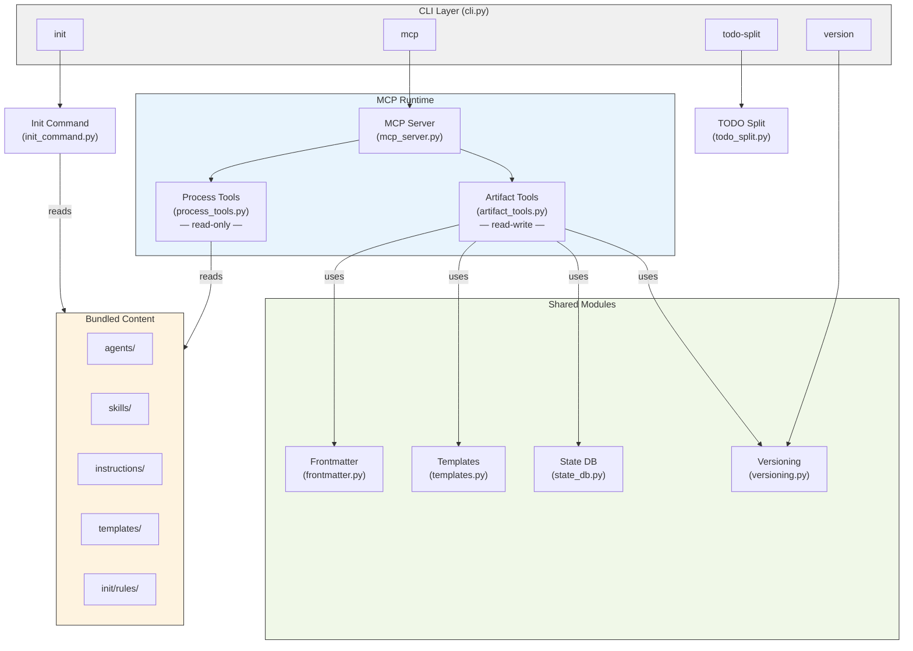
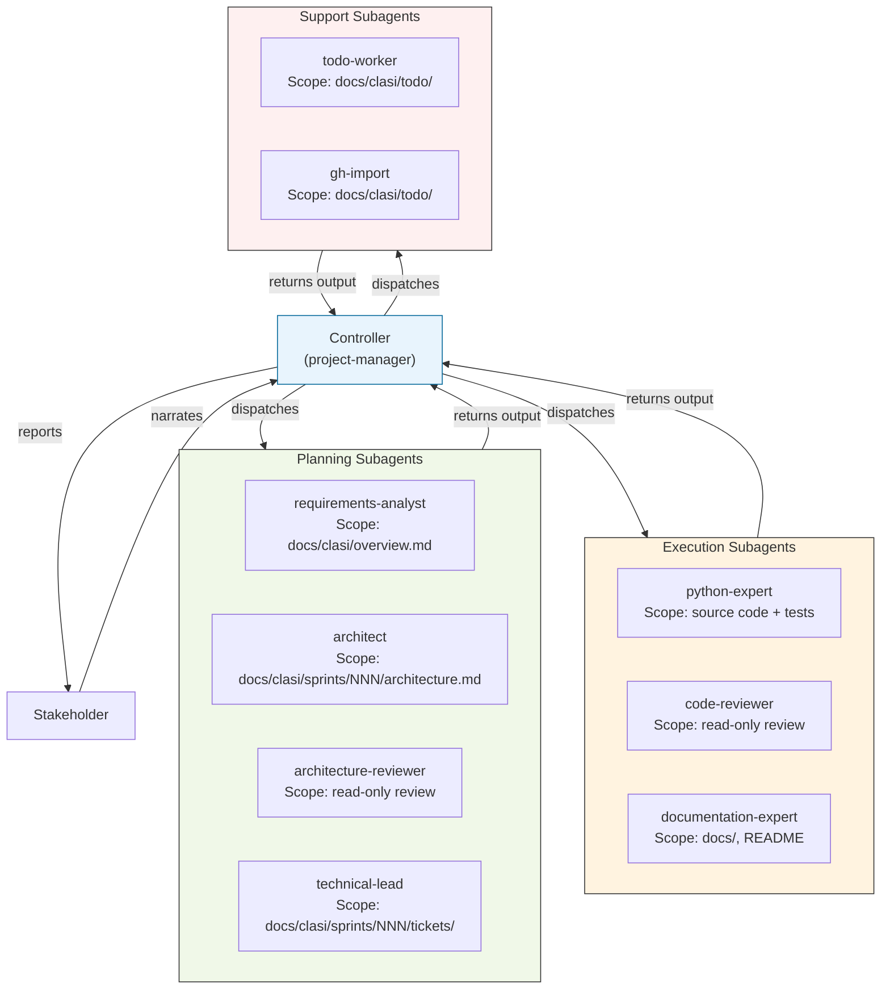
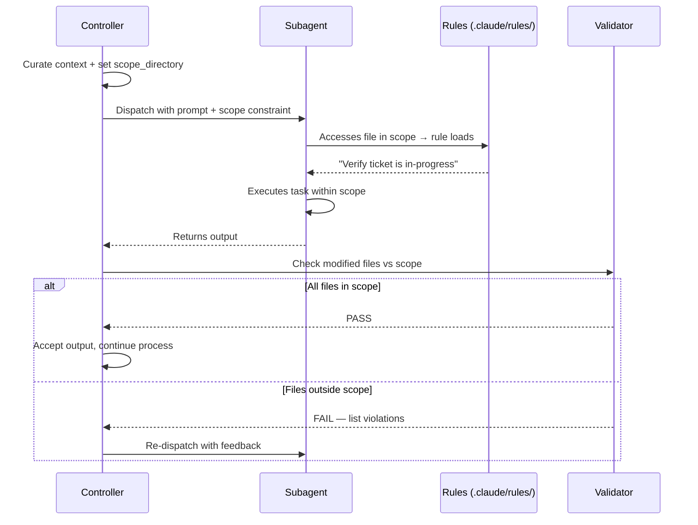
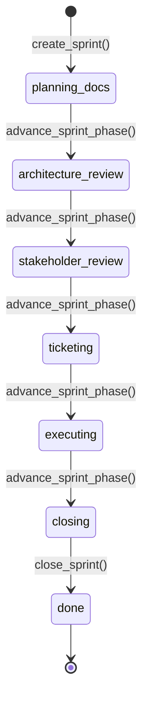

<!-- CLASI: Before changing code or making plans, review the SE process in CLAUDE.md -->

# Architecture 001: CLASI System

This document describes the CLASI system architecture as it will exist
at the end of sprint 001, with significant new sections on the
agent/subagent execution model and process compliance enforcement.

## Architecture Overview

CLASI is a pip-installable Python package that provides a structured
software engineering process for AI coding agents. The fundamental
design insight is that **LLM agents do not reliably follow behavioral
instructions alone** — 12 documented process failures confirm this.
CLASI responds with layered enforcement: a SQLite state machine for
lifecycle gates, path-scoped rules for decision-point reminders, and
directory-scoped subagent dispatch for execution isolation.

The system has four top-level responsibilities:

1. **Process Content Delivery** — Serving SE process definitions
   (agents, skills, instructions) to AI agents at runtime via MCP tools.
2. **Project Artifact Management** — Creating and maintaining planning
   artifacts (sprints, tickets, TODOs, architecture docs) in a project's
   repository, enforced by a lifecycle state machine.
3. **Project Initialization** — Installing the CLASI SE process into a
   new repository: MCP config, skill stubs, rules, and hooks.
4. **Process Compliance Enforcement** — Layered mechanisms that prevent
   agents from bypassing the process at different points in the workflow.

## Agent and Subagent Model

This section describes how CLASI agents are organized, how subagents
are dispatched, and how each is scoped to specific responsibilities.

### Agent Hierarchy

CLASI defines a **controller/worker** pattern. The controller agent
(typically project-manager) orchestrates the process. It never writes
code or planning documents directly — it dispatches specialized
subagents for each task, reviews their output, and advances the process.

### Agent Roles and Scope

Each agent has a defined role, a **scope directory** (where it may
write), and a context set (what it reads).

| Agent | Role | Write Scope | Read Context |
|-------|------|-------------|-------------|
| **project-manager** | Controller — orchestrates, never writes code | None (dispatches only) | All artifacts, sprint state |
| **requirements-analyst** | Produces overview from stakeholder narrative | `docs/clasi/overview.md` | Stakeholder input |
| **architect** | Updates architecture for each sprint | `docs/clasi/sprints/NNN/architecture.md` | Previous architecture, sprint goals |
| **architecture-reviewer** | Reviews architecture (read-only) | None | Architecture doc, existing code |
| **technical-lead** | Creates tickets from architecture | `docs/clasi/sprints/NNN/tickets/` | Architecture, use cases |
| **python-expert** | Implements code per ticket plan | `claude_agent_skills/`, `tests/` | Ticket, plan, architecture, instructions |
| **code-reviewer** | Reviews code changes (read-only) | None | Changed files, ticket, standards |
| **documentation-expert** | Updates documentation | `docs/`, `README.md` | Source code, existing docs |
| **todo-worker** | Creates/manages TODOs | `docs/clasi/todo/` | Issue data, existing TODOs |

### Subagent Dispatch Flow

When the controller dispatches a subagent, three things happen:

1. **Context curation** — The controller selects only the files and
   instructions relevant to the task. See `instructions/subagent-protocol`
   for include/exclude rules.

2. **Scope declaration** — The controller specifies the directory the
   subagent may write to. This is included in the subagent's prompt.

3. **Post-dispatch validation** — After the subagent returns, the
   controller checks which files were modified. If any file is outside
   the declared scope, the output is rejected and the subagent is
   re-dispatched with feedback (max 2 retries, then escalate to
   stakeholder).

### Isolation Model

Subagents are isolated at two levels:

**Context isolation** — Each subagent starts with a fresh context
containing only the curated files and instructions. It does not inherit
the controller's conversation history, other tickets, or debugging
logs from prior attempts.

**Directory isolation** — Each subagent has an explicit write scope.
The subagent can read files from anywhere (it needs to for context),
but may only create or modify files within its scope directory. If the
task requires writing outside the scope, the subagent returns a request
to the controller for expanded scope rather than writing directly.

For parallel execution (opt-in), subagents additionally get **filesystem
isolation** via git worktrees — each subagent works in its own worktree
on its own branch. See `skills/parallel-execution` and
`instructions/worktree-protocol`.

## Process Compliance Enforcement

Four layers of enforcement, from weakest to strongest:

### Layer 1: Instructional (session start)

CLAUDE.md, AGENTS.md, skill definitions, instruction files. Loaded at
session start. Provides the complete process definition but fades from
active context as the session progresses.

**Weakness**: Agents read these once and rely on memory at decision
points. 12 reflections document this failure mode.

### Layer 2: Contextual — Path-Scoped Rules (new in sprint 001)

`.claude/rules/*.md` files with `paths` frontmatter. Claude Code loads
these **on demand** when the agent accesses files matching the path
pattern. Short (3-5 sentences), actionable, and re-injected after
context compaction.

**Rules installed by `clasi init`:**

| Rule file | Path pattern | Fires when |
|-----------|-------------|------------|
| `clasi-artifacts.md` | `docs/clasi/**` | Touching planning artifacts |
| `source-code.md` | `claude_agent_skills/**`, `tests/**` | Modifying source or tests |
| `todo-dir.md` | `docs/clasi/todo/**` | Working in TODO directory |
| `git-commits.md` | `**/*.py`, `**/*.md` | Touching any code or docs |

**Coverage**: Rules target all five documented failure modes (process
bypass, wrong tool selection, no tests before commit, decision-point
consultation, completion bias). See `pc-architecture.md` for the
detailed coverage matrix.

### Layer 3: Mechanical — State Machine (existing)

SQLite state database with phase transitions, review gates, and
execution locks. MCP tools reject invalid operations — `create_ticket`
before ticketing phase, `advance_sprint_phase` without passing review
gates, executing without the lock.

**Strength**: Cannot be bypassed. The tool rejects the action regardless
of what the agent thinks it should do.

### Layer 4: Validation — Post-Hoc Checks (existing + enhanced)

Sprint review MCP tools (`review_sprint_pre_execution`,
`review_sprint_pre_close`, `review_sprint_post_close`) and the new
subagent scope validation. The controller checks subagent output against
the declared scope directory after every dispatch.

## Technology Stack

| Attribute | Value | Justification |
|-----------|-------|---------------|
| Language | Python >=3.10 | Target users are Claude Code / AI agent environments that have Python |
| CLI framework | Click >=8.0 | Lightweight, composable subcommands |
| MCP framework | FastMCP (mcp >=1.0) | Standard protocol for AI agent tool access |
| YAML parsing | PyYAML >=6.0 | Frontmatter I/O for markdown artifacts |
| State storage | SQLite (stdlib) | Zero-dependency, file-based, embedded in project |
| Build system | setuptools >=61.0 | Standard Python packaging |
| Version format | Configurable via `settings.yaml` | Default `X+.YYYYMMDD.R+` |
| Test framework | pytest | 356 tests |

## Module Design

### CLI (`cli.py`)

**Purpose**: Routes user commands to the appropriate subsystem.

**Subcommands**: `init`, `mcp`, `todo-split`, `version`, `version bump`.

### Init Command (`init_command.py`)

**Purpose**: Installs the CLASI SE process into a target repository.

**Outputs** (written to target project):
- `CLAUDE.md` — CLASI process block inline
- `.claude/skills/se/SKILL.md` — `/se` dispatcher skill
- `.claude/rules/*.md` — Path-scoped compliance rules (new)
- `.claude/settings.json` — Session-start hook
- `.claude/settings.local.json` — MCP permission allowlist
- `.mcp.json` + `.vscode/mcp.json` — MCP server configuration

**Key invariant**: All operations are idempotent.

### MCP Server, Process Tools, Artifact Tools

(Unchanged from architecture 021. See previous version for details.)

### State Database (`state_db.py`)

(Unchanged. Enforces sprint lifecycle state machine.)

### Versioning (`versioning.py`)

**Purpose**: Configurable version format, trigger-based auto-versioning,
multi-file sync.

**Settings** (from `docs/clasi/settings.yaml`):
- `version_format` — Token-based format string
- `version_trigger` — `manual`, `every_sprint`, `every_change`
- `version_source` — Primary version file
- `version_sync` — Additional files to update

### Bundled Content

- **9 agents**: architect, architecture-reviewer, code-reviewer,
  documentation-expert, product-manager, project-manager, python-expert,
  requirements-analyst, technical-lead
- **Skills**: plan-sprint, execute-ticket, close-sprint, create-tickets,
  dispatch-subagent, tdd-cycle, systematic-debugging, parallel-execution,
  gh-import, and others
- **Instructions**: software-engineering, architectural-quality,
  coding-standards, git-workflow, testing, subagent-protocol,
  worktree-protocol, dotconfig, rundbat
- **Rules templates**: init/rules/ — installed by `clasi init`

## Data Model

### Sprint Lifecycle (SQLite)

### Markdown Artifacts

| Artifact | Location | Key Metadata |
|----------|----------|-------------|
| Sprint | `docs/clasi/sprints/NNN-slug/sprint.md` | id, title, status, branch, use-cases |
| Architecture | `docs/clasi/sprints/NNN-slug/architecture.md` | version, status, sprint |
| Ticket | `docs/clasi/sprints/NNN-slug/tickets/NNN-slug.md` | id, title, status, use-cases, depends-on, github-issue, todo |
| TODO | `docs/clasi/todo/name.md` | status, sprint, github-issue |
| Settings | `docs/clasi/settings.yaml` | version_format, version_trigger, version_source, version_sync |

## Security Considerations

- The MCP server runs as a local subprocess over stdio — no network
  exposure.
- The state database is a local SQLite file (`.clasi.db`), gitignored.
- `init_command` preserves existing file content outside CLASI-delimited
  sections.
- GitHub operations use `gh` CLI (user's auth), never store tokens.
- All `gh` subprocess calls use list-form arguments (no `shell=True`).

## Design Rationale

### DR-001 through DR-005

(Unchanged from architecture 021.)

### DR-006: Path-Scoped Rules over Subdirectory CLAUDE.md

**Decision**: Use `.claude/rules/*.md` with path frontmatter rather than
placing CLAUDE.md files in each subdirectory. (Sprint 001)

**Context**: Need to inject process reminders at the point where agents
access specific directories. Two options: scatter CLAUDE.md files across
the project, or centralize rules in `.claude/rules/`.

**Alternatives**: (1) Subdirectory CLAUDE.md files, (2) `.claude/rules/`.

**Why rules**: Centralized — all enforcement in one directory, easy to
audit. Path-scoped — same on-demand loading behavior as subdirectory
CLAUDE.md. Installed by `clasi init` — consistent across projects.

**Consequences**: Requires Claude Code support for `.claude/rules/` with
`paths` frontmatter.

### DR-007: Directory Scope as Convention, Not Enforcement

**Decision**: Directory scoping for subagents is prompt-level + post-hoc
validation, not a hard filesystem restriction. (Sprint 001)

**Context**: No mechanism exists to prevent a Claude Code subagent from
writing to arbitrary file paths. The Agent tool's `isolation: "worktree"`
provides whole-repo isolation, not directory-level restriction.

**Alternatives**: (1) Prompt-only restriction, (2) Worktree isolation per
task, (3) Prompt + validation.

**Why prompt + validation**: Prompt tells the subagent the rule.
Validation catches violations after the fact. Together they're much
harder to bypass than either alone. Worktree-per-task is too heavy for
most operations.

**Consequences**: A subagent can still write outside scope; the violation
is caught by the controller and the output is rejected. This is
defense-in-depth, not absolute prevention.

## Open Questions

None.

## Sprint Changes

Changes planned for sprint 001:

### New Components

**Path-scoped rules** (`.claude/rules/`) — Four rule files installed by
`clasi init`. Static markdown with YAML frontmatter.

**Rules templates** (`init/rules/`) — Bundled rule content in the CLASI
package, used by init to create project rules.

### Changed Components

**Init Command (`init_command.py`)** — New `_create_rules()` function.
Follows the same idempotent pattern as other init functions.

**Skill: `dispatch-subagent`** — Updated with `scope_directory` parameter,
post-dispatch validation step, and rejection/re-dispatch flow.

**Instruction: `subagent-protocol`** — New "Directory Scope" section.

### Migration Concerns

Non-breaking. Running `clasi init` on existing projects adds rules
without modifying other artifacts. Dispatch skill changes are additive.
