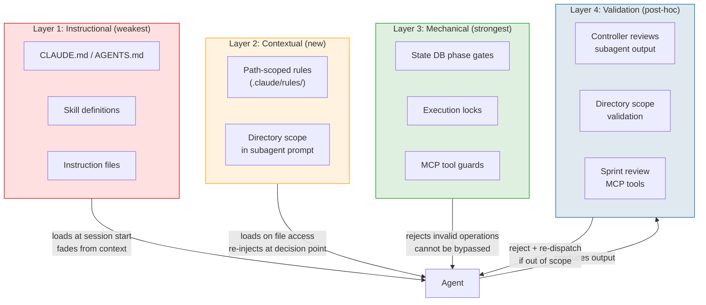
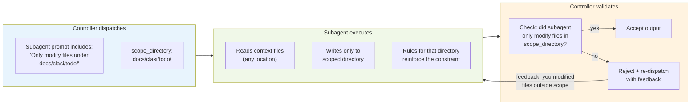

<!-- CLASI: Before changing code or making plans, review the SE process in CLAUDE.md -->

# Architecture 001: Process Compliance via Rules and Scoped Subagents

This document extends the CLASI architecture with two new enforcement
layers: path-scoped rules that inject process reminders at the point
of file access, and directory-scoped subagent dispatch that restricts
what each subagent can modify.

## The Compliance Problem

CLASI has three existing enforcement mechanisms:

1. **Instructional** — CLAUDE.md, AGENTS.md, skill definitions telling
   agents what to do. Loads at session start, fades from context.
2. **Mechanical (state machine)** — SQLite phase transitions, review
   gates, execution locks. Cannot be bypassed — tools reject invalid
   operations.
3. **Hooks** — Session-start hook that echoes a reminder. Fires once,
   agent can ignore.

12 documented reflections show that mechanism 1 fails consistently.
Mechanism 2 works perfectly but only covers sprint lifecycle transitions.
Mechanism 3 is too weak.

This sprint adds two new mechanisms:

4. **Path-scoped rules** — `.claude/rules/` files with `paths` frontmatter.
   Claude Code loads these on demand when the agent accesses files
   matching the path pattern. Short, targeted, re-injected on every
   file access.
5. **Directory-scoped subagents** — Subagents dispatched with an explicit
   working-directory constraint. Controller validates output stays in
   scope.

## Enforcement Layer Model



## Path-Scoped Rules

### How Claude Code loads rules

Rules live in `.claude/rules/*.md`. Each file has YAML frontmatter
with a `paths` field — a list of glob patterns. When the agent reads
or writes a file matching any pattern, Claude Code loads the rule into
context. Rules are:

- **On-demand** — not loaded at session start; loaded when a matching
  file is accessed
- **Re-injected** — loaded again if the agent accesses the path after
  context compaction
- **Additive** — multiple matching rules all load; they don't override
  each other

### Rule inventory

```
.claude/rules/
├── clasi-artifacts.md    # paths: docs/clasi/**
├── source-code.md        # paths: claude_agent_skills/**, tests/**
├── todo-dir.md           # paths: docs/clasi/todo/**
└── git-commits.md        # paths: **/*.py, **/*.md
```

### Rule: clasi-artifacts

```yaml
paths:
  - docs/clasi/**
```

Fires when: agent touches any planning artifact (sprints, tickets,
TODOs, architecture, overview).

Content: Verify active sprint or OOP. Use CLASI MCP tools, not manual
file operations.

### Rule: source-code

```yaml
paths:
  - claude_agent_skills/**
  - tests/**
```

Fires when: agent modifies source code or tests.

Content: Verify in-progress ticket or OOP. Follow execute-ticket skill.
Run tests after changes.

### Rule: todo-dir

```yaml
paths:
  - docs/clasi/todo/**
```

Fires when: agent works in the TODO directory. More specific than
clasi-artifacts — both fire, but this one adds the tool-routing rule.

Content: Use CLASI `todo` skill or `move_todo_to_done` MCP tool. Do
not use generic TodoWrite.

### Rule: git-commits

```yaml
paths:
  - "**/*.py"
  - "**/*.md"
```

Fires when: agent touches any Python or Markdown file (which is nearly
always when committing).

Content: Run tests before committing. Verify sprint branch and
execution lock if on a sprint. Reference ticket ID in commit message.

### Coverage matrix

| Failure Mode | Which rules fire |
|---|---|
| Process bypass (no sprint) | clasi-artifacts, source-code |
| Wrong tool (TodoWrite) | todo-dir |
| No tests before commit | git-commits, source-code |
| Decision-point consultation | source-code (links to execute-ticket) |
| Completion bias | git-commits (verify before commit) |

## Directory-Scoped Subagent Dispatch

### Current model

The `dispatch-subagent` skill defines a controller/worker pattern:
controller curates context, dispatches via the Agent tool, reviews
results. But the subagent has no directory restriction — it can modify
any file it can access.

### New model

The controller specifies a **scope directory** for each subagent. This
is the directory the subagent is allowed to modify. The constraint
operates at three levels:



### Three levels of scope enforcement

1. **Prompt-level** (instructional) — The subagent prompt says "You may
   only create or modify files under `<scope_directory>`." This is the
   weakest but most flexible level. The subagent can still read files
   anywhere (it needs to for context).

2. **Rule-level** (contextual) — If the subagent accesses files outside
   its scope, the rules for those directories fire and remind it of the
   process requirements. This creates friction for out-of-scope writes.

3. **Validation-level** (post-hoc) — The controller reviews the
   subagent's output and checks which files were modified. If any file
   is outside the scope directory, the controller rejects the output
   and re-dispatches with feedback explaining the violation.

### Subagent scope examples

| Task | Subagent type | Scope directory | Can read |
|---|---|---|---|
| Create TODOs from GitHub issues | todo-worker | `docs/clasi/todo/` | issue data, existing TODOs |
| Implement ticket code | python-expert | `claude_agent_skills/`, `tests/` | ticket, architecture, instructions |
| Write sprint planning docs | planner | `docs/clasi/sprints/NNN-slug/` | overview, previous architecture, TODOs |
| Update documentation | doc-writer | `docs/`, `README.md` | source code, existing docs |
| Code review | reviewer | (read-only, no writes) | changed files, ticket, standards |

### Dispatch-subagent skill changes

The skill gains:
- `scope_directory` parameter in the dispatch prompt template
- A post-dispatch validation step that lists modified files and checks
  each against the scope
- Rejection flow: if validation fails, compose a new prompt with the
  violation details and re-dispatch (max 2 retries, then escalate)

### Subagent-protocol instruction changes

The instruction gains a new section: **Directory Scope**
- When dispatching, always specify the scope directory
- Subagents may read files from any location (needed for context)
- Subagents may only write/create/modify files within their scope
- If the task requires writing outside the scope, the subagent should
  return a request to the controller asking for expanded scope

## Init Command Changes

`init_command.py` gains a `_create_rules()` function that:

1. Creates `.claude/rules/` directory
2. Writes each rule file (4 files)
3. Is idempotent: compares content before writing, skips unchanged files
4. Preserves any custom rules the developer has added

The rules content is bundled with the CLASI package (in a new
`init/rules/` directory or as string constants in `init_command.py`).

## Open Questions

None.

## Sprint Changes

Changes planned for sprint 001:

### New Components

**Path-scoped rules** (`.claude/rules/`) — Four rule files installed by
`clasi init`. Not Python code — static markdown with YAML frontmatter.

### Changed Components

**Init Command (`init_command.py`)** — New `_create_rules()` function
to install rule files during init. Follows the same idempotent pattern
as `_write_se_skill` and `_update_hooks_config`.

**Skill: `dispatch-subagent`** — Updated with `scope_directory` parameter,
post-dispatch validation step, and rejection/re-dispatch flow.

**Instruction: `subagent-protocol`** — New "Directory Scope" section
defining the read-anywhere/write-in-scope constraint.

### Migration Concerns

Non-breaking. Rules are new files that don't affect existing behavior.
Running `clasi init` on existing projects adds the rules without
modifying other artifacts. The dispatch skill changes are additive —
subagents dispatched without a scope directory work as before.
