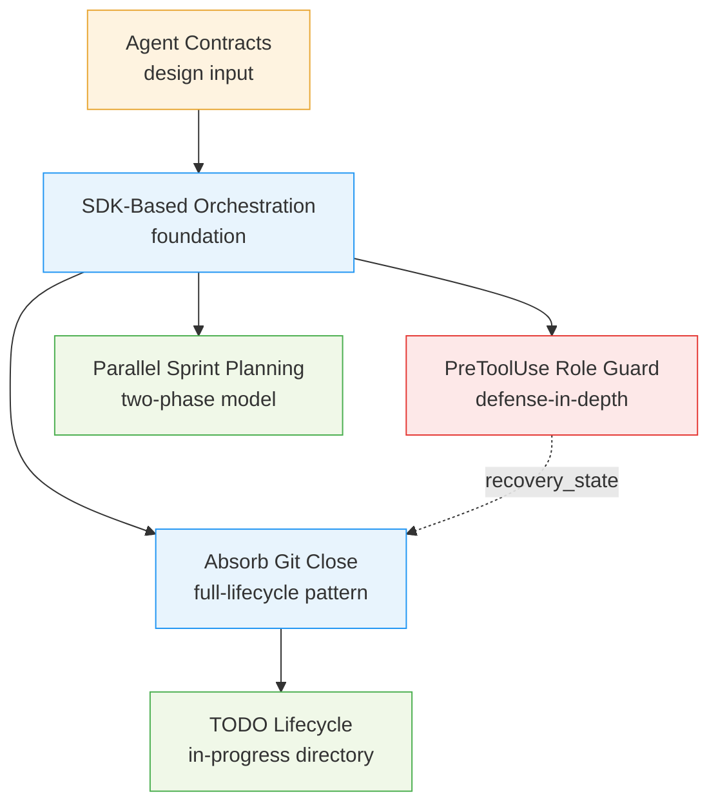

# Sprint 001: SDK-Based Orchestration and Enforcement Hardening

## Goals

This sprint transforms CLASI from an instruction-dependent dispatch model to a
structurally enforced SDK-based orchestration system. The central change is that
`dispatch_to_*` MCP tools own the full subagent lifecycle -- render prompt, log,
execute via Agent SDK `query()`, validate result, log result, return output --
eliminating the uncoupled two-step pattern where the team-lead separately calls
Claude's `Agent` tool.

Specifically, this sprint:

1. **Adds SDK-based orchestration** -- dispatch tools become `async def` and
   call `claude_agent_sdk.query()` internally, making logging and validation
   structurally guaranteed.
2. **Introduces agent contracts** -- each agent gets a `contract.yaml` declaring
   inputs, outputs, return schema, delegation edges, and allowed tools, making
   the process machine-readable and validatable.
3. **Absorbs git operations into `close_sprint`** -- the MCP tool handles merge,
   tag, push, and branch delete atomically, with pre-condition verification and
   self-repair.
4. **Adds a PreToolUse role guard** -- a Python hook blocks the team-lead from
   writing files directly, with recovery-state and OOP bypass mechanisms.
5. **Implements TODO three-state lifecycle** -- TODOs move through pending,
   in-progress, and done states with individual completion tracking.
6. **Enables two-phase sprint planning** -- separates batch roadmap planning
   (high-level, multiple sprints) from detailed planning (one sprint, full
   depth), with late branching at execution time.

## Problem

CLASI's current enforcement model relies on four layers: instructional
(CLAUDE.md, agent.md), contextual (path-scoped rules), mechanical (state
machine), and post-hoc (review tools). The instructional layer -- which governs
dispatch behavior -- fades from context during long conversations. Thirteen
reflections document the team-lead writing artifacts directly instead of
dispatching to subagents.

The dispatch tools currently render a Jinja2 prompt, log it, and return it to
the team-lead. The team-lead then separately calls Claude's `Agent` tool. These
are two uncoupled steps: the team-lead can skip logging, log a different prompt
than it sends, or call `Agent` directly without the dispatch tool. Logging
compliance is a social contract, not a structural property.

Sprint closure is similarly split: the `close_sprint` MCP tool handles CLASI
state (archive, DB, lock), while the agent handles git operations (merge, tag,
push, branch delete) as separate manual steps. Multiple reflections document
divergence between git state and CLASI state.

## Solution

Make the dispatch tools the single entry point for all subagent work. Each
`dispatch_to_*` tool renders the prompt, logs it, loads the agent contract,
calls `query()`, validates the return against the contract schema, logs the
result, and returns structured JSON. The team-lead never calls `Agent` directly.

This approach is paired with:
- **Agent contracts** that declare what each dispatch tool should configure and
  validate, making the process inspectable and enforceable.
- **A PreToolUse hook** that mechanically blocks the team-lead from writing
  files, serving as defense-in-depth once SDK dispatch removes the `Agent` tool
  from the team-lead's vocabulary.
- **Full-lifecycle `close_sprint`** that absorbs all git operations, with
  recovery state for partial failures.
- **Two-phase planning** that separates roadmap planning (batch, lightweight)
  from detailed planning (single sprint, full artifacts), with late branching
  at execution time.

## Success Criteria

1. All 11 dispatch tools implemented as `async def` functions calling `query()`.
2. Every dispatch produces a dispatch log entry (pre and post) without agent
   cooperation -- logging is in the tool's code path.
3. Agent contracts exist for all agents with dispatch tools, validated by
   `contract-schema.yaml`.
4. `close_sprint` handles merge, tag, push, and branch delete in a single call.
   The close-sprint skill is 3 steps, not 15.
5. `close_sprint` writes a recovery record on partial failure; retrying after
   recovery succeeds.
6. PreToolUse hook blocks Write/Edit/MultiEdit from the team-lead session.
   Recovery state allows targeted path exceptions.
7. TODOs move through pending/in-progress/done directories with individual
   completion tracking tied to ticket closure.
8. Sprint-planner dispatch supports `mode` parameter (`roadmap` vs `detail`)
   with different validation contracts per mode.
9. All existing tests pass; new tests cover dispatch tools, contracts, recovery
   state, role guard, and TODO lifecycle.

## Scope

### In Scope

- **New module: `dispatch_tools.py`** -- all 11 `dispatch_to_*` functions,
  extracted from `artifact_tools.py` into a dedicated orchestration module.
- **New files: `contract.yaml` per agent** -- machine-readable contracts for
  all agents that have dispatch tools (11 agents).
- **New file: `contract-schema.yaml`** -- JSON Schema (draft 2020-12, written
  in YAML) validating all contract files.
- **New file: `hooks/role_guard.py`** -- Python PreToolUse hook script,
  installed by `clasi init`.
- **New directory: `docs/clasi/todo/in-progress/`** -- physical directory for
  in-progress TODOs.
- **Modified: `artifact_tools.py`** -- remove the 3 existing dispatch functions
  and `log_subagent_dispatch` / `update_dispatch_log` tools (replaced by
  dispatch_tools.py).
- **Modified: `state_db.py`** -- add `recovery_state` table, TTL mechanism.
  WAL mode is already enabled.
- **Modified: `init_command.py`** -- register PreToolUse hook, install
  `role_guard.py`, create `todo/in-progress/` directory.
- **Modified: `mcp_server.py`** -- import and register dispatch_tools.
- **Modified: `pyproject.toml`** -- add `claude-agent-sdk` dependency.
- **Model selection in contracts** -- each contract.yaml specifies the Claude
  model; dispatch tools pass it to ClaudeAgentOptions.
- **Modified: agent.md files** -- remove references to calling `Agent` directly;
  add references to reading contracts.
- **Modified: close-sprint skill** -- shrink from 15 steps to 3.
- **Modified: `close_sprint` MCP tool** -- add git parameters, pre-condition
  verification with self-repair, recovery state, structured result.
- **Modified: `create_ticket` tool** -- move referenced TODOs to in-progress.
- **Modified: `move_todo_to_done` tool** -- support individual TODO completion.

### Out of Scope

- **Parallel sprint execution** -- execution remains strictly serial, gated by
  the execution lock. Only Phase 1 roadmap planning is parallelized.
- **Background/non-blocking dispatch** -- dispatch tools block until the
  subagent completes. Background task management is a future enhancement if
  timeout issues emerge.
- **Formal delegation condition language** -- the `when` field in contracts
  remains informal prose, not a machine-evaluated grammar.
- **Process overview generation from contracts** -- updating `get_se_overview`
  to generate from contracts is desirable but not required for this sprint.
- **add-applicability-conditions-to-project-knowledge.md** -- independent TODO,
  no dependency on orchestration.
- **use-case-review-and-developer-engagement.md** -- explicitly marked
  "do not implement yet."
- **CI contract validation** -- the schema and validation code are created, but
  CI pipeline integration is out of scope.

## Dependencies Between Work Streams

The six TODOs have a clear dependency ordering:

1. **Agent Contracts** (design input) -- defines what dispatch tools need to
   pass and validate. Informs all other work.
2. **SDK-Based Orchestration** (foundation) -- must land first. Reads contracts
   to configure `query()`.
3. **Absorb Git Close** (depends on SDK) -- first tool to adopt the
   full-lifecycle pattern. Recovery state mechanism is shared with the role
   guard.
4. **PreToolUse Role Guard** (depends on SDK) -- defense-in-depth once SDK
   dispatch removes `Agent` from team-lead. Checks recovery state from the
   close-sprint work.
5. **TODO Lifecycle** (depends on Git Close) -- in-progress state feeds
   close_sprint's pre-condition verification.
6. **Parallel Sprint Planning** (depends on SDK) -- dispatch topology change
   requires SDK dispatch as the only dispatch path.

## Risk Assessment

| Risk | Likelihood | Impact | Mitigation |
|------|-----------|--------|------------|
| `query()` timeout on long subagent runs | Medium | High | Start with blocking calls (Option A). FastMCP supports async tools. Add background-task mechanism later if needed. |
| Concurrent SQLite access from nested subagents | Medium | Medium | WAL mode already enabled in `state_db.py`. Test concurrent access from parent + child MCP instances. |
| PreToolUse hook false positives during legitimate OOP work | Low | Medium | `.clasi-oop` flag file bypass. Recovery state allows targeted paths. Start conservative, expand safe list. |
| Agent contracts over-constraining subagent behavior | Low | Medium | Contracts declare structure, not behavior. Agent.md prose remains the behavioral guide. |
| Large PR size (6 TODOs in one sprint) | High | Medium | Clear dependency ordering enables sequential ticket execution. Each ticket is independently testable. |
| `close_sprint` partial failure leaves inconsistent state | Medium | High | Recovery state table, idempotent steps (each detects if already done), TTL for stale records. |

## Design Decisions

These decisions were resolved during TODO cluster analysis:

1. **Single MCP instance** -- dispatch tools live in the same FastMCP server.
   `query()` calls are async and block the tool invocation until the subagent
   completes. Simpler than process management; timeout issues addressed later
   if they emerge.

2. **WAL mode for SQLite** -- already enabled in `state_db.py`. Handles
   concurrent reads from parent + child MCP instances safely. Writes are
   serialized by SQLite.

3. **Separate `contract.yaml`** -- agent.md stays pure prose for human readers
   and system prompts. contract.yaml is the machine-readable contract. JSON
   Schema validates the contract format.

4. **`--no-ff` merge** -- `close_sprint` defaults to `git merge --no-ff` so
   sprint boundaries are visible in `git log --graph`.

5. **Python role guard script** -- the PreToolUse hook is a Python script (not
   bash) that uses the same `state_db.py` module to check recovery state.
   Installed by `clasi init` as `.claude/hooks/role_guard.py`.

6. **Late branching** -- sprint branches created by `acquire_execution_lock`,
   not during planning. Only one branch at a time. Detailed planning runs
   against latest main, so artifacts are always current.

7. **Per-agent model selection** -- each agent's `contract.yaml` specifies
   which Claude model to use (`opus`, `sonnet`, `haiku`). The dispatch tool
   reads this and passes it to `ClaudeAgentOptions`. Defaults to `sonnet`
   when omitted. This allows cost and speed optimization: complex planning
   agents use Opus, implementation agents use Sonnet, and simple utility
   agents (todo-worker, code-reviewer) can use Haiku.

## Test Strategy

- **Unit tests** for each dispatch tool: mock `query()`, verify logging calls,
  contract loading, return validation, and structured JSON output.
- **Unit tests** for contract schema validation: valid contracts pass, invalid
  contracts fail with clear errors.
- **Unit tests** for `close_sprint` extended flow: mock git subprocess calls,
  verify pre-condition checks, self-repair actions, recovery state writes,
  idempotent step detection.
- **Unit tests** for `role_guard.py`: mock tool input JSON, verify blocking
  and allowing based on path, recovery state, safe list, OOP bypass.
- **Unit tests** for TODO lifecycle: verify moves between pending/in-progress/
  done, frontmatter updates, individual completion.
- **Integration test** for contract-schema.yaml: load all contract.yaml files,
  validate against schema, check delegation edge references.
- **Existing test suite** must continue to pass throughout.

## Architecture Notes

See `technical-plan.md` for the comprehensive architecture update. Key
architectural changes:

- The MCP server gains a fifth responsibility: **subagent orchestration**.
- Enforcement shifts from instructional-primary to **structural-primary**
  (SDK dispatch) with instructional, contextual, mechanical, and validation
  layers as defense-in-depth.
- `dispatch_tools.py` becomes a new module alongside `process_tools.py` and
  `artifact_tools.py`.
- The state DB gains a `recovery_state` table for partial-failure recovery.

## Definition of Ready

Before tickets can be created, all of the following must be true:

- [x] Sprint planning documents are complete (sprint.md, use cases, technical plan)
- [ ] Architecture review passed
- [ ] Stakeholder has approved the sprint plan

## Tickets

(To be created after sprint approval.)
