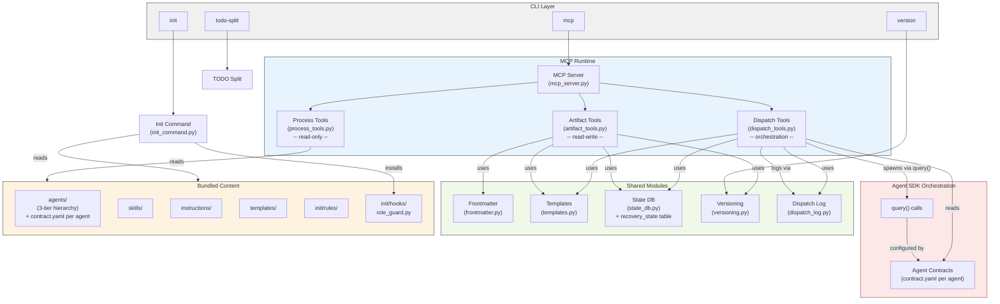
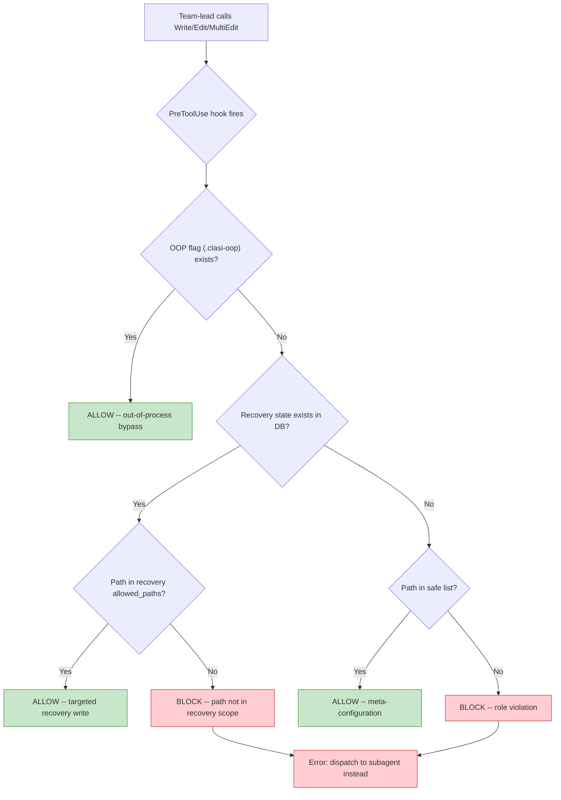
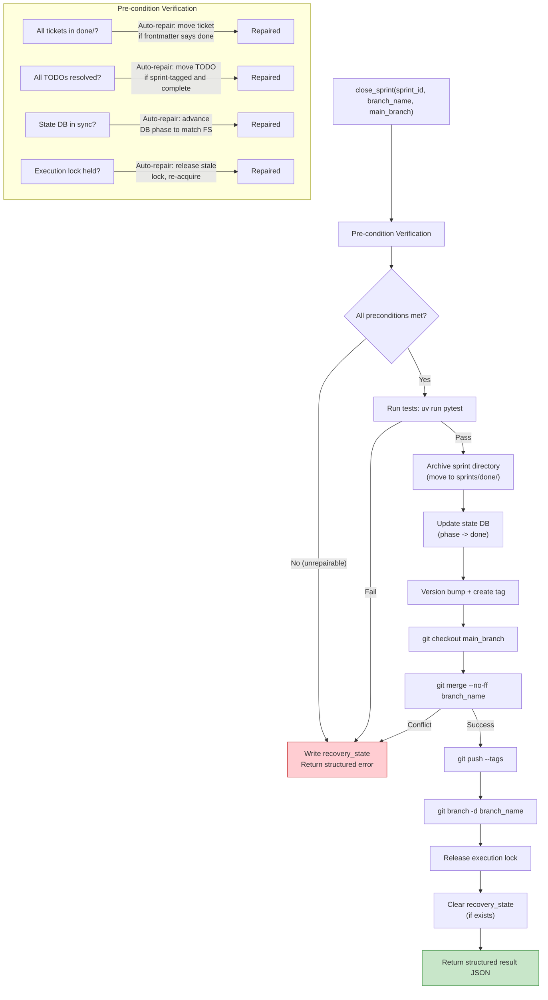
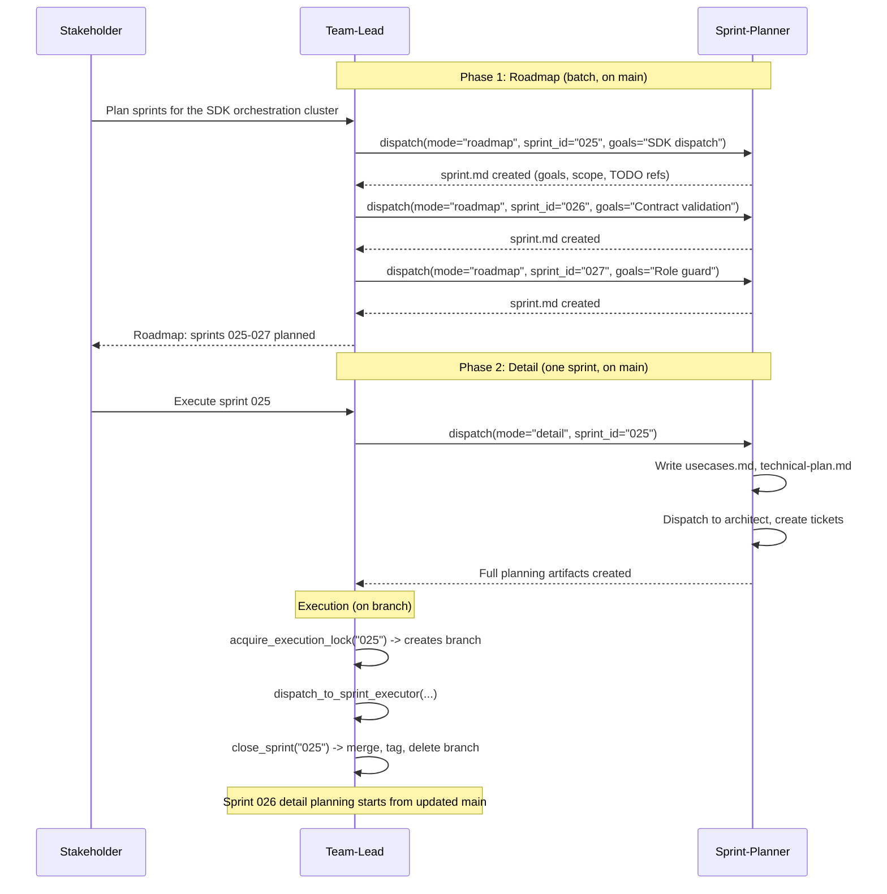
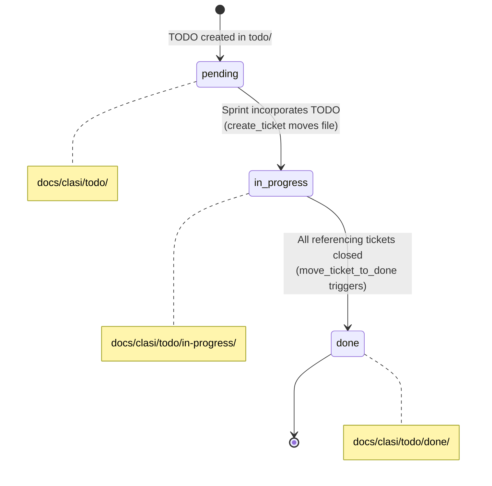

# Sprint 001 Technical Plan

This document is the architecture update for Sprint 001: SDK-Based
Orchestration and Enforcement Hardening. It describes the target
architecture after the sprint, serving as the reference for all ticket
implementation.

## 1. System Responsibilities (Revised)

The CLASI MCP server currently has four responsibilities. This sprint adds
a fifth and restructures enforcement.

| # | Responsibility | Current State | After Sprint 001 |
|---|---------------|---------------|------------------|
| 1 | Process Content Delivery | MCP tools serve agents, skills, instructions | Unchanged |
| 2 | Artifact Management | MCP tools create/move sprints, tickets, TODOs | Extended: TODO three-state lifecycle (pending/in-progress/done) |
| 3 | Project Initialization | `clasi init` installs config, rules, hooks | Extended: installs PreToolUse role guard hook, creates `todo/in-progress/` |
| 4 | Compliance Enforcement | 4-layer model (instructional, contextual, mechanical, post-hoc) | Restructured: structural enforcement primary, others defense-in-depth |
| 5 | **Subagent Orchestration** | **Does not exist** -- team-lead calls `Agent` directly | **New**: dispatch tools own full subagent lifecycle via Agent SDK `query()` |


## 2. Component Architecture

### Current Architecture

The MCP server has two tool modules (`process_tools.py` for read-only,
`artifact_tools.py` for read-write) plus shared modules (frontmatter,
templates, state_db, versioning, dispatch_log). Dispatch functions live
inside `artifact_tools.py` alongside artifact management tools.

### Target Architecture



### Why dispatch moves out of artifact_tools.py

The three existing dispatch functions in `artifact_tools.py` (lines 1955-2093)
are qualitatively different from artifact management tools. Artifact tools
create, move, and modify files on disk. Dispatch tools spawn and manage
subagent sessions -- a different kind of work with different dependencies
(Agent SDK, contract loading, return validation).

After this sprint, dispatch_tools.py contains 11 `async def` functions that
depend on `claude_agent_sdk`, `jsonschema`, dispatch_log, templates, and
contracts. This is a distinct module with its own concerns:

- `artifact_tools.py` -- filesystem operations (sprints, tickets, TODOs)
- `dispatch_tools.py` -- orchestration operations (render, log, query, validate)
- `process_tools.py` -- read-only content delivery (agents, skills, instructions)

The `mcp_server.py` file gains one new import:

```python
from claude_agent_skills import dispatch_tools  # registers tools with server
```

The `log_subagent_dispatch` and `update_dispatch_log` MCP tools in
`artifact_tools.py` are removed -- they are superseded by the dispatch tools
which log automatically.


## 3. Dispatch Tool Contract Pattern

Every `dispatch_to_*` tool follows this 7-step pattern:

```
1. RENDER   -- Jinja2 template + parameters -> prompt text
2. LOG      -- log_dispatch() -> pre-execution dispatch log entry
3. LOAD     -- contract.yaml -> ClaudeAgentOptions config
4. EXECUTE  -- query(prompt, options) -> subagent session
5. VALIDATE -- jsonschema.validate() on return JSON + file checks
6. LOG      -- update_dispatch_result() -> post-execution log entry
7. RETURN   -- structured JSON to caller
```

### Code Example

```python
@server.tool()
async def dispatch_to_sprint_planner(
    sprint_id: str,
    sprint_directory: str,
    todo_ids: list[str],
    goals: str,
    mode: str = "detail",
) -> str:
    """Dispatch to the sprint-planner agent via Agent SDK.

    Renders the dispatch template, logs the dispatch, executes the
    subagent via query(), validates the result against the agent
    contract, logs the result, and returns structured JSON.

    Args:
        sprint_id: The sprint ID (e.g., '001')
        sprint_directory: Path to the sprint directory
        todo_ids: List of TODO IDs to address
        goals: High-level goals for the sprint
        mode: Planning mode -- 'roadmap' (lightweight) or 'detail' (full)
    """
    import json
    from pathlib import Path
    from claude_agent_sdk import query, ClaudeAgentOptions, ResultMessage
    from claude_agent_skills.dispatch_log import log_dispatch, update_dispatch_result
    from claude_agent_skills.contracts import load_contract, validate_return

    # 1. RENDER
    template = _load_jinja2_template("sprint-planner")
    rendered = template.render(
        sprint_id=sprint_id,
        sprint_directory=sprint_directory,
        todo_ids=todo_ids,
        goals=goals,
        mode=mode,
    )

    sprint_name = Path(sprint_directory).name

    # 2. LOG (pre-execution -- always happens)
    log_path = log_dispatch(
        parent="team-lead",
        child="sprint-planner",
        scope=sprint_directory,
        prompt=rendered,
        sprint_name=sprint_name,
        template_used="dispatch-template.md.j2",
    )

    # 3. LOAD contract
    contract = load_contract("sprint-planner")
    options = ClaudeAgentOptions(
        system_prompt=_load_agent_system_prompt("sprint-planner"),
        cwd=sprint_directory,
        allowed_tools=contract["allowed_tools"],
        mcp_servers=contract.get("mcp_servers", []),
        model=contract.get("model", "sonnet"),
    )

    # 4. EXECUTE
    result_text = ""
    try:
        async for message in query(prompt=rendered, options=options):
            if isinstance(message, ResultMessage):
                result_text = message.result
    except Exception as e:
        update_dispatch_result(log_path, result="error", response=str(e))
        return json.dumps({"status": "error", "message": str(e), "log_path": str(log_path)})

    # 5. VALIDATE
    validation = validate_return(contract, mode, result_text, sprint_directory)

    # 6. LOG (post-execution -- always happens)
    update_dispatch_result(log_path, result=validation["status"], response=result_text)

    # 7. RETURN
    return json.dumps({
        "status": validation["status"],
        "result": result_text,
        "log_path": str(log_path),
        "validations": validation,
    }, indent=2)
```

### All 11 Dispatch Tools

| Dispatch Tool | Caller | Target | Key Parameters |
|--------------|--------|--------|----------------|
| `dispatch_to_requirements_narrator` | team-lead | requirements-narrator | project_path |
| `dispatch_to_todo_worker` | team-lead | todo-worker | todo_ids, action |
| `dispatch_to_sprint_planner` | team-lead | sprint-planner | sprint_id, sprint_directory, todo_ids, goals, mode |
| `dispatch_to_sprint_executor` | team-lead | sprint-executor | sprint_id, sprint_directory, branch_name, tickets |
| `dispatch_to_ad_hoc_executor` | team-lead | ad-hoc-executor | task_description, scope_directory |
| `dispatch_to_sprint_reviewer` | team-lead | sprint-reviewer | sprint_id, sprint_directory |
| `dispatch_to_architect` | sprint-planner | architect | sprint_id, sprint_directory |
| `dispatch_to_architecture_reviewer` | sprint-planner | architecture-reviewer | sprint_id, sprint_directory |
| `dispatch_to_technical_lead` | sprint-planner | technical-lead | sprint_id, sprint_directory, tickets |
| `dispatch_to_code_monkey` | sprint-executor, ad-hoc-executor | code-monkey | ticket_path, ticket_plan_path, scope_directory, sprint_name, ticket_id |
| `dispatch_to_code_reviewer` | ad-hoc-executor | code-reviewer | file_paths, review_scope |

Each tool is a typed function -- not a generic "dispatch to anyone" mechanism.
Each knows its target agent's contract and validates accordingly.


## 4. Agent Contract System

### contract.yaml Schema

Each agent gets a `contract.yaml` alongside its `agent.md`. The contract
declares the agent's interface in machine-readable form.

**Top-level fields:**

| Field | Type | Purpose |
|-------|------|---------|
| `name` | string | Agent identifier, matches directory name |
| `tier` | 0, 1, or 2 | Hierarchy level |
| `description` | string | One-paragraph role summary |
| `inputs` | object | `required` and `optional` arrays of input specs |
| `outputs` | object or keyed-by-mode | Files the agent must produce |
| `returns` | object | JSON Schema for the agent's return value |
| `delegates_to` | array | Delegation edges with `agent`, `mode`, `when` |
| `allowed_tools` | array | Tools for the SDK session |
| `mcp_servers` | array | MCP servers the agent connects to |
| `model` | string | Claude model to use for this agent's SDK session. Values: `"opus"`, `"sonnet"`, `"haiku"`. Defaults to `"sonnet"` if omitted. |
| `cwd` | string | Working directory (supports template variables like `{sprint_directory}`) |

**Input spec fields:**

| Field | Required | Purpose |
|-------|----------|---------|
| `name` | yes | Reference name used in agent.md prose |
| `type` | yes | `file`, `file-list`, `text`, or `interactive` |
| `description` | yes | What this input is |
| `pattern` | no | Glob pattern for where it typically lives |
| `default` | no | Default path if caller doesn't provide one |

**Output spec fields:**

| Field | Required | Purpose |
|-------|----------|---------|
| `path` | yes | Expected output file (globs allowed) |
| `min_count` | no | Minimum files matching a glob |
| `frontmatter` | no | Expected YAML frontmatter fields |
| `acceptance_criteria_checked` | no | All criteria must be `[x]` |

**Delegation edge fields:**

| Field | Required | Purpose |
|-------|----------|---------|
| `agent` | yes | Target agent name |
| `mode` | no | Which mode if target has multiple |
| `when` | yes | Human-readable condition string (informal, not machine-evaluated) |

### Example: Sprint-Planner Contract (Two-Mode)

```yaml
name: sprint-planner
tier: 1
model: "opus"
description: >
  Plans sprints from TODOs and stakeholder goals. Produces sprint
  documents, use cases, architecture updates, and tickets. Operates
  in two modes: roadmap (batch, lightweight) and detail (single
  sprint, full artifacts).

inputs:
  required:
    - name: sprint-goals
      type: text
      description: High-level goals from the team-lead
    - name: todo-list
      type: file-list
      description: TODO files to address in this sprint
      pattern: "docs/clasi/todo/*.md"
  optional:
    - name: sprint-guidance
      type: file
      description: External constraints on how to structure work
    - name: prior-architecture
      type: file
      description: Current system architecture for reference
      default: "docs/clasi/architecture/current.md"
    - name: supplementary-context
      type: file-list
      description: Design sketches, meeting notes, anything to consider

outputs:
  roadmap:
    - path: sprint.md
      frontmatter:
        status: planned
  detail:
    - path: sprint.md
      frontmatter:
        status: planned
        phase: planning-docs
    - path: usecases.md
    - path: technical-plan.md
    - path: "tickets/*.md"
      min_count: 1

returns:
  type: object
  required: [status, summary, files_created]
  properties:
    status:
      type: string
      enum: [success, partial, failed]
    summary:
      type: string
      description: Human-readable summary of what was accomplished
    files_created:
      type: array
      items:
        type: string
      description: Paths to files created or modified
    ticket_ids:
      type: array
      items:
        type: string
      description: IDs of tickets created (detail mode only)
    errors:
      type: array
      items:
        type: string
      description: Issues encountered (present when status != success)

delegates_to:
  - agent: architect
    when: "Detail mode -- after writing use cases, before creating tickets"
  - agent: architecture-reviewer
    when: "Detail mode -- after architect produces architecture document"
  - agent: technical-lead
    when: "Detail mode -- when ticket implementation planning requires technical depth"

allowed_tools:
  - Read
  - Write
  - Edit
  - Bash
  - Glob
  - Grep
  - "mcp__clasi__*"

mcp_servers:
  - clasi

cwd: "{sprint_directory}"
```

### Example: Code-Monkey Contract (Leaf Agent)

```yaml
name: code-monkey
tier: 2
model: "sonnet"
description: >
  Implements code changes for a single ticket. Reads the ticket and
  ticket plan, writes code and tests, updates frontmatter on
  completion. Does not delegate to other agents.

inputs:
  required:
    - name: ticket
      type: file
      description: The ticket file with requirements and acceptance criteria
    - name: ticket-plan
      type: file
      description: Implementation plan for the ticket
  optional:
    - name: implementation-notes
      type: file
      description: Stakeholder preferences or constraints for this ticket

outputs:
  - path: "{ticket_path}"
    frontmatter:
      status: done
    acceptance_criteria_checked: true

returns:
  type: object
  required: [status, summary, files_changed, test_results]
  properties:
    status:
      type: string
      enum: [success, partial, failed]
    summary:
      type: string
    files_changed:
      type: array
      items:
        type: string
    test_results:
      type: object
      properties:
        passed:
          type: integer
        failed:
          type: integer
        total:
          type: integer
    errors:
      type: array
      items:
        type: string

delegates_to: []

allowed_tools:
  - Read
  - Write
  - Edit
  - Bash
  - Glob
  - Grep
  - "mcp__clasi__*"

mcp_servers:
  - clasi

cwd: "{scope_directory}"
```

### How Dispatch Tools Read Contracts

The dispatch tool flow for contract usage:

1. `load_contract(agent_name)` reads and parses the agent's `contract.yaml`.
2. The tool configures `ClaudeAgentOptions` from the contract:
   - `allowed_tools` from `contract.allowed_tools`
   - `mcp_servers` from `contract.mcp_servers` (resolved to MCP config)
   - `cwd` from `contract.cwd` (template variables replaced)
3. The contract content is included in the agent's prompt so the agent can
   read its own return schema and output expectations.
4. After `query()` returns, the tool calls `validate_return(contract, mode, result_text, work_dir)`:
   - Extracts JSON from the agent's final message
   - Validates against `contract.returns` using `jsonschema.validate()`
   - Checks `contract.outputs[mode]` for file existence and frontmatter

### How Agents Read Their Own Contracts

The contract is passed to the agent in two ways:

1. **Included in the dispatch prompt** -- the dispatch tool appends the
   relevant contract sections to the rendered prompt. The agent sees its
   return schema and output expectations inline.
2. **Via `get_agent_definition`** -- the MCP tool is extended to return the
   parsed `contract.yaml` alongside `agent.md` content. Agents that delegate
   can read their target's contract to understand what to pass.

### Contract Validation (contract-schema.yaml)

A `contract-schema.yaml` file (JSON Schema draft 2020-12, written in YAML)
validates all contract files. This enables:

- **Runtime validation** by dispatch tools before using a contract
- **CI validation** of all contracts against the schema
- **Self-documentation** -- the schema describes every field

```python
import yaml
import jsonschema

schema = yaml.safe_load(open("contract-schema.yaml"))
contract = yaml.safe_load(open("sprint-planner/contract.yaml"))
jsonschema.validate(contract, schema)
```

The `jsonschema` package is added to `pyproject.toml` dependencies.


## 5. Enforcement Model (Revised)

### Before/After Comparison

**Current (4 independent layers):**

| Layer | Mechanism | Reliability |
|-------|-----------|-------------|
| 1. Instructional | CLAUDE.md, agent.md | Fades from context in long conversations |
| 2. Contextual | Path-scoped rules (`.claude/rules/`) | Re-injected on file access; effective within scope |
| 3. Mechanical | State machine (sprint phases, execution lock) | Rejects invalid state transitions; reliable |
| 4. Post-hoc | Review tools, reflections | Catches after the fact; does not prevent |

**After Sprint 001 (structural-primary + 4 defense-in-depth):**

| Layer | Mechanism | Reliability |
|-------|-----------|-------------|
| **Primary: Structural** | **SDK dispatch -- team-lead cannot call `Agent` directly** | **Guaranteed by code path -- no bypass possible** |
| 1. Instructional | CLAUDE.md, agent.md | Less critical for dispatch; still matters for subagent behavior |
| 2. Contextual | Path-scoped rules | Unchanged; fires when subagents access files |
| 3. Mechanical | State machine + **PreToolUse role guard** | State machine unchanged; **hook blocks direct writes** |
| 4. Validation | **Dispatch tool return validation** | **Upgraded: inline validation before result propagates** |

The shift: from "hope the agent follows instructions and catch it afterward"
to "the agent physically cannot take the wrong path, and the tools validate
results before propagating them."

### PreToolUse Role Guard Decision Tree



**Safe list** (paths the team-lead may write directly):
- `.claude/` -- settings, hooks, meta-configuration
- `CLAUDE.md` -- process document
- `AGENTS.md` -- process document

**OOP bypass**: The ad-hoc-executor dispatch tool creates a `.clasi-oop`
flag file in the project root. While it exists, the hook allows all writes.
The flag is removed when the OOP task completes.

### Recovery State Interaction

When `close_sprint` encounters an unrecoverable error:

1. It writes a `recovery_state` record with `allowed_paths` listing the
   specific files that need to be edited to resolve the issue.
2. The PreToolUse hook reads this record before blocking.
3. If the target file is in `allowed_paths`, the hook allows the write.
4. All other paths remain blocked.
5. Once `close_sprint` succeeds on retry, the recovery record is cleared.
6. Stale records (>24h) are auto-cleared with a warning.

### Implementation: role_guard.py

The hook is a Python script (not bash) that uses the `state_db` module
directly for recovery state checks. This avoids the fragility of shelling
out to `sqlite3` from bash.

```python
#!/usr/bin/env python3
"""CLASI role guard: blocks team-lead from writing files directly.

Fires on PreToolUse for Edit, Write, MultiEdit.
Reads TOOL_INPUT from stdin as JSON.
"""
import json
import sys
from pathlib import Path

SAFE_PREFIXES = [".claude/", "CLAUDE.md", "AGENTS.md"]

def main():
    tool_input = json.load(sys.stdin)
    file_path = (
        tool_input.get("file_path")
        or tool_input.get("path")
        or tool_input.get("new_path")
        or ""
    )

    if not file_path:
        sys.exit(0)  # Can't determine path, allow

    # Check OOP bypass
    if Path(".clasi-oop").exists():
        sys.exit(0)

    # Check safe list
    for prefix in SAFE_PREFIXES:
        if file_path == prefix or file_path.startswith(prefix):
            sys.exit(0)

    # Check recovery state
    db_path = Path(".clasi.db")
    if db_path.exists():
        try:
            from claude_agent_skills.state_db import get_recovery_state
            recovery = get_recovery_state(str(db_path))
            if recovery and file_path in json.loads(recovery["allowed_paths"]):
                sys.exit(0)
        except Exception:
            pass  # DB read failure -- default to blocking

    # Block
    print(f"CLASI ROLE VIOLATION: team-lead attempted direct file write to: {file_path}")
    print("The team-lead does not write files. Dispatch to the appropriate subagent:")
    print("- sprint-planner for sprint/architecture/ticket artifacts")
    print("- code-monkey for source code and tests")
    print("- todo-worker for TODOs")
    print("- ad-hoc-executor for out-of-process changes")
    print('Call get_agent_definition("team-lead") to review your delegation map.')
    sys.exit(1)

if __name__ == "__main__":
    main()
```

Installed by `clasi init` to `.claude/hooks/role_guard.py` with execute
permissions. Registered in `.claude/settings.json` under PreToolUse for
Edit, Write, and MultiEdit matchers.


## 6. close_sprint Full Lifecycle

### Flow Diagram



### Extended Function Signature

```python
def close_sprint(
    sprint_id: str,
    branch_name: str | None = None,    # Falls back to sprint frontmatter/DB
    main_branch: str = "main",          # Target branch for merge
    push_tags: bool = True,             # Whether to push after tagging
    delete_branch: bool = True,         # Whether to delete sprint branch
) -> str:
```

When `branch_name` is omitted, the tool reads it from the sprint's YAML
frontmatter (`branch` field) or the state DB. This maintains backward
compatibility -- existing callers that omit `branch_name` get the current
behavior (archive + state only, no git operations).

When `branch_name` is provided, the tool executes the full lifecycle
including all git operations.

### Recovery State Table

```sql
CREATE TABLE IF NOT EXISTS recovery_state (
    id INTEGER PRIMARY KEY CHECK (id = 1),
    sprint_id TEXT NOT NULL,
    step TEXT NOT NULL,           -- which step failed: precondition, tests, merge
    allowed_paths TEXT NOT NULL,  -- JSON array of file paths
    reason TEXT NOT NULL,         -- human-readable description
    recorded_at TEXT NOT NULL     -- ISO 8601 timestamp
);
```

Singleton table (`id = 1` constraint) -- only one active recovery at a time.
This is intentional: if a second failure occurs, it overwrites the first.
There should never be two concurrent recovery scenarios because sprint
execution is serial.

### Structured Result JSON (Success)

```json
{
  "status": "success",
  "old_path": "docs/clasi/sprints/001-sdk-based-orchestration",
  "new_path": "docs/clasi/sprints/done/001-sdk-based-orchestration",
  "repairs": [
    "moved ticket 003 to done/",
    "advanced DB phase from 'executing' to 'closing'"
  ],
  "todos_verified": ["sdk-based-orchestration.md", "agent-contracts.md"],
  "version": "0.20260329.1",
  "tag": "v0.20260329.1",
  "git": {
    "merged": true,
    "merge_strategy": "--no-ff",
    "merge_target": "master",
    "tags_pushed": true,
    "branch_deleted": true,
    "branch_name": "sprint/001-sdk-based-orchestration"
  }
}
```

### Structured Error JSON (Failure)

```json
{
  "status": "error",
  "error": {
    "step": "merge",
    "message": "Merge conflict in claude_agent_skills/dispatch_tools.py",
    "recovery": {
      "recorded": true,
      "allowed_paths": ["claude_agent_skills/dispatch_tools.py"],
      "instruction": "Resolve the merge conflict in dispatch_tools.py, then call close_sprint again."
    }
  },
  "completed_steps": ["precondition_verification", "tests", "archive", "db_update", "version_bump"],
  "remaining_steps": ["merge", "push_tags", "delete_branch", "release_lock"]
}
```

### Idempotency Design

Each step detects if it's already been completed:

| Step | Already-Done Detection |
|------|----------------------|
| Archive | Sprint directory already in `sprints/done/` |
| DB update | Phase already `done` |
| Version bump | Version already incremented since last release |
| Merge | Branch already merged (branch does not exist or is ancestor of main) |
| Push tags | Tag already exists on remote |
| Delete branch | Branch does not exist locally |
| Release lock | Lock not held |

This means retrying `close_sprint` after a partial failure skips completed
steps and resumes from the failure point.


## 7. Sprint Planning and Branching Model

### Two-Phase Planning



### Sprint-Planner Mode Parameter

The `dispatch_to_sprint_planner` tool accepts a `mode` parameter:

- **`roadmap`** -- Phase 1. Produces a lightweight `sprint.md` with title,
  goals, feature scope, and TODO references. No use cases, no architecture,
  no tickets. The contract's roadmap output spec requires only `sprint.md`
  with `status: planned`.

- **`detail`** -- Phase 2. Produces the full artifact set: `sprint.md` (with
  updated status), `usecases.md`, `technical-plan.md`, and tickets. The
  sprint-planner dispatches to the architect and may dispatch to the
  architecture-reviewer. The contract's detail output spec requires all files
  and at least one ticket.

### Late Branching Model

```mermaid
gitgraph
    commit id: "roadmap: plan sprints 025-027"
    commit id: "detail: sprint 025 artifacts"
    branch sprint/025-sdk-dispatch
    checkout sprint/025-sdk-dispatch
    commit id: "025-001: extract dispatch_tools.py"
    commit id: "025-002: implement query() pattern"
    commit id: "025-003: add contract loading"
    checkout main
    merge sprint/025-sdk-dispatch id: "close sprint 025" tag: "v0.20260401.1"
    commit id: "detail: sprint 026 artifacts"
    branch sprint/026-contract-validation
    checkout sprint/026-contract-validation
    commit id: "026-001: add contract-schema.yaml"
    commit id: "026-002: validate returns"
    checkout main
    merge sprint/026-contract-validation id: "close sprint 026" tag: "v0.20260405.1"
```

Key properties:
- Branches are created by `acquire_execution_lock`, not during planning.
- Only one sprint branch exists at a time.
- Detailed planning always runs against the latest main.
- `--no-ff` merge creates explicit sprint boundary commits.

### Why Execution Is Strictly Serial

Parallel sprint execution would add:
- **DB contention** -- concurrent writes to sprints, gates, locks tables
- **Merge conflicts** -- two branches modifying overlapping files
- **Resource contention** -- multiple `query()` sessions consuming LLM capacity
- **Complexity** -- process recovery with multiple active sprints

For CLASI-scale sprints (5-10 tickets, single codebase), serial execution
with parallel roadmap planning provides all the time savings without the
complexity. This is a deliberate constraint, not a limitation to fix later.


## 8. TODO Lifecycle (Revised)

### Three-State Lifecycle



### Physical Directories

```
docs/clasi/todo/
├── pending-todo-1.md           # Not yet picked up
├── pending-todo-2.md
├── in-progress/                # NEW directory
│   ├── sdk-orchestration.md    # Picked up by sprint 001
│   └── agent-contracts.md      # Picked up by sprint 001
├── done/
│   ├── versioning.md           # Completed in a prior sprint
│   └── ...
└── sdk-orchestration-cluster/  # Cluster directories stay in place
    └── README.md               # until all TODOs in the cluster are done
```

### Extended Frontmatter

```yaml
---
status: in-progress          # pending | in-progress | done
sprint: "001"                # which sprint picked this up
tickets:                     # which tickets reference this TODO
  - "001-003"
  - "001-005"
source: https://...          # optional, existing field
---
```

The `status` field replaces the implicit status derived from directory
location. Both must agree: a TODO in `in-progress/` must have
`status: in-progress`.

### How create_ticket Moves TODOs to in-progress

When `create_ticket(sprint_id, title)` is called and the ticket content
references a TODO:

1. The tool identifies the TODO file from the reference.
2. If the TODO is in `todo/` (pending), it moves it to `todo/in-progress/`.
3. The tool updates the TODO's frontmatter:
   - Sets `status: in-progress`
   - Sets `sprint` to the current sprint ID
   - Appends the new ticket ID to `tickets`
4. If the TODO is already in `in-progress/` (another ticket already
   references it), the tool only appends the new ticket ID.

### How Ticket Closure Triggers TODO Completion

When a ticket referencing a TODO is moved to done:

1. `move_ticket_to_done` (or the ticket status update) checks all TODOs
   referenced by the ticket.
2. For each TODO, it checks whether ALL tickets in the TODO's `tickets`
   list have `status: done`.
3. If all referencing tickets are done, the TODO moves from `in-progress/`
   to `done/` with `status: done`.
4. If some tickets are still open, the TODO stays in `in-progress/`.

### close_sprint Verification

During pre-condition verification, `close_sprint` checks:

1. All TODOs listed in the sprint's `todos` frontmatter are in `done/`.
2. If any TODO is still in `in-progress/`, the tool checks whether the
   blocker is an incomplete ticket (actionable) or a missing reference
   (informational).
3. TODOs are NOT bulk-moved at sprint close. Each TODO must have been
   individually moved to `done/` via the ticket completion flow.


## 9. State DB Schema Changes

### Current Schema

```sql
CREATE TABLE IF NOT EXISTS sprints (
    id TEXT PRIMARY KEY,
    slug TEXT NOT NULL,
    phase TEXT NOT NULL DEFAULT 'planning-docs',
    branch TEXT,
    created_at TEXT NOT NULL,
    updated_at TEXT NOT NULL
);

CREATE TABLE IF NOT EXISTS sprint_gates (
    id INTEGER PRIMARY KEY AUTOINCREMENT,
    sprint_id TEXT NOT NULL REFERENCES sprints(id),
    gate_name TEXT NOT NULL,
    result TEXT NOT NULL,
    recorded_at TEXT NOT NULL,
    notes TEXT,
    UNIQUE(sprint_id, gate_name)
);

CREATE TABLE IF NOT EXISTS execution_locks (
    id INTEGER PRIMARY KEY CHECK (id = 1),
    sprint_id TEXT NOT NULL REFERENCES sprints(id),
    acquired_at TEXT NOT NULL
);
```

### New Table: recovery_state

```sql
CREATE TABLE IF NOT EXISTS recovery_state (
    id INTEGER PRIMARY KEY CHECK (id = 1),
    sprint_id TEXT NOT NULL,
    step TEXT NOT NULL,
    allowed_paths TEXT NOT NULL,  -- JSON array of file paths
    reason TEXT NOT NULL,
    recorded_at TEXT NOT NULL
);
```

**Singleton constraint**: `CHECK (id = 1)` ensures only one recovery record
exists at a time. `INSERT OR REPLACE` semantics -- a new failure overwrites
the previous record.

**TTL mechanism**: `close_sprint` checks `recorded_at` before using a
recovery record. If the record is older than 24 hours:

```python
def get_recovery_state(db_path: str) -> dict | None:
    conn = _connect(db_path)
    try:
        row = conn.execute("SELECT * FROM recovery_state WHERE id = 1").fetchone()
        if row is None:
            return None
        recorded = datetime.fromisoformat(row["recorded_at"])
        if (datetime.now(timezone.utc) - recorded).total_seconds() > 86400:
            conn.execute("DELETE FROM recovery_state WHERE id = 1")
            conn.commit()
            logger.warning("Cleared stale recovery state (>24h old)")
            return None
        return dict(row)
    finally:
        conn.close()
```

### WAL Mode

WAL mode is already enabled in `state_db.py`:

```python
def _connect(db_path: str | Path) -> sqlite3.Connection:
    conn = sqlite3.connect(str(db_path))
    conn.row_factory = sqlite3.Row
    conn.execute("PRAGMA journal_mode=WAL")
    conn.execute("PRAGMA foreign_keys=ON")
    return conn
```

This handles the concurrent access scenario where a parent MCP instance
(serving the team-lead or sprint-planner) and a child MCP instance (serving
a subagent spawned by `query()`) both access the state DB. WAL mode allows
concurrent reads and serializes writes safely.

### New state_db Functions

```python
def write_recovery_state(
    db_path: str | Path,
    sprint_id: str,
    step: str,
    allowed_paths: list[str],
    reason: str,
) -> None:
    """Write or overwrite the recovery state record."""
    ...

def get_recovery_state(db_path: str | Path) -> dict | None:
    """Read the recovery state, clearing stale records (>24h)."""
    ...

def clear_recovery_state(db_path: str | Path) -> None:
    """Delete the recovery state record."""
    ...
```


## 10. File Structure Changes

### New Files

| File | Purpose |
|------|---------|
| `claude_agent_skills/dispatch_tools.py` | 11 `async def` dispatch tools using Agent SDK `query()` |
| `claude_agent_skills/contracts.py` | Contract loading, validation helpers (`load_contract`, `validate_return`) |
| `claude_agent_skills/hooks/role_guard.py` | PreToolUse hook script (installed to `.claude/hooks/`) |
| `claude_agent_skills/content/contract-schema.yaml` | JSON Schema for validating all contract.yaml files |
| `claude_agent_skills/content/agents/*/contract.yaml` | Agent contracts (one per agent with a dispatch tool, 11 total) |
| `docs/clasi/todo/in-progress/` | Directory for in-progress TODOs (created by `clasi init`) |

### Modified Files

| File | Changes |
|------|---------|
| `claude_agent_skills/artifact_tools.py` | Remove `dispatch_to_sprint_planner`, `dispatch_to_sprint_executor`, `dispatch_to_code_monkey`, `log_subagent_dispatch`, `update_dispatch_log`. Add TODO lifecycle logic to `create_ticket` and `move_ticket_to_done`. Extend `close_sprint` with git parameters, pre-condition verification, recovery state, structured result. |
| `claude_agent_skills/state_db.py` | Add `recovery_state` table to `_SCHEMA`. Add `write_recovery_state`, `get_recovery_state`, `clear_recovery_state` functions. |
| `claude_agent_skills/init_command.py` | Register PreToolUse hook in `HOOKS_CONFIG`. Add step to install `role_guard.py` to `.claude/hooks/`. Add step to create `todo/in-progress/` directory. |
| `claude_agent_skills/mcp_server.py` | Add `from claude_agent_skills import dispatch_tools` import. |
| `claude_agent_skills/process_tools.py` | Extend `get_agent_definition` to return parsed `contract.yaml` alongside agent.md. |
| `pyproject.toml` | Add `claude-agent-sdk` and `jsonschema` to dependencies. |
| `claude_agent_skills/content/agents/*/agent.md` | Remove references to calling `Agent` directly. Add note about contract.yaml. |
| `claude_agent_skills/content/skills/close-sprint.md` | Shrink from ~15 steps to 3 steps: confirm, call `close_sprint`, report. |

### Unchanged Files

| File | Reason |
|------|--------|
| `claude_agent_skills/process_tools.py` | Read-only tools; minor extension for contract loading only |
| `claude_agent_skills/dispatch_log.py` | Reused as-is by new dispatch tools |
| `claude_agent_skills/frontmatter.py` | Reused as-is |
| `claude_agent_skills/templates.py` | Reused as-is |
| `claude_agent_skills/versioning.py` | Reused as-is |


## 11. Migration and Backward Compatibility

### close_sprint Backward Compatibility

The `branch_name` parameter is optional. When omitted:

- `close_sprint` falls back to the current behavior: archive sprint
  directory, update state DB, release execution lock, bump version.
- No git operations are performed.
- Existing tests and callers continue to work.

When `branch_name` is provided, the full lifecycle (including git) executes.
This allows gradual adoption: the close-sprint skill starts using the new
parameter immediately, but any code or test calling `close_sprint` without
it remains functional.

### Dispatch Tools: Breaking Change

The three existing dispatch tools (`dispatch_to_sprint_planner`,
`dispatch_to_sprint_executor`, `dispatch_to_code_monkey`) currently return:

```json
{
  "rendered_prompt": "...",
  "log_path": "..."
}
```

After this sprint, they return:

```json
{
  "status": "success",
  "result": "...",
  "log_path": "...",
  "validations": {...}
}
```

This is a breaking change in return format. The caller no longer needs to
call `Agent` with the rendered prompt -- the dispatch tool has already
executed the subagent. The team-lead agent definition is updated to reflect
this.

The eight new dispatch tools have no backward compatibility concern -- they
are net-new.

### Agent Definitions: Additive

- `agent.md` files are updated to remove `Agent` tool references, but the
  prose content and role descriptions are unchanged.
- `contract.yaml` is a new file alongside `agent.md` -- purely additive.
- The `get_agent_definition` MCP tool returns the contract alongside the
  agent.md content. Callers that don't use the contract field are unaffected.

### Dependencies

New dependencies added to `pyproject.toml`:

```toml
dependencies = [
    "click>=8.0",
    "jinja2>=3.0",
    "mcp>=1.0",
    "pyyaml>=6.0",
    "claude-agent-sdk",    # NEW: Agent SDK for query()
    "jsonschema>=4.0",     # NEW: contract validation
]
```

Both packages are pure Python with no native compilation requirements.
They do not conflict with existing dependencies.

### Model Field Backward Compatibility

The `model` field in `contract.yaml` defaults to `"sonnet"` when omitted.
Existing contracts without a `model` field work without modification --
the dispatch tool passes `contract.get("model", "sonnet")` to
`ClaudeAgentOptions`, so the default behavior is unchanged.
