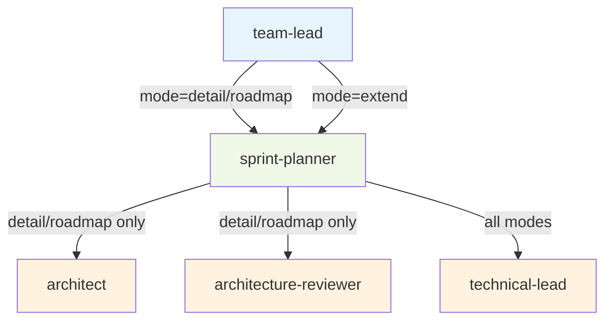

<!-- CLASI: Before changing code or making plans, review the SE process in CLAUDE.md -->

# Architecture Update -- Sprint 031: Refactor dispatch_to_sprint_planner

## What Changed

### Modified: Dispatch Tools (`clasi/tools/dispatch_tools.py`)

The `dispatch_to_sprint_planner` function signature changes from:

```
(sprint_id, sprint_directory, todo_ids, goals, mode="detail")
```

to:

```
(todo_ids, goals, mode="detail", sprint_id=None, title=None)
```

Key changes:
- **`sprint_directory` parameter removed** — derived internally from
  `sprint_id` via `project.get_sprint()`.
- **`sprint_id` becomes optional** — when `None` in roadmap/detail mode,
  the dispatch tool creates the sprint internally using `create_sprint`,
  requiring the new `title` parameter.
- **`title` parameter added** — required when `sprint_id` is `None`,
  passed to `create_sprint` for new sprint creation.
- **`extend` mode added** — new formal mode value for adding TODOs to an
  already-executing sprint. Requires `sprint_id` (sprint must exist).
  Skips architecture review and stakeholder approval, dispatching directly
  to ticket creation via the technical-lead.

### Modified: Sprint Planner Agent (`clasi/agents/domain-controllers/sprint-planner/`)

- **`agent.md`** — documents the extend mode workflow: read existing sprint
  plan and tickets, then dispatch to technical-lead for new ticket creation.
- **`plan-sprint.md`** — adds extend mode section describing the abbreviated
  planning flow (no architecture, no stakeholder gate).
- **`dispatch-template.md.j2`** — adds a template branch for extend mode
  dispatches, which provides existing sprint context to the planner.
- **`contract.yaml`** — adds extend mode inputs/outputs: accepts
  `sprint_id` + `todo_ids`, returns new ticket file paths.

### Modified: Team-Lead Agent (`clasi/agents/main-controller/team-lead/agent.md`)

- **"Execute TODOs" workflow** — no longer includes a `create_sprint` step
  before dispatching to sprint-planner. The dispatch tool handles sprint
  creation internally.
- **"Sprint Planning Only" workflow** — same simplification: no
  `create_sprint` pre-step.
- **"Implement new TODO in existing sprint" workflow** — now uses
  `mode="extend"` with `sprint_id` instead of the informal ad-hoc
  `mode="add_to_sprint"`.

### Modified: Tests (`tests/`)

- Existing `dispatch_to_sprint_planner` tests updated for new signature.
- New test cases for: `sprint_id=None` with `title`, `sprint_id=None`
  without `title` (error), `mode="extend"` with and without `sprint_id`.

## Why

The current `dispatch_to_sprint_planner` API has three problems
(SUC-031-01, SUC-031-02, SUC-031-03):

1. **Redundant parameter**: `sprint_directory` is always derivable from
   `sprint_id` via `project.get_sprint()`, yet callers must compute and
   pass both. This violates DRY and increases coupling.

2. **Unnecessary orchestration burden**: The team-lead must call
   `create_sprint` before dispatching to the sprint-planner, adding a
   step that could fail independently and complicates the two main
   planning workflows.

3. **Missing formal extend mode**: When a new TODO must be added to an
   executing sprint, the team-lead uses an informal ad-hoc
   `mode="add_to_sprint"` that isn't defined in the sprint-planner
   contract or dispatch template, making it fragile and undocumented.

## Impact on Existing Components

### Dispatch Tools Module

The signature change is **breaking** for all callers of
`dispatch_to_sprint_planner`. However, the only caller is the team-lead
agent (via rendered dispatch templates), so the blast radius is contained
to agent definitions.

The dispatch tool gains a new internal dependency: it now calls
`create_sprint` when `sprint_id` is `None`. This shifts sprint creation
responsibility from the team-lead into the dispatch layer.

### Sprint Lifecycle

No changes to the sprint state machine or phase transitions. The extend
mode operates within the existing `executing` phase — it creates tickets
but does not change sprint status or phase.

### Agent Hierarchy

No structural changes to the three-tier hierarchy. The team-lead still
dispatches to sprint-planner; sprint-planner still dispatches to architect,
architecture-reviewer, and technical-lead. The extend mode simply skips
the architect and architecture-reviewer dispatches.



### Contract Validation

The sprint-planner contract (`contract.yaml`) must be updated to include
extend mode inputs and outputs. The existing dispatch retry-on-validation-
failure mechanism (from sprint 029) applies unchanged.

## Decisions

Resolved from architecture review advisories:

1. **Detail-mode return schema must include `sprint_id` and
   `sprint_directory`** — when the dispatch tool creates the sprint
   internally (`sprint_id=None`), the team-lead needs `sprint_id` for
   subsequent calls to `acquire_execution_lock` and
   `dispatch_to_sprint_executor`. Add these as required fields in the
   detail-mode return schema (contract.yaml and dispatch template).

2. **Extend-mode return schema**: `{status, summary, ticket_ids,
   files_created}`. Add to contract.yaml under `outputs.extend` and
   to the dispatch template.

3. **`goals` in extend mode**: Document it as "description of the work
   being added" — a brief statement about the new TODO(s), not a
   restatement of the sprint's original goals. Keep it required (callers
   can pass a short description).

4. **plan-sprint.md detail-mode step 1**: Update to handle both cases:
   "If `sprint_id` was provided, verify the sprint exists. If `sprint_id`
   was not provided (sprint created by dispatch tool), the sprint was
   just created — proceed directly."

## Migration Concerns

- **No data migration needed** — this is a code-only change affecting
  function signatures and agent definition documents.
- **Backward compatibility** — the old signature
  (`sprint_id, sprint_directory, todo_ids, goals`) is not preserved.
  All callers (team-lead agent definition, tests) must be updated
  atomically in this sprint.
- **No deployment sequencing** — all changes are in the same package
  and take effect together on the sprint branch merge.
