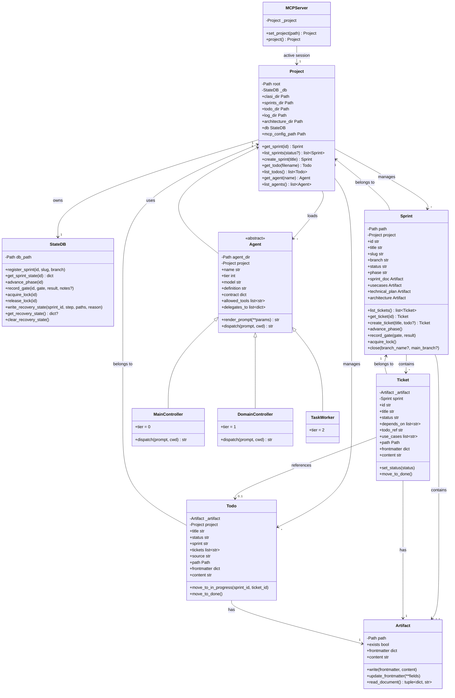

# Refactor System into Proper Object-Oriented Code

## Problem

The CLASI codebase uses a procedural style with module-level functions
and relies on `Path.cwd()` in multiple places to determine the working
directory. This creates several issues:

1. **No single source for the working directory.** `Path.cwd()` is
   called throughout `artifact_tools.py` and the MCP server resolves
   paths relative to whatever directory the process happens to be in.
   When subagents spawned by `query()` set `cwd` to a sprint directory,
   the MCP server they connect to resolves `docs/clasi/` relative to
   that sprint directory, creating doubled paths like
   `sprints/001-.../docs/clasi/sprints/001-.../sprint.md`. This is the
   direct cause of the path nesting bug discovered during e2e testing.

2. **No sensible abstractions.** `artifact_tools.py` is a 2000+ line
   file containing dispatch functions, sprint management, ticket
   management, TODO management, and version management — all as
   module-level functions with shared state via `_plans_dir()` and
   `_sprints_dir()` helpers.

3. **Difficult to test.** Functions that call `Path.cwd()` require
   monkeypatching or test fixtures that change the working directory.
   Dependency injection via constructor parameters would be cleaner.

## Domain Model

The system has these core abstractions:

### Project

The top-level object. Constructed on a project root directory path.
All path resolution flows through Project — nothing calls `Path.cwd()`
directly. Project owns the `docs/clasi/` directory tree and the state
database. It provides access to all other domain objects.

```python
project = Project("/path/to/repo")
project.clasi_dir       # -> /path/to/repo/docs/clasi/
project.sprints_dir     # -> /path/to/repo/docs/clasi/sprints/
project.todo_dir        # -> /path/to/repo/docs/clasi/todo/
project.db              # -> StateDB instance
project.get_sprint("001")     # -> Sprint
project.list_sprints()        # -> list[Sprint]
project.create_sprint("title") # -> Sprint
project.get_todo("my-idea.md") # -> Todo
project.list_todos()           # -> list[Todo]
```

### StateDB

Wraps the SQLite database at `docs/clasi/.clasi.db`. Constructed by
Project with the database path — never resolves the path itself.
Owns sprint phase tracking, gate results, execution locks, and
recovery state. Sprint objects delegate their DB operations here.

```python
db = project.db
db.register_sprint("001", "my-sprint", "sprint/001-my-sprint")
db.get_sprint_state("001")
db.advance_phase("001")
db.acquire_lock("001")
db.write_recovery_state(...)
```

### Sprint

Represents a sprint. Constructed with a directory path and a reference
to the Project. Gives access to the sprint's artifacts (sprint.md,
usecases.md, technical-plan.md, architecture-update.md) and its tickets.
DB operations for this sprint go through the Project's StateDB.

A Sprint knows its own identity (id, slug, branch) from its frontmatter.
It can list, create, and find tickets within its directory. It knows
its phase from the DB.

```python
sprint = project.get_sprint("001")
sprint.path             # -> Path to sprint directory
sprint.id               # -> "001" (from frontmatter)
sprint.title            # -> from frontmatter
sprint.branch           # -> from frontmatter
sprint.phase            # -> from StateDB
sprint.sprint_doc       # -> Artifact (sprint.md)
sprint.usecases         # -> Artifact (usecases.md)
sprint.technical_plan   # -> Artifact (technical-plan.md)
sprint.architecture     # -> Artifact (architecture-update.md)
sprint.list_tickets()   # -> list[Ticket]
sprint.create_ticket("title") # -> Ticket
sprint.get_ticket("001")      # -> Ticket
```

### Ticket

Represents a ticket within a sprint. Constructed with a file path and
a reference to the Sprint (which gives access to the Project). A Ticket
is a single markdown file with frontmatter. It knows which sprint it
belongs to, what its status is, what TODOs it references, and what its
acceptance criteria are.

```python
ticket = sprint.get_ticket("001")
ticket.path             # -> Path to ticket file
ticket.id               # -> "001" (from frontmatter)
ticket.title            # -> from frontmatter
ticket.status           # -> "todo" | "in-progress" | "done"
ticket.depends_on       # -> list of ticket IDs
ticket.todo_ref         # -> TODO filename or None
ticket.set_status("in-progress")
ticket.move_to_done()   # -> moves file to tickets/done/
ticket.sprint           # -> parent Sprint
ticket.sprint.sprint_doc # -> navigate back to sprint artifacts
```

### Todo

Represents a TODO item. A TODO is a single markdown file with
frontmatter. It lives in one of three directories representing its
lifecycle state: `todo/` (pending), `todo/in-progress/`, or
`todo/done/`. The Todo object knows where it is and provides methods
to move through the lifecycle.

```python
todo = project.get_todo("my-idea.md")
todo.path               # -> Path to file
todo.title              # -> from heading
todo.status             # -> "pending" | "in-progress" | "done"
todo.sprint             # -> sprint ID or None
todo.tickets            # -> list of ticket refs
todo.move_to_in_progress("001", "001-003")
todo.move_to_done()
todo.frontmatter        # -> dict
todo.content            # -> markdown body
```

### Artifact

A thin wrapper around a markdown file with YAML frontmatter. Sprint
documents (sprint.md, usecases.md, technical-plan.md, architecture-update.md),
tickets, and TODOs are all Artifacts. Provides read/write access to
frontmatter and content. Knows its own path and can be used as a
file-like object.

Artifact is the base. Ticket and Todo might subclass it (or compose it)
to add domain-specific behavior.

```python
artifact = sprint.sprint_doc
artifact.path           # -> Path
artifact.exists         # -> bool
artifact.frontmatter    # -> dict (read/write)
artifact.content        # -> str (markdown body)
artifact.write(frontmatter, content)
artifact.update_frontmatter(status="done")
```

### Agent

Represents an agent definition. Constructed from an agent directory
(containing agent.md, contract.yaml, dispatch-template.md.j2, etc.).
Provides access to the agent's definition, contract, and dispatch
template. Can render a dispatch prompt for a given set of parameters.

Subclassed by tier:
- `MainController` (tier 0) — team-lead, dispatch-only, no file writes
- `DomainController` (tier 1) — sprint-planner, sprint-executor, etc.
- `TaskWorker` (tier 2) — code-monkey, architect, etc.

Each subclass knows what it can delegate to (from the contract's
`delegates_to` field) and what tools it's allowed to use.

```python
agent = project.get_agent("sprint-planner")
agent.name              # -> "sprint-planner"
agent.tier              # -> 1
agent.model             # -> "opus"
agent.definition        # -> agent.md content
agent.contract          # -> parsed contract.yaml dict
agent.allowed_tools     # -> from contract
agent.delegates_to      # -> list of delegation edges
agent.render_prompt(sprint_id="001", goals="...", mode="detail")
agent.dispatch(prompt, cwd, mcp_config_path)  # -> calls query()
```

### MCPServer

The top-level server. Holds a reference to the current Project (the
active session). MCP tool functions are thin wrappers that delegate
to Project, Sprint, Ticket, Todo, and Agent methods.

Supports a session concept: set the active project, and all subsequent
tool calls resolve against that project. The session is set once at
startup (from cwd or explicit path) and can be changed via a
`set_project` tool.

```python
mcp = MCPServer()
mcp.set_project("/path/to/repo")  # -> creates Project, sets as active
mcp.project                        # -> current Project
mcp.project.get_sprint("001")      # -> Sprint
```

## Class Diagram



## Key Design Decisions

### 1. Project is the root of all path resolution

Every object receives its paths from Project, either directly or
through its parent. No object calls `Path.cwd()`. This eliminates
the entire class of path-nesting bugs — when a subagent sets its cwd
to a sprint directory, the MCP server's Project still resolves from
the original project root.

### 2. Artifact is composition, not inheritance

Ticket and Todo each have an Artifact rather than subclassing it.
This keeps the file I/O logic in one place and lets Ticket/Todo add
domain-specific behavior (lifecycle transitions, cross-references)
without inheriting file operations.

Sprint contains multiple named Artifacts (sprint_doc, usecases,
technical_plan, architecture). Each is a specific file in the
sprint directory.

### 3. Sprint delegates DB operations to StateDB via Project

Sprint doesn't hold a direct reference to StateDB. It goes through
`self.project.db`. This keeps the dependency graph clean: Sprint
depends on Project, Project depends on StateDB. Sprint never needs
to know the DB path.

### 4. Agent.dispatch() owns the query() lifecycle

The dispatch logic (render template, log, call query(), validate,
log result) lives in Agent.dispatch(). The dispatch MCP tools
become thin wrappers: look up the agent, call agent.dispatch().
The Agent object knows its own contract, tools, model, and
template — it has everything it needs to configure the
ClaudeAgentOptions.

### 5. MCPServer holds the session

The MCP server maintains an active Project reference. Tool functions
access it via `mcp.project`. This replaces all the `Path.cwd()` calls.
The session can be changed (for multi-project support) but defaults
to the cwd at server startup.

## Migration Strategy

This refactoring should be done incrementally across multiple sprints:

1. **Sprint A: Project and StateDB** — Create the Project class with
   path resolution. Create StateDB wrapping the existing functions.
   Wire into MCP server. Replace `_plans_dir()`, `_sprints_dir()`,
   `_db_path()`, `_todo_dir()` with Project methods. All existing
   tests continue to pass.

2. **Sprint B: Artifact and Sprint** — Create Artifact. Create Sprint
   with its named artifacts. Replace sprint-related functions in
   artifact_tools.py with Sprint methods. Tool functions become
   thin wrappers.

3. **Sprint C: Ticket and Todo** — Create Ticket and Todo with
   lifecycle methods. Replace ticket/todo functions in artifact_tools.py.
   Include the three-state TODO lifecycle.

4. **Sprint D: Agent and Dispatch** — Create Agent hierarchy. Move
   dispatch logic from dispatch_tools.py into Agent.dispatch().
   Dispatch MCP tools become lookups + agent.dispatch().

Each sprint preserves the MCP tool interface — no breaking changes to
tool signatures or return formats. The refactoring is internal.

## What Does Not Change

- MCP tool names, parameters, and return formats
- File formats (frontmatter + markdown)
- Directory layout (docs/clasi/sprints/, todo/, etc.)
- State DB schema
- Agent definition files (agent.md, contract.yaml)
- The SE process itself
