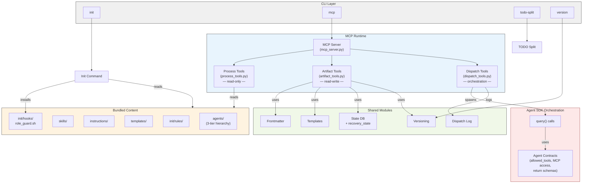
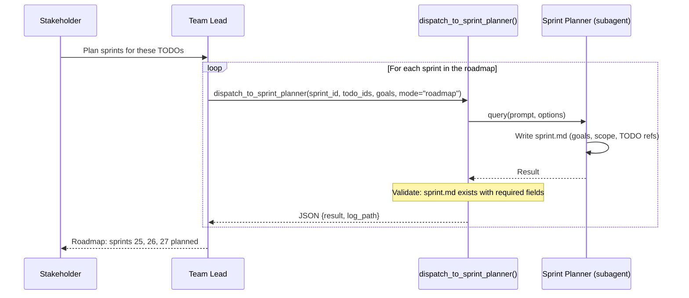
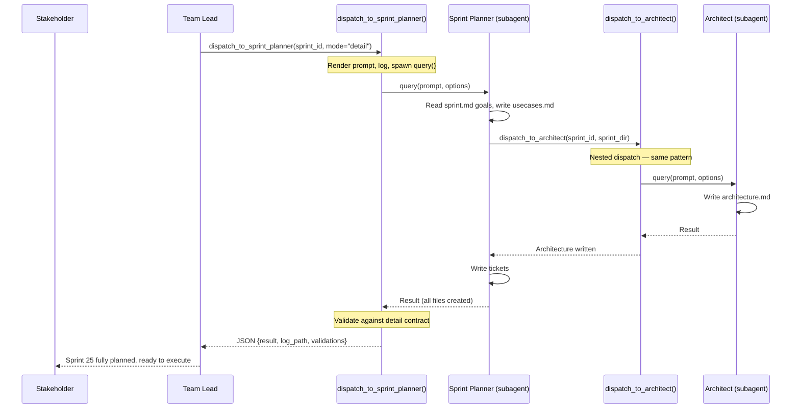
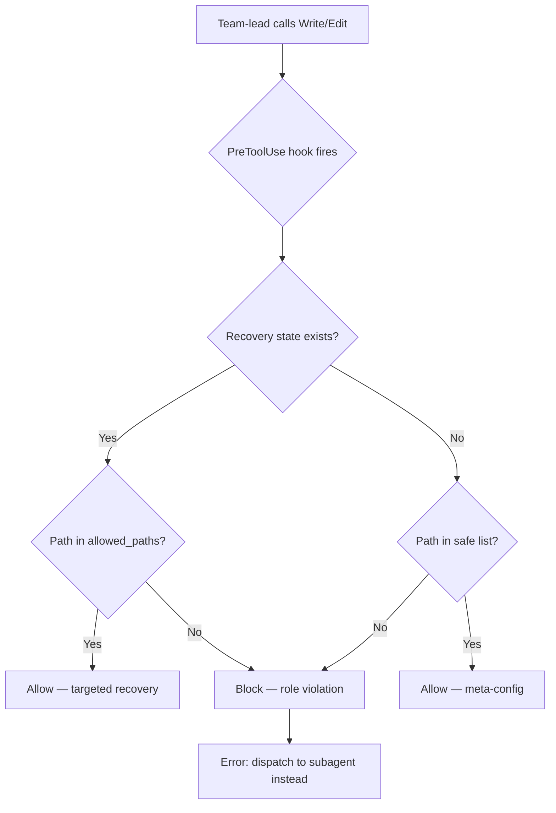
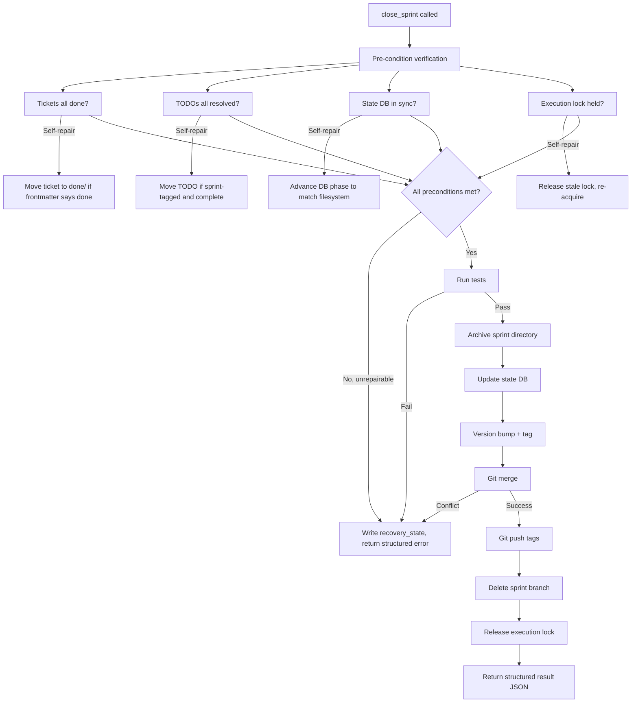
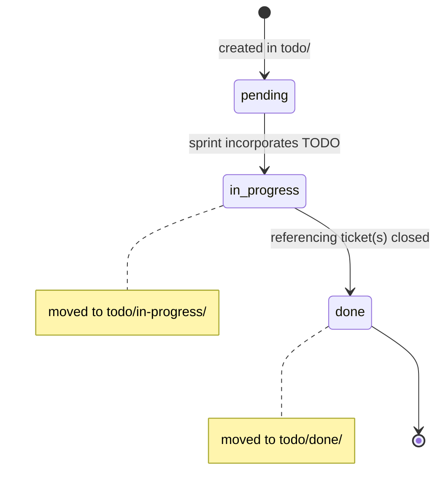

# Architecture Design: SDK-Based Orchestration

This document describes the target architecture after the SDK
orchestration sprint. It is a design document, not a sprint
architecture update — it will be refined into the formal
`architecture-NNN.md` during sprint planning.

## 1. System Responsibilities (revised)

Architecture 024 describes four responsibilities. This sprint adds a
fifth and restructures enforcement.

| # | Responsibility | Current (024) | After This Sprint |
|---|---------------|---------------|-------------------|
| 1 | Process Content Delivery | MCP tools serve agents, skills, instructions | Unchanged |
| 2 | Artifact Management | MCP tools create/move sprints, tickets, TODOs | Extended: TODO three-state lifecycle |
| 3 | Project Initialization | `clasi init` installs config, rules, hooks | Extended: installs PreToolUse role guard hook |
| 4 | Compliance Enforcement | 4-layer model (instructional → rules → state machine → post-hoc) | Restructured: see § Enforcement Model |
| 5 | **Subagent Orchestration** | **Does not exist** — team-lead calls `Agent` directly | **New**: dispatch tools own full subagent lifecycle via Agent SDK |

## 2. Component Architecture (revised)



The new `dispatch_tools.py` module contains all `dispatch_to_*` tools.
Each tool is `async def`, calls `query()` from the Agent SDK, and
returns structured JSON. The Orchestration subgraph is the new
component — it lives inside the MCP server process but represents a
qualitatively different kind of work (spawning and managing subagent
sessions).

## 3. Dispatch Tool Contract

Every dispatch tool follows this pattern:

```
dispatch_to_<agent>(
    # domain-specific parameters
    sprint_id, todo_ids, goals, ...
) -> JSON result
```

Internally:

1. **Render** the prompt from a Jinja2 template + parameters
2. **Log** the dispatch (before execution — always happens)
3. **Load** the agent contract (system prompt, allowed_tools, MCP config)
4. **Execute** via `query(prompt, options=ClaudeAgentOptions(...))`
5. **Validate** the result against the agent's return contract
6. **Log** the result (after execution — always happens)
7. **Return** structured JSON to the team-lead

The team-lead's only job is: call the dispatch tool, interpret the
result, report to the stakeholder.

### Agent Contract Schema

Each agent definition declares its SDK contract. This lives in the
agent.md YAML frontmatter:

```yaml
---
name: sprint-planner
tier: 1
allowed_tools:
  - Read
  - Write
  - Edit
  - Bash
  - "mcp__clasi__*"
mcp_servers:
  - clasi
cwd: "{sprint_directory}"
modes:
  roadmap:
    # Phase 1: high-level planning (batch, multiple sprints)
    returns:
      required_files:
        - sprint.md
      frontmatter_checks:
        sprint.md:
          status: roadmap
    validates:
      - sprint.md has title, goals, feature scope, TODO references
  detail:
    # Phase 2: full planning (one sprint, pre-execution)
    returns:
      required_files:
        - sprint.md
        - usecases.md
        - architecture.md
        - "tickets/*.md"
      frontmatter_checks:
        sprint.md:
          status: planning_docs
    validates:
      - All required files exist in sprint directory
      - sprint.md frontmatter has required fields
      - At least one ticket created
---
```

The dispatch tool reads this frontmatter to configure `ClaudeAgentOptions`
and to validate the result before returning it to the team-lead.
`dispatch_to_sprint_planner` accepts a `mode` parameter (`roadmap` or
`detail`) that selects which validation contract applies. Roadmap mode
is lightweight — it only requires sprint.md with goals and scope.
Detail mode produces the full planning artifact set.

## 4. Agent Hierarchy (revised)

The hierarchy itself doesn't change — still three tiers. What changes
is the *dispatch mechanism* and the *formality of the contract* at each
boundary.

### Dispatch Boundaries

**Phase 1 — Batch roadmap planning:**



**Phase 2 — Detailed planning (one sprint, pre-execution):**



Key change: the team-lead never sees the intermediate dispatch between
sprint-planner and architect. That's an internal delegation. The
team-lead sees one call and one result. Roadmap planning is fast and
lightweight; detailed planning is deep but only happens for the next
sprint to execute.

### Nested Dispatch

Tier 1 agents (sprint-planner, sprint-executor) themselves dispatch to
Tier 2 agents. With SDK orchestration, these nested dispatches also go
through typed dispatch tools. The sprint-planner calls
`dispatch_to_architect()` and `dispatch_to_technical_lead()` — it
doesn't call `Agent` directly either.

This means the CLASI MCP server exposes dispatch tools for every
delegation edge in the hierarchy:

| Dispatch Tool | Caller | Target |
|--------------|--------|--------|
| `dispatch_to_requirements_narrator` | team-lead | requirements-narrator |
| `dispatch_to_todo_worker` | team-lead | todo-worker |
| `dispatch_to_sprint_planner` | team-lead | sprint-planner |
| `dispatch_to_sprint_executor` | team-lead | sprint-executor |
| `dispatch_to_ad_hoc_executor` | team-lead | ad-hoc-executor |
| `dispatch_to_sprint_reviewer` | team-lead | sprint-reviewer |
| `dispatch_to_architect` | sprint-planner | architect |
| `dispatch_to_architecture_reviewer` | sprint-planner | architecture-reviewer |
| `dispatch_to_technical_lead` | sprint-planner | technical-lead |
| `dispatch_to_code_monkey` | sprint-executor, ad-hoc-executor | code-monkey |
| `dispatch_to_code_reviewer` | ad-hoc-executor | code-reviewer |

Each dispatch tool is a typed function — not a generic "dispatch to
anyone" mechanism. This means each tool knows its target agent's
contract and can validate accordingly.

## 5. Enforcement Model (revised)

### Current (024): Four independent layers

```
Layer 1: Instructional (CLAUDE.md, agent.md) — fades from context
Layer 2: Contextual (path-scoped rules) — re-injected on file access
Layer 3: Mechanical (state machine) — rejects invalid operations
Layer 4: Post-hoc (review tools) — catches after the fact
```

### After This Sprint: Structural + layered

```
Primary: Structural (SDK dispatch)
    The team-lead cannot bypass dispatch because it has no Agent tool.
    Logging is guaranteed because it's in the dispatch tool's code path.
    Scope is enforced because allowed_tools is set by the dispatch tool.

Layer 1: Instructional (CLAUDE.md, agent.md)
    Still present. Less critical for dispatch compliance. Still matters
    for subagent behavior within their scope.

Layer 2: Contextual (path-scoped rules)
    Unchanged. Fires when subagents access files. Reinforces scope.

Layer 3: Mechanical (state machine + PreToolUse hook)
    State machine unchanged. NEW: PreToolUse role guard blocks direct
    file writes from the team-lead session. Recovery state in DB allows
    targeted exceptions during error recovery.

Layer 4: Validation (dispatch tool return validation)
    Upgraded. Dispatch tools validate subagent output against the agent
    contract before returning. This is no longer post-hoc — it's
    inline, before the team-lead ever sees the result.
```

The shift: enforcement moves from "hope the agent follows instructions
and catch it afterward" to "the agent physically cannot take the wrong
path, and the tools validate results before propagating them."

### PreToolUse Role Guard Detail



Safe list (not blocked): `.claude/`, `CLAUDE.md`, `AGENTS.md`.
Everything else requires dispatch.

## 6. close_sprint as Full-Lifecycle Template

`close_sprint` becomes the reference implementation for a full-lifecycle
MCP tool:



This pattern — verify with self-repair, execute atomically, return
structured result or structured error with recovery path — applies to
every tool that owns a multi-step lifecycle.

## 7. Sprint Planning and Branching Model

### Two-Phase Planning

Sprint planning happens in two phases with different levels of detail.

**Phase 1 — Batch roadmap planning (multiple sprints, high-level).**
The team-lead and sprint-planner produce a lightweight sprint.md for
each upcoming sprint: title, goals, feature scope, which TODOs it
addresses, and rough ordering. No architecture docs, no use cases, no
tickets. This is a roadmap — it says *what* goes into each sprint, not
*how* it gets built. Multiple sprints are planned in one pass on main.

**Phase 2 — Detailed sprint planning (one sprint, full depth).**
When a sprint becomes the next to execute, the sprint-planner fills in
the full planning artifacts: use cases, architecture update, and
tickets. This happens on main, immediately before branching and
execution. Because it runs against the latest main, it accounts for
everything the previous sprint changed.

This split matters because the high-level roadmap almost never goes
stale — "add SDK-based dispatch" doesn't become invalid because the
previous sprint refactored a module. The detailed artifacts (architecture
updates, ticket specs) are the things that go stale, and they're only
created when the sprint is about to execute.

### Late Branching

Sprint branches are created at execution time, not planning time.

**Roadmap planning**: `create_sprint()` creates the sprint directory
with a high-level sprint.md on main. Multiple sprints are planned in
sequence. No branches.

**Detailed planning**: When the sprint is next up, the sprint-planner
fills in use cases, architecture, and tickets — still on main.

**Execution**: `acquire_execution_lock(sprint_id)` creates the sprint
branch from current main (`git checkout -b sprint/NNN-slug`). The
code-monkey always starts from the latest merged state.

**Close**: `close_sprint()` merges back to main with `--no-ff`, tags,
and deletes the branch. One sprint branch exists at a time.

```mermaid
gitgraph
    commit id: "roadmap: plan sprints 25-27"
    commit id: "detail sprint 25"
    branch sprint/025
    checkout sprint/025
    commit id: "ticket 025-001"
    commit id: "ticket 025-002"
    checkout main
    merge sprint/025 id: "close sprint 25" tag: "v1.5.0"
    commit id: "detail sprint 26"
    branch sprint/026
    checkout sprint/026
    commit id: "ticket 026-001"
    commit id: "ticket 026-002"
    checkout main
    merge sprint/026 id: "close sprint 26" tag: "v1.6.0"
    commit id: "detail sprint 27"
    branch sprint/027
    checkout sprint/027
    commit id: "ticket 027-001"
    checkout main
    merge sprint/027 id: "close sprint 27" tag: "v1.7.0"
```

### Execution Is Sequential

Sprint execution is strictly serial, gated by the execution lock. No
concurrent sprint branches, no parallel `query()` calls for execution.
The parallelism in "parallel sprint planning" refers only to Phase 1 —
batch roadmap planning. One sprint executes at a time.

This is a deliberate constraint, not a limitation to fix later.
Parallel execution adds concurrency complexity (DB contention, merge
conflicts, resource contention for the LLM) with minimal time savings
for the kinds of sprints CLASI manages.

### OOP Conflicts (edge case)

If an out-of-process change lands on main while a sprint branch is
active, the sprint branch diverges. This is handled by `close_sprint`'s
recovery mechanism: attempt merge, detect conflict, write
recovery_state with allowed_paths, return structured error. The
sprint-executor (or team-lead) resolves the conflict and retries.

Expected to be rare. OOP changes are small and targeted.

## 8. TODO Lifecycle (revised)



Physical directories:
- `docs/clasi/todo/` — pending TODOs
- `docs/clasi/todo/in-progress/` — TODOs picked up by active sprints
- `docs/clasi/todo/done/` — completed TODOs

The `create_ticket` tool moves referenced TODOs to `in-progress/` and
updates their frontmatter. The `close_sprint` tool moves only those
TODOs whose referencing tickets are all done — it does not bulk-move.

## 9. State DB Schema Changes

### New table: recovery_state

```sql
CREATE TABLE IF NOT EXISTS recovery_state (
    id INTEGER PRIMARY KEY CHECK (id = 1),
    sprint_id TEXT NOT NULL,
    step TEXT NOT NULL,
    allowed_paths TEXT NOT NULL,  -- JSON array
    reason TEXT NOT NULL,
    recorded_at TEXT NOT NULL
);
```

Singleton table (only one active recovery at a time). Cleared by
successful `close_sprint` or explicit `clear_recovery_state()`.
TTL: 24 hours — stale records auto-cleared with warning.

### Extended TODO frontmatter

```yaml
---
status: in-progress        # pending | in-progress | done
sprint: "025"              # which sprint picked this up
tickets:                   # which tickets reference this TODO
  - "025-001"
  - "025-003"
source: https://...        # optional, existing field
---
```

## 10. Open Design Decisions

These need resolution before this becomes a sprint plan:

### 10.1 Single MCP instance vs. orchestration layer

**Option A**: Dispatch tools live in the same FastMCP server that serves
process and artifact tools. `query()` calls are `async` and the server
handles them as long-running tool invocations.

- Pro: Simple. One process, one DB connection, no IPC.
- Con: A 20-minute subagent run blocks the MCP tool call. If the
  team-lead's session times out waiting, the subagent is orphaned.

**Option B**: Dispatch tools spawn subagents as separate processes and
poll for completion.

- Pro: Non-blocking. Team-lead can do other work while subagent runs.
- Con: Complex. Needs process management, result storage, reconnection.

**Recommendation**: Start with Option A. FastMCP supports async tools
and Claude Code's Agent tool already blocks for long runs. If timeout
issues emerge, add a background-task mechanism later.

### 10.2 Subagent MCP access

**Option A**: Pass MCP config in `ClaudeAgentOptions(mcp_servers=...)`
pointing at the same `.mcp.json`. The subagent starts its own connection
to the CLASI server — which means a second server instance.

- Pro: Clean isolation. Subagent has full MCP access.
- Con: Two server instances hitting the same SQLite DB.

**Option B**: Pre-fetch everything the subagent needs and pass it as
context. Subagent doesn't get MCP access.

- Pro: No concurrent DB access. Simpler subagent.
- Con: Subagent can't call `create_ticket`, `advance_sprint_phase`,
  etc. Limits what subagents can do autonomously.

**Option C**: Use WAL mode on SQLite and let multiple instances coexist.

- Pro: Subagents have full MCP access. SQLite WAL handles concurrent
  reads well and serializes writes safely.
- Con: Need to verify FastMCP + WAL behavior under concurrent access.

**Recommendation**: Option A + C. Pass MCP config, enable WAL mode,
test concurrent access. This gives subagents full capability.

### 10.3 Agent contract location

**Decision: separate `contract.yaml` per agent directory (Option B).**

agent.md stays pure prose — role, instructions, examples. contract.yaml
is the machine-readable contract — inputs, outputs, delegation edges,
allowed tools, MCP access. The schema for contract.yaml is defined in
JSON Schema (written in YAML) so contracts can be validated in CI and
by dispatch tools at runtime.

This keeps agent.md clean for human readers and for the agent's own
system prompt, while giving dispatch tools a structured format to
configure `ClaudeAgentOptions` and validate results.

### 10.4 Merge strategy convention

Should `close_sprint` use `--no-ff` to always create a merge commit?

- Pro: Sprint boundaries visible in `git log --graph`.
- Con: Slightly noisier history for single-commit sprints.

**Recommendation**: Default `--no-ff`. Sprint boundaries in the git
history are useful for traceability.

### 10.5 Role guard hook implementation

The hook needs to check recovery_state in SQLite. Options:

**Option A**: Bash script calls `sqlite3` directly.
**Option B**: Bash script calls a lightweight MCP tool
(`check_write_permission(path)`) via the CLI.
**Option C**: Python script instead of bash.

**Recommendation**: Option C. A Python script can use the same
`state_db.py` module as the MCP server, keeping DB access consistent.
`clasi init` installs it as `.claude/hooks/role_guard.py`.

### 10.6 Sprint branching timing

**Decision: late branching.** Branch created by `acquire_execution_lock`,
not during planning. Only one sprint branch exists at a time.

This pairs with two-phase planning (§ 7). Batch roadmap planning only
produces high-level sprint.md files (goals, feature scope, TODO refs).
These are committed to main and almost never go stale — a feature scope
like "add SDK-based dispatch" doesn't become invalid because the
previous sprint refactored a module.

Detailed planning (use cases, architecture, tickets) happens
immediately before execution, against the latest main. By the time
the branch is created, all planning artifacts are current. If
something does need adjustment, the sprint.md is lightweight enough
that updating it is trivial.

**Execution is strictly serial.** One sprint branch at a time, gated
by the execution lock. No parallel execution. This is a deliberate
constraint — parallel execution adds concurrency complexity with
minimal benefit for CLASI-scale sprints.
