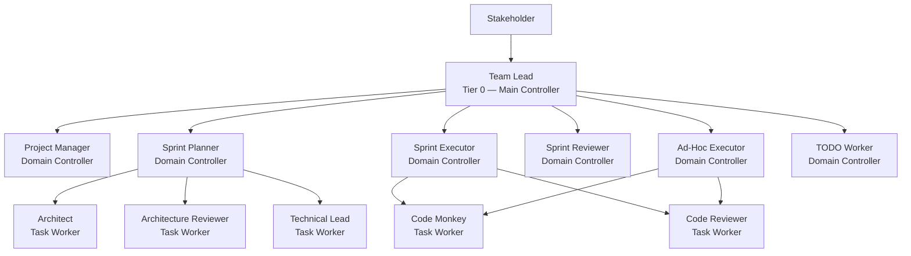
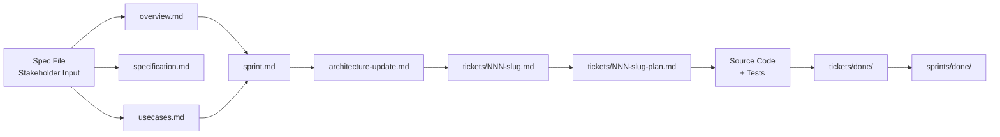
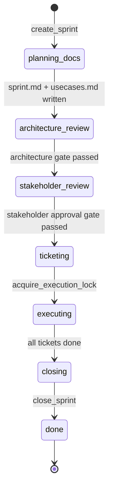

# CLASI — Claude Agent Software Intelligence

## What is CLASI?

CLASI is a multi-agent software engineering system built on top of Claude. It replaces the ad-hoc, single-conversation model of AI-assisted coding with a structured, team-based process: a hierarchy of specialized AI agents who plan, review, implement, and validate software changes in the same way a disciplined engineering team would.

Where a traditional Claude conversation puts a single model in charge of everything — requirements, architecture, code, testing, and commit hygiene — CLASI distributes those responsibilities across agents with narrowly defined roles and enforces handoffs, review gates, and artifact contracts between them.

The result is a system that can take a stakeholder's rough idea from first expression all the way through a merged, tested, versioned release, producing a complete paper trail of planning artifacts, architecture decisions, and tickets along the way.

---

## The Core Idea

CLASI is organized around a single insight: **software engineering quality comes from process, not just capability**. A single capable agent writing code without review, architecture, or ticketing will produce the same problems a solo developer produces — inconsistency, drift from stated requirements, missed edge cases, and no shared understanding of what was built and why.

CLASI imposes structure by:

1. **Separating concerns** — different agents own planning, architecture, implementation, and review. No agent does all of these.
2. **Enforcing gates** — work cannot advance to the next phase until the previous phase passes review. Architecture is reviewed before tickets are created. Stakeholders approve plans before execution begins.
3. **Producing artifacts** — every decision is recorded in a file. Sprint goals, architecture updates, tickets, ticket plans, code reviews, and closure records are all written and preserved.
4. **Maintaining state** — a SQLite database tracks which sprint is open, which phase it is in, which gates have passed, and who holds the execution lock.

---

## System Architecture

CLASI is a three-tier agent hierarchy:

**Tier 0 — Main Controller (Team Lead)**
The team lead is the only agent the stakeholder talks to. It receives requests, reads project state, dispatches to domain controllers, validates their returns, and reports back. It never writes files or implements code.

**Tier 1 — Domain Controllers**
Each domain controller owns one phase of the process:
- **Project Manager** — processes written specifications into project documents; builds sprint roadmaps from assessed TODOs
- **Sprint Planner** — coordinates sprint planning: architecture, architecture review, use cases, and tickets
- **Sprint Executor** — drives ticket execution in dependency order, dispatching code-monkey for each ticket
- **Sprint Reviewer** — validates sprint completion before closure (read-only)
- **Ad-Hoc Executor** — handles out-of-process changes without sprint ceremony
- **TODO Worker** — creates and manages TODO files; imports GitHub issues

**Tier 2 — Task Workers**
Task workers are leaf agents that implement atomic units of work:
- **Architect** — writes sprint architecture update documents
- **Architecture Reviewer** — reviews architecture updates for consistency, quality, and risk
- **Technical Lead** — breaks sprint architecture into sequenced, numbered tickets with plans
- **Code Monkey** — implements tickets: writes code, tests, and updates documentation
- **Code Reviewer** — reviews implementations for correctness (Phase 1) and quality (Phase 2)
- **Project Architect** — assesses TODOs against the codebase, producing difficulty and dependency estimates

---

## Artifact Ecosystem

Every stage of the process produces files. These artifacts are the shared memory of the system — later agents read what earlier agents wrote.

| Artifact | Location | Producer | Consumer |
|---|---|---|---|
| `overview.md` | `docs/clasi/` | Project Manager | All agents |
| `specification.md` | `docs/clasi/` | Project Manager | Project Architect, Sprint Planner |
| `usecases.md` | `docs/clasi/` | Project Manager | Architect, Technical Lead |
| `architecture-NNN.md` | `docs/clasi/architecture/` | Architect | Architecture Reviewer, Technical Lead |
| `sprint.md` | `docs/clasi/sprints/NNN-slug/` | Sprint Planner | Sprint Executor, Sprint Reviewer |
| `architecture-update.md` | `docs/clasi/sprints/NNN-slug/` | Architect | Architecture Reviewer, Technical Lead |
| `tickets/NNN-slug.md` | `docs/clasi/sprints/NNN-slug/tickets/` | Technical Lead | Sprint Executor, Code Monkey |
| `tickets/NNN-slug-plan.md` | same | Technical Lead | Code Monkey |
| `todo/*.md` | `docs/clasi/todo/` | TODO Worker | Project Architect, Sprint Planner |

---

## Sprint Lifecycle

A sprint is the fundamental unit of work. Every sprint has its own branch, directory, and seven-phase lifecycle enforced by a state machine:

Phase transitions are enforced: the MCP server validates exit conditions before allowing a transition. Tickets cannot be created before the `ticketing` phase. Execution cannot begin without the lock. Only one sprint can hold the execution lock at a time.

---

## Dispatch Infrastructure

All agent-to-agent communication flows through typed MCP dispatch tools — never through direct Agent SDK calls. Each `dispatch_to_X` tool:

- Renders the agent's Jinja2 prompt template with the call parameters
- Logs the dispatch event to the state database
- Executes the subagent via the Claude Agent SDK
- Validates the return value against the agent's output contract
- Logs the outcome

This means every dispatch is traceable, every return is validated, and no agent can silently fail or return malformed results.

---

## Out-of-Process Changes

Not every change warrants a full sprint. When the stakeholder explicitly requests an out-of-process (OOP) change — small, targeted modifications that don't need architecture review or planning artifacts — the team lead routes to the ad-hoc executor instead. The ad-hoc executor dispatches code-monkey, optionally requests code review, runs tests, and commits directly to the current branch. No sprint directory, no tickets, no architecture update.

---

## Key Design Principles

- **No agent writes outside its scope.** Each agent has a defined write scope. Task workers cannot touch sprint-level artifacts; domain controllers cannot modify source code.
- **All state lives in files or the MCP database.** There is no implicit in-memory state. Any agent can reconstruct the current situation by reading the artifact tree and querying the MCP server.
- **Review gates are non-optional.** Architecture is always reviewed before tickets are created. Stakeholders always approve plans before execution. Sprint-reviewer must pass before closure.
- **Dispatch tools, never the Agent tool.** Using the Agent tool directly bypasses logging and contract validation. CLASI agents are prohibited from using it.
- **Prefer smaller sprints.** The sprint planner is instructed to keep sprints focused. Large changes are split across multiple sprints.
