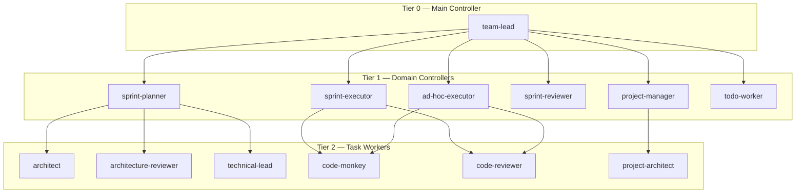
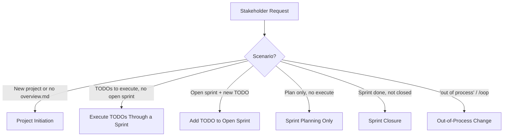
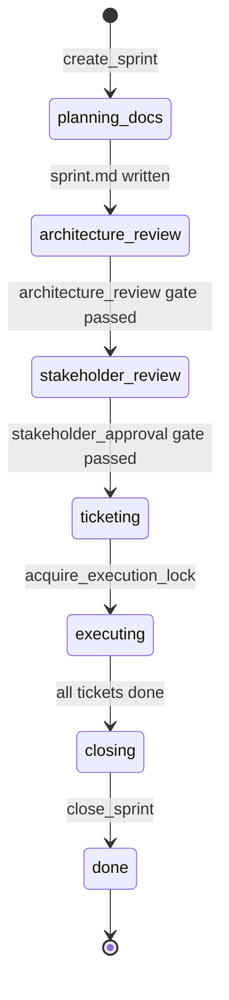
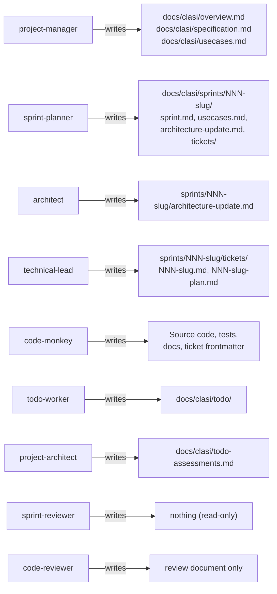

# CLASI Software Engineering Process — Formal Specification

## 1. Overview

CLASI (Claude Agent Software Intelligence) is a structured multi-agent software engineering system. It defines a hierarchy of AI agents, a set of process scenarios, a lifecycle state machine for sprints, an artifact schema, and a dispatch protocol that binds everything together.

This document specifies the processes, agents, artifacts, state machine, dispatch protocol, and behavioral rules that govern the CLASI system.

---

## 2. Agent Hierarchy

CLASI agents are organized into three tiers. Tier 0 is the single entry point for stakeholder interaction. Tier 1 domain controllers each own one phase or process. Tier 2 task workers are leaf agents that perform atomic implementation tasks.



### 2.1 Agent Definitions

#### team-lead (Tier 0)
- **Role**: Pure dispatcher. Routes stakeholder requests to domain controllers, validates returns, reports to stakeholder.
- **Write scope**: None. All file modifications happen through dispatched agents.
- **Read scope**: Anything needed to determine current state and route requests.
- **Constraint**: Must use `dispatch_to_*` MCP tools exclusively. Never uses the Agent tool directly. Never creates files or writes code.

#### project-manager (Tier 1)
- **Role**: Processes written specifications into project documents (initiation mode) or groups assessed TODOs into sprint roadmaps (roadmap mode).
- **Write scope (initiation)**: `docs/clasi/` — produces `overview.md`, `specification.md`, `usecases.md`
- **Write scope (roadmap)**: `docs/clasi/sprints/NNN-slug/` — produces lightweight `sprint.md` files
- **Constraint**: Never interviews stakeholders. Processes written artifacts only. Never loses stakeholder detail from specification.md.

#### sprint-planner (Tier 1)
- **Role**: Creates and populates sprint directories with all planning artifacts. Coordinates architect, architecture-reviewer, and technical-lead.
- **Write scope**: `docs/clasi/sprints/NNN-slug/` — produces `sprint.md`, `usecases.md`, `architecture-update.md`, and `tickets/`
- **Constraint**: Never writes code or tests. Never skips the architecture review gate. Sprint and ticket creation must use CLASI MCP tools.

#### sprint-executor (Tier 1)
- **Role**: Executes sprint tickets in dependency order, dispatching code-monkey for each. Validates each return before advancing.
- **Write scope**: `docs/clasi/sprints/NNN-slug/` (ticket frontmatter, sprint status) plus source code and tests via code-monkey delegation.
- **Constraint**: Never writes code itself. Validates all acceptance criteria and runs the full test suite after each ticket. Escalates after 2 failed re-dispatches.

#### sprint-reviewer (Tier 1)
- **Role**: Post-sprint read-only validator. Checks tickets, frontmatter, tests, architecture, and git state before closure.
- **Write scope**: None. Strictly read-only.
- **Returns**: Verdict (`pass` or `fail`) plus checklist results and blocking issues.

#### ad-hoc-executor (Tier 1)
- **Role**: Handles out-of-process (OOP) changes. No sprint ceremony.
- **Write scope**: Per-task, determined by the change request.
- **Constraint**: Requires explicit OOP authorization. Never creates sprint directories or tickets. Flags unexpectedly large changes to team-lead.

#### todo-worker (Tier 1)
- **Role**: Creates and manages TODO files. Imports GitHub issues as TODOs.
- **Write scope**: `docs/clasi/todo/`
- **Constraint**: Always uses CLASI MCP tools. Never creates TODO files manually. Never modifies source code or planning artifacts.

#### architect (Tier 2)
- **Role**: Writes architecture update documents per sprint (sprint update mode) or produces the initial architecture document (initial mode).
- **Write scope**: `docs/clasi/sprints/<sprint>/architecture-update.md`
- **Constraint**: Operates at module/subsystem level. No function signatures, column schemas, or method inventories. Every module must address at least one use case. Dependency graph must be acyclic.

#### architecture-reviewer (Tier 2)
- **Role**: Reviews sprint architecture updates for version consistency, codebase alignment, design quality, anti-patterns, and risks.
- **Write scope**: None. Produces a review document with verdict: APPROVE, APPROVE WITH CHANGES, or REVISE.
- **Constraint**: Cannot design architecture or create tickets. Does not make final approval decisions (that is the stakeholder's job).

#### technical-lead (Tier 2)
- **Role**: Breaks the sprint's architecture update into sequenced, numbered implementation tickets with ticket plans.
- **Write scope**: `docs/clasi/sprints/<sprint>/tickets/`
- **Constraint**: Every ticket must trace to at least one use case. Every use case must be covered by at least one ticket. No ticket created before the sprint reaches the `ticketing` phase.

#### code-monkey (Tier 2)
- **Role**: Implements tickets. Writes production code, tests, and documentation updates. Updates ticket frontmatter to done.
- **Write scope**: Source code, tests, documentation, and ticket frontmatter.
- **Constraint**: Does not create tickets or plans. Does not dispatch other agents. Does not skip tests. Does not move completed tickets to `done/` (the dispatching controller handles that).

#### code-reviewer (Tier 2)
- **Role**: Reviews implementations via a two-phase process: correctness (Phase 1) then quality (Phase 2). Read-only except for the review document.
- **Write scope**: Review document only.
- **Constraint**: Phase 2 is not entered if Phase 1 fails. Does not implement code or fix issues. Does not write tests.

#### project-architect (Tier 2)
- **Role**: Assesses TODOs against the current codebase. Produces difficulty estimates, affected-code lists, dependency maps, and change-type classifications.
- **Write scope**: `docs/clasi/todo-assessments.md` (or per-TODO files)
- **Constraint**: Every TODO in the input must have an assessment in the output. Difficulty must be justified by code analysis.

---

## 3. Process Scenarios

The team-lead selects a scenario based on the stakeholder's intent. The SE process is the default. OOP is entered only on explicit stakeholder request.



### 3.1 Project Initiation

**Trigger**: Stakeholder wants to start a new project, or no `overview.md` exists.

**Steps**:

1. Dispatch to project-manager in initiation mode with the specification file path.
   - Returns `overview.md`, `specification.md`, `usecases.md` in `docs/clasi/`.
   - Completion check: status `success`, all three files exist.

2. If TODOs exist in `docs/clasi/todo/`, dispatch to project-architect with their paths.
   - Returns impact assessment for every TODO.
   - Completion check: every input TODO has an assessment entry.

3. Dispatch to project-manager in roadmap mode with the assessments and sprint goals.
   - Returns lightweight `sprint.md` files grouping TODOs into sprints.
   - Completion check: all TODOs are covered by at least one sprint.

4. Present roadmap to stakeholder. Await feedback before proceeding to sprint planning.

### 3.2 Execute TODOs Through a Sprint

**Trigger**: Stakeholder provides TODOs to execute; no sprint is currently open.

**Steps**:

1. If TODOs are raw ideas (not yet files): dispatch to todo-worker with `action="create"` or `action="import"`.
   - Returns created TODO file paths. Verify files exist in `docs/clasi/todo/`.

2. Call `create_sprint(title)` → returns `sprint_id`, `sprint_directory`.

3. Dispatch to sprint-planner in detail mode.
   - Returns populated sprint directory: `sprint.md`, `usecases.md`, `architecture-update.md`, `tickets/`.
   - Completion check: `sprint.md` and at least one ticket file exist.

4. Present plan to stakeholder. On approval: `record_gate_result(sprint_id, "stakeholder_approval", "passed")`.

5. Call `acquire_execution_lock(sprint_id)` → returns `branch` name.

6. Dispatch to sprint-executor with sprint ID, directory, branch, and ticket list.
   - Returns sprint with all tickets in `done` status.
   - Completion check: all ticket files moved to `tickets/done/`.

7. Dispatch to sprint-reviewer.
   - Returns verdict `pass` or `fail` with checklist results.
   - If `fail`: address blocking issues and re-dispatch.

8. Call `close_sprint(sprint_id, branch_name)` — merges branch, archives sprint directory, bumps version, pushes tags, deletes sprint branch.

### 3.3 Add TODO to Open Sprint

**Trigger**: An open sprint exists; stakeholder wants to add a new TODO to it.

**Steps**:

1. Call `list_sprints()` and `get_sprint_status(sprint_id)` to find the open sprint's ID, directory, and branch.

2. Dispatch to sprint-planner in `add_to_sprint` mode with the new TODO.
   - Returns new ticket file(s) consistent with existing sprint tickets.

3. Dispatch to sprint-executor with the new ticket(s) only (not the full ticket list).

4. Report result to stakeholder.

### 3.4 Sprint Planning Only

**Trigger**: Stakeholder wants a plan produced but not yet executed.

**Steps**:

1. Call `create_sprint(title)` → `sprint_id`, `sprint_directory`.

2. Dispatch to sprint-planner in detail mode.
   - Completion check: same as §3.2 step 3.

3. Present plan to stakeholder. Record: `record_gate_result(sprint_id, "stakeholder_approval", "passed")`.

4. Stop. Do not acquire execution lock or dispatch to executor.

### 3.5 Sprint Closure

**Trigger**: Sprint is fully executed (all tickets done) but not yet closed.

**Steps**:

1. Dispatch to sprint-reviewer.
   - Completion check: verdict must be `pass`. If `fail`, address issues first.

2. Call `close_sprint(sprint_id, branch_name)`.
   - Completion check: status `success`, sprint branch deleted, sprint directory archived.

### 3.6 Out-of-Process Change

**Trigger**: Stakeholder explicitly says "out of process", "direct change", or invokes `/oop`.

**Steps**:

1. Dispatch to ad-hoc-executor with task description and scope directory.
   - Returns `status: success` and commit hash.
   - Verify commit exists via `git log`.

2. Report result to stakeholder.

---

## 4. Sprint Lifecycle State Machine

A sprint progresses through seven ordered phases. Phase transitions are enforced by the MCP server — `advance_sprint_phase` validates that exit conditions are met before allowing the transition.



### 4.1 Phase Definitions

| Phase | Description | Exit Condition |
|---|---|---|
| `planning_docs` | sprint.md and usecases.md being written | sprint.md populated |
| `architecture_review` | Architect writes update; reviewer evaluates | `architecture_review` gate passed |
| `stakeholder_review` | Team-lead presents plan to stakeholder | `stakeholder_approval` gate passed |
| `ticketing` | Technical-lead creates tickets | All tickets created |
| `executing` | Sprint-executor works through tickets | All ticket statuses `done` |
| `closing` | Pre-closure validation by sprint-reviewer | Reviewer verdict `pass` |
| `done` | Sprint closed, branch merged, archived | — |

### 4.2 Review Gates

Two gates must pass before certain phase transitions are permitted:

| Gate | Required to advance | Recorded by |
|---|---|---|
| `architecture_review` | `architecture_review` → `stakeholder_review` | `record_gate_result` |
| `stakeholder_approval` | `stakeholder_review` → `ticketing` | `record_gate_result` |

### 4.3 Execution Lock

Only one sprint can be in the `executing` phase at a time. The execution lock must be acquired via `acquire_execution_lock(sprint_id)` before the sprint can advance to `executing`. The lock is released automatically by `close_sprint`.

---

## 5. Artifact Schema

### 5.1 Overview Document (`docs/clasi/overview.md`)
One-page project summary for agents that do not need the full specification. Contains: project name, problem statement, target users, key constraints, high-level requirements, technology stack, sprint roadmap, out-of-scope items.

### 5.2 Specification (`docs/clasi/specification.md`)
Full feature specification preserving all stakeholder detail. Exact messages, behavior rules, edge cases, and test expectations must survive verbatim. No summarization, paraphrasing, or omission.

### 5.3 Use Cases (`docs/clasi/usecases.md`)
Numbered use cases (UC-001, UC-002, …). Each use case includes: ID, title, actor, preconditions, main flow, postconditions, and error flows.

### 5.4 Architecture Documents (`docs/clasi/architecture/`)
Versioned documents — one per sprint — describing the system at the module and subsystem level. Each document includes: architecture overview, component diagram, entity-relationship diagram, dependency graph, technology stack (with justification), module design, data model, security considerations, design rationale (with alternatives), open questions, and Sprint Changes section.

### 5.5 Sprint Directory (`docs/clasi/sprints/NNN-slug/`)

```
NNN-slug/
├── sprint.md              # Sprint goals, scope, TODO references
├── usecases.md            # Sprint-level use cases (SUC-NNN)
├── architecture-update.md # Focused architecture diff for this sprint
└── tickets/
    ├── NNN-slug.md        # Active ticket
    ├── NNN-slug-plan.md   # Ticket plan (created before implementation)
    └── done/              # Completed tickets and plans
```

**sprint.md frontmatter:**
```yaml
---
id: "NNN"
title: Sprint title
status: planning | active | done
branch: sprint/NNN-slug
use-cases: [UC-XXX, ...]
---
```

### 5.6 Tickets (`tickets/NNN-slug.md`)

**Ticket frontmatter:**
```yaml
---
id: "NNN"
title: Short title
status: todo | in-progress | done
use-cases: [SUC-001, SUC-002]
depends-on: ["NNN"]
---
```

Followed by: description, acceptance criteria (checkboxes), implementation notes.

### 5.7 Ticket Plans (`tickets/NNN-slug-plan.md`)
Four required sections:
1. **Approach** — How the work will be done, key design decisions.
2. **Files to create or modify** — List of affected files.
3. **Testing plan** — What tests, what type, what verification strategy.
4. **Documentation updates** — What docs need updating on completion.

A ticket plan without a testing section and a documentation section is incomplete.

### 5.8 TODO Files (`docs/clasi/todo/NNN.md`)
One file per idea. Single level-1 heading followed by description. YAML frontmatter with `status: pending`. Moved to `docs/clasi/todo/done/` when consumed by a sprint.

### 5.9 State Database (`docs/clasi/.clasi.db`)
SQLite database managed exclusively by MCP tools. Tracks: sprint lifecycle phase, gate results, execution lock, and ticket status. Agents never write to this database directly.

---

## 6. Dispatch Protocol

### 6.1 Rule: All inter-agent communication uses typed MCP dispatch tools

Every agent-to-agent call must use a `dispatch_to_X` MCP tool. These tools:
- Render the target agent's Jinja2 prompt template with call parameters
- Log the dispatch event to the state database
- Execute the subagent via the Claude Agent SDK
- Validate the return value against the agent's output contract
- Log the outcome

Using the Agent tool directly is prohibited because it bypasses logging and contract validation.

### 6.2 Dispatch Tools

| Tool | Caller | Target |
|---|---|---|
| `dispatch_to_project_manager(mode, ...)` | team-lead | project-manager |
| `dispatch_to_project_architect(todo_files)` | team-lead | project-architect |
| `dispatch_to_sprint_planner(sprint_id, sprint_directory, todo_ids, goals, mode)` | team-lead | sprint-planner |
| `dispatch_to_sprint_executor(sprint_id, sprint_directory, branch_name, tickets)` | team-lead | sprint-executor |
| `dispatch_to_sprint_reviewer(sprint_id, sprint_directory)` | team-lead | sprint-reviewer |
| `dispatch_to_ad_hoc_executor(task_description, scope_directory)` | team-lead | ad-hoc-executor |
| `dispatch_to_todo_worker(todo_ids, action)` | team-lead | todo-worker |
| `dispatch_to_architect(sprint_id, sprint_directory)` | sprint-planner | architect |
| `dispatch_to_architecture_reviewer(sprint_id, sprint_directory)` | sprint-planner | architecture-reviewer |
| `dispatch_to_technical_lead(sprint_id, sprint_directory)` | sprint-planner | technical-lead |
| `dispatch_to_code_monkey(ticket_path, ticket_plan_path, scope_directory, sprint_name, ticket_id)` | sprint-executor, ad-hoc-executor | code-monkey |
| `dispatch_to_code_reviewer(file_paths, review_scope)` | sprint-executor, ad-hoc-executor | code-reviewer |

### 6.3 Return Contract

Every dispatch tool returns structured JSON. The minimum contract for most calls is:
```json
{ "status": "success" | "failure", ... }
```

If status is not `success`, or if expected artifacts are missing after the call, the caller must not advance. It should either re-dispatch with specific remediation instructions or escalate to the stakeholder.

### 6.4 Re-dispatch Limit

Sprint-executor and ad-hoc-executor allow at most 2 re-dispatches of code-monkey per ticket before escalating to the team-lead. Sprint-planner allows at most 2 architecture-review iterations before escalating.

---

## 7. Definition of Done

A ticket is not done until all of the following are true:

- [ ] All acceptance criteria in the ticket are met and checked off (`- [x]`)
- [ ] Tests are written and passing (`uv run pytest`)
- [ ] Code review passed by code-reviewer (both phases)
- [ ] Documentation updated as specified in the ticket plan
- [ ] Changes committed to git with a message referencing the ticket ID
- [ ] Ticket and plan files moved to `tickets/done/`

A sprint is not done until all of the following are true:

- [ ] All tickets have `status: done`
- [ ] All ticket files are in `tickets/done/`
- [ ] Full test suite passes
- [ ] Architecture document reflects end-of-sprint state
- [ ] All changes committed on the sprint branch
- [ ] Sprint-reviewer verdict is `pass`

---

## 8. Write Scope Constraints

Each agent has a strictly defined write scope. Violations are prohibited.



---

## 9. Code Review Protocol

Code review is a two-phase process conducted by code-reviewer.

### Phase 1: Correctness
- Read the ticket to extract all acceptance criteria.
- For each criterion: PASS or FAIL with specific explanation.
- Verify tests exist for each criterion and pass.
- **If Phase 1 fails, stop.** Do not proceed to Phase 2.

### Phase 2: Quality (only if Phase 1 passes)
- Review against coding standards, security practices, architectural consistency, and maintainability.
- Issue severity levels: Critical, Major, Minor, Suggestion.
- **Phase 2 verdict**: PASS if zero critical or major issues; FAIL otherwise.

**Overall verdict**: PASS only if both phases pass.

---

## 10. Architecture Review Protocol

Architecture review is conducted by architecture-reviewer during sprint planning.

**Review criteria:**
1. **Version consistency** — Sprint Changes section accurately describes the delta; document is internally consistent.
2. **Codebase alignment** — Documented architecture matches the actual codebase; drift is accounted for.
3. **Design quality** — Cohesion (single responsibility), coupling (minimal and intentional), boundary clarity, dependency health (no cycles, reasonable fan-out), abstraction appropriateness.
4. **Anti-pattern detection** — God component, shotgun surgery, feature envy, shared mutable state, circular dependencies, leaky abstractions, speculative generality.
5. **Risks** — Data migration, breaking changes, performance implications, security considerations, deployment sequencing.

**Verdicts:**
- **APPROVE** — No significant issues.
- **APPROVE WITH CHANGES** — Minor issues that can be addressed during ticket execution.
- **REVISE** — Significant issues that must be resolved before creating tickets.

Circular dependencies, god components, and inconsistencies between the Sprint Changes section and the architecture document body always require REVISE.

---

## 11. Error Recovery

### Test Failures
1. Read the error carefully and diagnose the root cause.
2. Fix the code (not the test unless the test is wrong).
3. Re-run. If two consecutive failed fix attempts occur, invoke systematic-debugging skill.

### Plan Gaps
- Small and local: update the ticket plan and continue.
- Architectural: stop, flag to architect, update architecture first, then ticket plan, then resume.

### Ticket Too Large
1. Complete and close the finished portion (with tests).
2. Create a new ticket for remaining work, depending on the closed one.
3. Resume with the new ticket.

### Unresolvable Blockers
1. Set ticket status back to `todo`.
2. Document what was tried.
3. Escalate to stakeholder.

---

## 12. MCP Server Requirement

Before any work begins, the team-lead must call `get_version()` to verify the CLASI MCP server is running. If the call fails, all SE process operations must halt. Do not create sprint directories, tickets, TODOs, or planning artifacts manually. All SE process operations require the MCP server.
