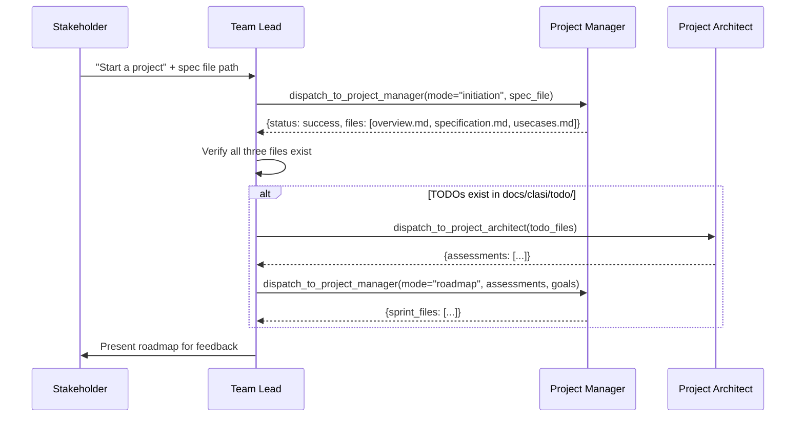
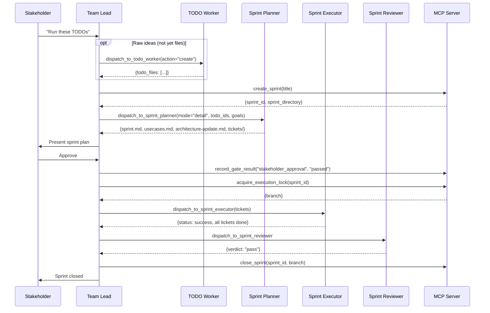
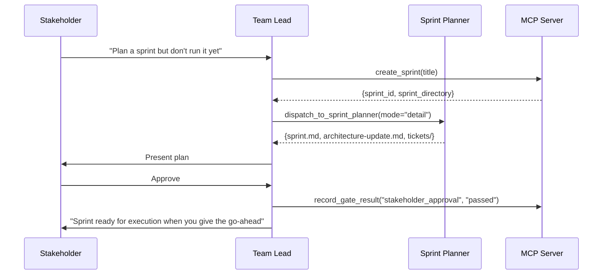
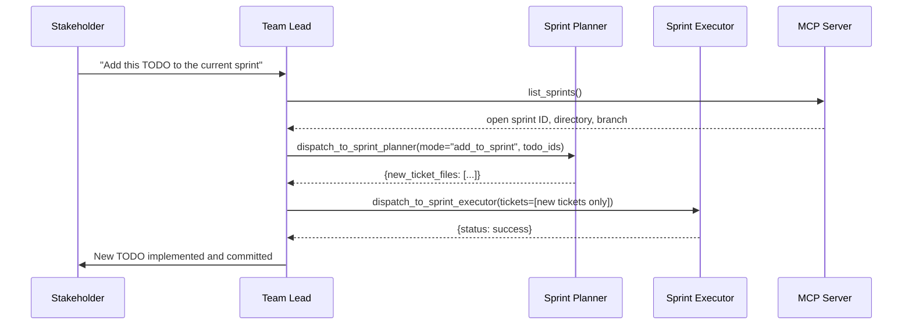
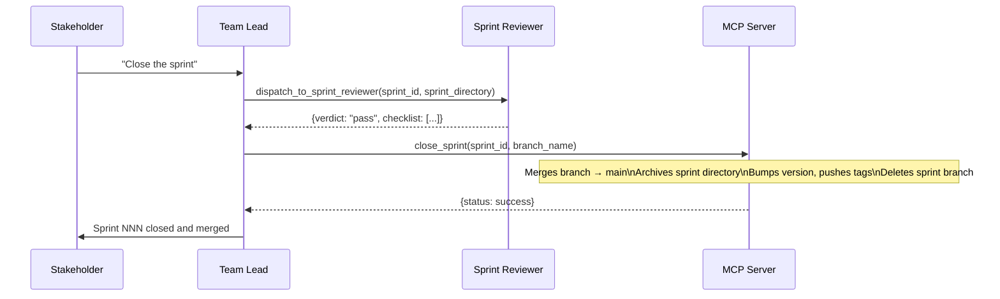
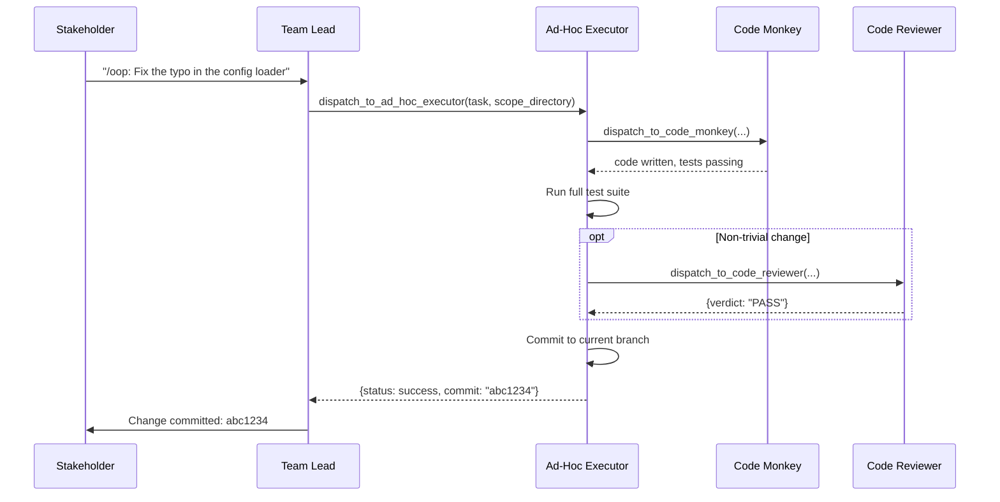
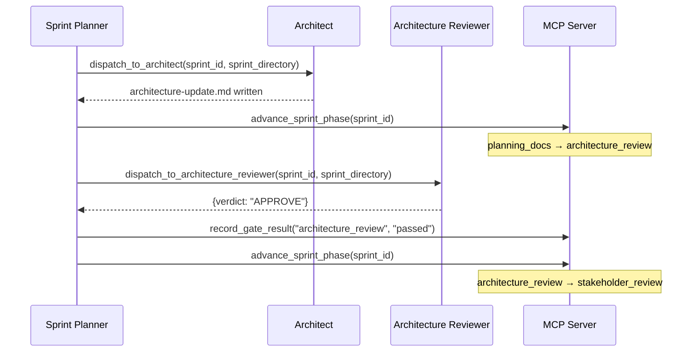
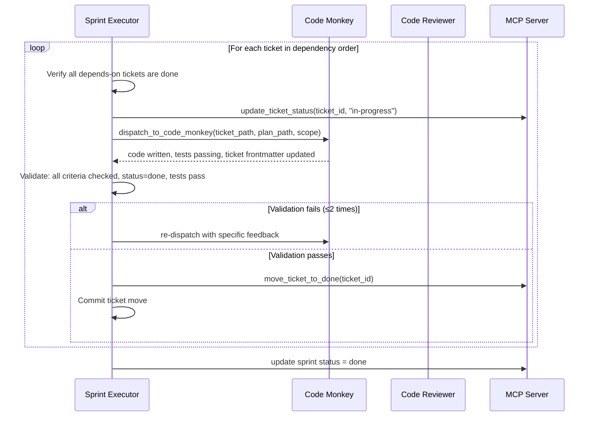
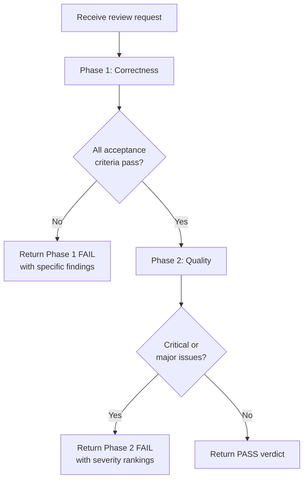

# CLASI — Use Cases

## Actor Glossary

| Actor | Description |
|---|---|
| **Stakeholder** | The human who owns the project. Interacts with team-lead only. |
| **Team Lead** | Tier 0 dispatcher. Routes requests, validates returns, reports to stakeholder. |
| **Domain Controller** | Tier 1 agent owning one process phase (e.g., sprint-planner, sprint-executor). |
| **Task Worker** | Tier 2 leaf agent implementing atomic units (e.g., code-monkey, architect). |
| **MCP Server** | The CLASI MCP server that manages state, dispatch logging, and lifecycle enforcement. |

---

## UC-001 — Bootstrap a New Project

**Actor**: Stakeholder, Team Lead, Project Manager, Project Architect
**Preconditions**: No `overview.md` exists in `docs/clasi/`. A written specification file exists.

**Main Flow**:

**Postconditions**:
- `docs/clasi/overview.md`, `specification.md`, `usecases.md` exist and contain full stakeholder detail.
- If TODOs were present, a sprint roadmap groups them into lightweight `sprint.md` files.
- Stakeholder has reviewed and acknowledged the roadmap.

**Error Flows**:
- If project-manager returns without all three files: re-dispatch with instructions to complete missing artifacts.
- If MCP server unavailable: halt and instruct stakeholder to check `.mcp.json`.

---

## UC-002 — Execute TODOs Through a Full Sprint

**Actor**: Stakeholder, Team Lead, Sprint Planner, Sprint Executor, Sprint Reviewer
**Preconditions**: No sprint is currently open. One or more TODOs or issues exist.

**Main Flow**:

**Postconditions**:
- All tickets are in `done` status and moved to `tickets/done/`.
- Sprint branch is merged to main.
- Sprint directory is archived to `sprints/done/`.
- Version is bumped and tagged.

**Error Flows**:
- Sprint-reviewer returns `fail`: team-lead addresses blocking issues and re-dispatches.
- Sprint-executor fails to complete a ticket after 2 re-dispatches: escalates to stakeholder.
- `close_sprint` fails: team-lead reads error, addresses issue, retries.

---

## UC-003 — Plan a Sprint Without Executing It

**Actor**: Stakeholder, Team Lead, Sprint Planner
**Preconditions**: Stakeholder explicitly wants to review the plan before execution begins.

**Main Flow**:

**Postconditions**:
- Sprint directory is fully populated.
- Stakeholder approval gate is recorded.
- Execution lock is NOT acquired.
- Sprint remains in `ticketing` phase.

---

## UC-004 — Add a TODO to an Open Sprint

**Actor**: Stakeholder, Team Lead, Sprint Planner, Sprint Executor
**Preconditions**: A sprint is currently open and in the `executing` phase.

**Main Flow**:

**Postconditions**:
- New ticket(s) are created, implemented, and moved to `done/`.
- No new sprint branch is created; changes are on the existing sprint branch.

**Error Flows**:
- If sprint is not in `executing` phase: team-lead informs stakeholder and suggests waiting.

---

## UC-005 — Close a Completed Sprint

**Actor**: Stakeholder, Team Lead, Sprint Reviewer, MCP Server
**Preconditions**: Sprint is fully executed; all tickets have `status: done`.

**Main Flow**:

**Postconditions**:
- Sprint branch is deleted.
- Sprint directory is in `sprints/done/`.
- Version is bumped and tagged.
- Execution lock is released.

**Error Flows**:
- Sprint-reviewer returns `fail`: team-lead reports blocking issues to stakeholder before proceeding.

---

## UC-006 — Make an Out-of-Process Change

**Actor**: Stakeholder, Team Lead, Ad-Hoc Executor, Code Monkey, Code Reviewer
**Preconditions**: Stakeholder has explicitly authorized OOP execution (says "out of process", "direct change", or `/oop`).

**Main Flow**:

**Postconditions**:
- Change is committed directly to the current branch.
- Full test suite passes.
- No sprint directory, tickets, or architecture artifacts created.

**Error Flows**:
- If the change is larger than expected (would normally warrant a sprint): ad-hoc-executor flags this to team-lead, who asks stakeholder whether to continue OOP or switch to a sprint.

---

## UC-007 — Create a TODO from Stakeholder Input

**Actor**: Stakeholder, Team Lead, TODO Worker
**Preconditions**: Stakeholder has a new idea or feature request.

**Main Flow**:

1. Stakeholder provides raw, conversational text describing the idea.
2. Team-lead dispatches to todo-worker with `action="create"` and the raw text.
3. TODO Worker interprets the input, structures it into a proper TODO file with:
   - A clear, descriptive title
   - YAML frontmatter (`status: pending`)
   - A Problem section
   - A Desired Behavior section
4. TODO Worker creates the file using the CLASI `todo` MCP skill.
5. Returns the file path to team-lead.

**Postconditions**:
- A new `.md` file exists in `docs/clasi/todo/`.
- File has proper frontmatter and structure.

---

## UC-008 — Import GitHub Issues as TODOs

**Actor**: Stakeholder, Team Lead, TODO Worker
**Preconditions**: GitHub issues exist in the project repository.

**Main Flow**:

1. Stakeholder provides issue URLs or a repository reference.
2. Team-lead dispatches to todo-worker with `action="import"` and the issue references.
3. TODO Worker uses the `gh-import` skill to:
   - Fetch each issue via the `gh` CLI.
   - Check for existing TODOs with matching GitHub issue URLs (skip duplicates).
   - Create a TODO file preserving the issue title, body, labels, and assignee.
   - Add a reference back to the GitHub issue URL.
4. Returns import results (created files, skipped duplicates, any failures).

**Postconditions**:
- Each imported issue has a corresponding TODO file in `docs/clasi/todo/`.
- No duplicate TODOs created.

---

## UC-009 — Sprint Planning (Internal): Architecture Phase

**Actor**: Sprint Planner, Architect, Architecture Reviewer
**Preconditions**: Sprint directory exists; `sprint.md` is populated. Sprint is in `planning_docs` phase.

**Main Flow**:

**Error Flows**:
- Architecture reviewer returns `REVISE`: sprint-planner sends feedback to architect and re-dispatches. Maximum 2 iterations before escalating to team-lead.
- Architecture reviewer returns `APPROVE WITH CHANGES`: sprint-planner records the gate as passed and carries the advisory items into ticket notes.

---

## UC-010 — Sprint Execution (Internal): Ticket Execution Loop

**Actor**: Sprint Executor, Code Monkey, Code Reviewer
**Preconditions**: Sprint is in `executing` phase; tickets exist in `tickets/` with `status: todo`.

**Main Flow**:

**Postconditions**:
- All tickets are in `tickets/done/` with `status: done`.
- Full test suite passes after each ticket.
- All changes committed on the sprint branch.

**Error Flows**:
- Ticket fails validation after 2 re-dispatches: sprint-executor escalates to team-lead with a detailed report.

---

## UC-011 — Code Review (Internal): Two-Phase Review

**Actor**: Code Reviewer
**Preconditions**: Code-monkey has completed implementation. Sprint-executor has requested review.

**Main Flow**:

**Phase 1 checks**:
- Every acceptance criterion is individually evaluated: PASS or FAIL
- Tests exist for each criterion and pass
- No criteria silently skipped or partially implemented

**Phase 2 checks** (only if Phase 1 passes):
- Coding standards compliance
- Security (injection risks, hardcoded secrets, missing validation)
- Architectural consistency
- Maintainability (naming, abstraction, complexity)

**Severity levels**: Critical (must fix) → Major (should fix) → Minor (fix if time permits) → Suggestion (consider for future)

**Postconditions**:
- Review document produced with overall PASS or FAIL verdict.
- Blocking issues identified with specific file locations and remediation guidance.

---

## UC-012 — Architecture Review (Internal): Sprint Architecture Validation

**Actor**: Architecture Reviewer
**Preconditions**: Architect has written `architecture-update.md`. Sprint is in `architecture_review` phase.

**Main Flow**:

1. Read the current consolidated architecture from `docs/clasi/architecture/`.
2. Read the sprint's `architecture-update.md`.
3. Read `instructions/architectural-quality.md`.
4. Explore the codebase with Grep/Glob to check for drift between documented and actual architecture.
5. Evaluate against all review criteria (version consistency, codebase alignment, design quality, anti-patterns, risks).
6. Produce review with verdict, design quality assessment, and findings.

**Verdict guidelines**:
- **APPROVE**: No significant issues.
- **APPROVE WITH CHANGES**: Contained minor issues fixable during implementation.
- **REVISE**: Circular dependencies, god components, inconsistency between Sprint Changes and document body, or significant unaccounted codebase drift.

**Postconditions**:
- Review document produced with verdict, design quality assessment, and (if applicable) blocking findings.
- Gate result recorded by sprint-planner based on the verdict.

---

## UC-013 — Check Project Status

**Actor**: Stakeholder, Team Lead
**Preconditions**: Project has been initiated.

**Main Flow**:

1. Stakeholder asks for a status update.
2. Team-lead calls `list_sprints()` and `get_sprint_status(sprint_id)` for any open sprints.
3. Team-lead reads `docs/clasi/` to identify which artifacts exist.
4. Team-lead reports:
   - Which phase the project is in (initiation, sprint planning, executing, etc.)
   - Which sprint is open (if any) and its current phase
   - How many tickets are done vs. remaining
   - What the next action is

**Postconditions**: Stakeholder has a clear, current picture of project state.
