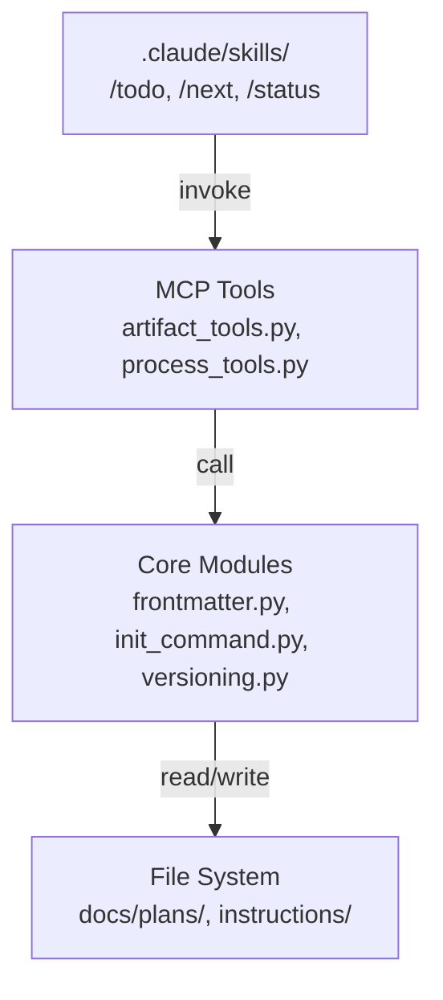

# Sprint 004 Technical Plan

## Architecture Overview

This sprint adds MCP tools, refactors existing code, and introduces slash
commands. The changes touch three layers:



Key principle: slash commands are Claude Code skills that call MCP tools.
MCP tools call core module functions. Core modules operate on files.

## Component Design

### Component 1: Fix clasi init

**Use Cases**: SUC-001

Modify `claude_agent_skills/init_command.py`:
- Change `_update_settings_json` to write `.mcp.json` at project root
  instead of `.claude/settings.json`.
- The `.mcp.json` format is `{"mcpServers": {"clasi": {"command": "clasi", "args": ["mcp"]}}}`.
- Keep the merge behavior (read existing, add clasi entry, write back).
- Update tests in `tests/unit/test_init_command.py`.

### Component 2: TODO management MCP tools

**Use Cases**: SUC-002

Add to `claude_agent_skills/artifact_tools.py`:
- `list_todos()` — Scan `docs/plans/todo/*.md`, return JSON array of
  `{filename, title}` where title is the first `# ` heading.
- `move_todo_to_done(filename)` — Move a file from `docs/plans/todo/` to
  `docs/plans/todo/done/`. Create `done/` if needed.

### Component 3: Dissolve coding-standards.md

**Use Cases**: SUC-003

Content migration plan for `instructions/coding-standards.md`:

| Section | Destination |
|---------|-------------|
| Project Structure | `languages/python.md` (Python-specific parts) |
| Error Handling | `languages/python.md` (Python examples, principles) |
| Logging | `languages/python.md` |
| Import Ordering | `languages/python.md` (already partially covered) |
| Dependency Management | `languages/python.md` (already has uv/pyproject section) |
| Naming Conventions | `languages/python.md` |
| Type Hints | `languages/python.md` (already covered, merge any gaps) |
| Code Style | `languages/python.md` (already partially covered) |

After migration:
- Delete `instructions/coding-standards.md`.
- Update `ACTIVITY_GUIDES` in `process_tools.py` to remove
  `coding-standards` references. Replace with `languages/python` where
  appropriate, or the language-agnostic instruction if one remains.
- Update `instructions/system-engineering.md` references.

### Component 4: Frontmatter MCP tools

**Use Cases**: SUC-004

Add to `claude_agent_skills/artifact_tools.py`:
- `read_artifact_frontmatter(path)` — Wraps `frontmatter.read_frontmatter`,
  returns JSON dict.
- `write_artifact_frontmatter(path, updates)` — Wraps
  `frontmatter.write_frontmatter`, merges the given dict into existing
  frontmatter.

The existing `frontmatter.py` functions handle all the parsing/writing.
These tools are thin wrappers that add path resolution and JSON serialization.

### Component 5: Transparent done/ path resolution

**Use Cases**: SUC-005

Create `resolve_artifact_path(path)` in `claude_agent_skills/artifact_tools.py`:

```python
def resolve_artifact_path(path: str) -> Path:
    """Resolve a path, checking done/ subdirectory if not found."""
    p = Path(path)
    if p.exists():
        return p
    # Try inserting done/ before filename
    done_path = p.parent / "done" / p.name
    if done_path.exists():
        return done_path
    # Try removing done/ from path
    if p.parent.name == "done":
        undone_path = p.parent.parent / p.name
        if undone_path.exists():
            return undone_path
    raise FileNotFoundError(
        f"Not found: {path} (also checked done/ subdirectory)"
    )
```

Integrate into existing tools that accept file paths:
- `update_ticket_status`
- `move_ticket_to_done`
- `read_artifact_frontmatter`
- `write_artifact_frontmatter`

### Component 6: Versioning

**Use Cases**: SUC-006

Create `claude_agent_skills/versioning.py`:
- `compute_next_version(major: int) -> str` — Reads existing git tags,
  computes `<major>.<YYYYMMDD>.<build>`.
- `update_pyproject_version(version: str)` — Updates `pyproject.toml`.
- `tag_version(version: str)` — Creates git tag `v<version>`.

Integrate into `close_sprint` in `artifact_tools.py` — after merging,
compute and tag the version.

### Component 7: Slash commands

**Use Cases**: SUC-007

Create Claude Code skill files in the project. These get installed by
`clasi init` into `.claude/skills/`:

- `.claude/skills/todo/SKILL.md` — `/todo`: Create a TODO file from the
  user's message.
- `.claude/skills/next/SKILL.md` — `/next`: Determine current state and
  execute the next process step.
- `.claude/skills/status/SKILL.md` — `/status`: Run project-status report.

Each skill is a markdown file with instructions that the AI follows. They
reference MCP tools to accomplish their work.

## Open Questions

1. **Coding standards — anything truly language-agnostic?** The error
   handling principles and dependency management guidance could apply to
   any language. Should we keep a slim `coding-standards.md` with just the
   generic parts, or absorb everything into language files?

2. **Versioning integration point**: Should `close_sprint` auto-version,
   or should it be a separate MCP tool (`tag_version`) that the sprint
   closure skill calls? Auto-versioning couples the two; a separate tool
   is more flexible.

3. **Slash command installation**: Should `clasi init` install the skill
   files, or should they be symlinked from the package like agent/skill
   definitions?
