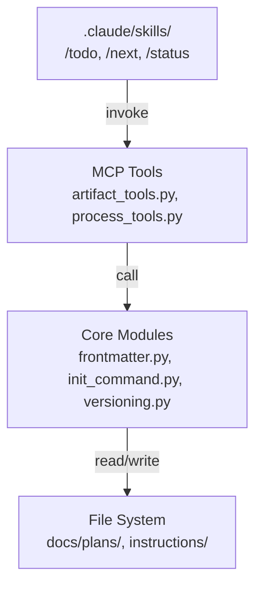

# Sprint 004 Technical Plan

## Architecture Overview

This sprint adds MCP tools, refactors existing code, and introduces slash
commands. The changes touch three layers:



Key principle: slash commands are Claude Code skills that call MCP tools.
MCP tools call core module functions. Core modules operate on files.

## Component Design

### Component 1: Fix clasi init

**Use Cases**: SUC-001

Modify `claude_agent_skills/init_command.py`:
- Change `_update_settings_json` to write `.mcp.json` at project root
  instead of `.claude/settings.json`.
- The `.mcp.json` format is `{"mcpServers": {"clasi": {"command": "clasi", "args": ["mcp"]}}}`.
- Keep the merge behavior (read existing, add clasi entry, write back).
- Update tests in `tests/unit/test_init_command.py`.

### Component 2: TODO management MCP tools

**Use Cases**: SUC-002

Add to `claude_agent_skills/artifact_tools.py`:
- `list_todos()` — Scan `docs/plans/todo/*.md`, return JSON array of
  `{filename, title}` where title is the first `# ` heading.
- `move_todo_to_done(filename)` — Move a file from `docs/plans/todo/` to
  `docs/plans/todo/done/`. Create `done/` if needed.

### Component 3: Slim coding-standards.md, move Python content

**Use Cases**: SUC-003

Keep a slim `instructions/coding-standards.md` with language-agnostic
principles only. Move Python-specific content into `languages/python.md`.

**Stays in coding-standards.md** (generic principles):
- Error handling philosophy (fail fast, be specific, validate at boundaries)
- Dependency management principles (minimize deps, pin to minimum compatible)
- General naming guidance (descriptive names, avoid catch-all modules)

**Moves to languages/python.md** (Python-specific):
- Project Structure (Python package layout)
- Logging (Python `logging` module usage)
- Import Ordering (PEP 8 groups)
- Naming Conventions (snake_case, PascalCase — Python conventions)
- Type Hints (already mostly covered, merge any gaps)
- Code Style (PEP 8, Black, f-strings, pathlib — already partially covered)

After migration:
- Update `ACTIVITY_GUIDES` in `process_tools.py` — keep `coding-standards`
  in guides where it applies, also add language instruction references.
- Update `instructions/system-engineering.md` references if needed.

### Component 4: Frontmatter MCP tools

**Use Cases**: SUC-004

Add to `claude_agent_skills/artifact_tools.py`:
- `read_artifact_frontmatter(path)` — Wraps `frontmatter.read_frontmatter`,
  returns JSON dict.
- `write_artifact_frontmatter(path, updates)` — Wraps
  `frontmatter.write_frontmatter`, merges the given dict into existing
  frontmatter.

The existing `frontmatter.py` functions handle all the parsing/writing.
These tools are thin wrappers that add path resolution and JSON serialization.

### Component 5: Transparent done/ path resolution

**Use Cases**: SUC-005

Create `resolve_artifact_path(path)` in `claude_agent_skills/artifact_tools.py`:

```python
def resolve_artifact_path(path: str) -> Path:
    """Resolve a path, checking done/ subdirectory if not found."""
    p = Path(path)
    if p.exists():
        return p
    # Try inserting done/ before filename
    done_path = p.parent / "done" / p.name
    if done_path.exists():
        return done_path
    # Try removing done/ from path
    if p.parent.name == "done":
        undone_path = p.parent.parent / p.name
        if undone_path.exists():
            return undone_path
    raise FileNotFoundError(
        f"Not found: {path} (also checked done/ subdirectory)"
    )
```

Integrate into existing tools that accept file paths:
- `update_ticket_status`
- `move_ticket_to_done`
- `read_artifact_frontmatter`
- `write_artifact_frontmatter`

### Component 6: Versioning

**Use Cases**: SUC-006

Create `claude_agent_skills/versioning.py`:
- `compute_next_version(major: int) -> str` — Reads existing git tags,
  computes `<major>.<YYYYMMDD>.<build>`.
- `update_pyproject_version(version: str)` — Updates `pyproject.toml`.
- `tag_version(version: str)` — Creates git tag `v<version>`.

Two integration points:
- **`close_sprint`** in `artifact_tools.py` — auto-versions after merging.
  Calls `compute_next_version` and `tag_version` automatically.
- **`tag_version` MCP tool** — standalone tool for versioning outside of
  sprint closure (e.g., hotfixes, manual releases).

### Component 7: Slash commands

**Use Cases**: SUC-007

**Architecture**: Thin skill stubs + MCP-served definitions.

Skill stubs are small files installed by `clasi init` into
`.claude/skills/`. Each stub just tells the AI to call the MCP server
for the full skill instructions:

```markdown
# /todo

Call `get_skill_definition("todo")` from the CLASI MCP server to get
the full instructions for this skill, then follow them. The user's
message is the input.
```

The real logic lives in MCP-served skill definitions (`skills/todo.md`,
`skills/next.md`, `skills/status.md`) which are part of the package and
updated with it. The stubs are stable pointers that rarely change.

Skill definitions to create in the package:
- `skills/todo.md` — Create a TODO file from the user's message
- `skills/next.md` — Determine current state, execute next process step
- `skills/status.md` — Run project-status report

`clasi init` installs the stub files. Update `init_command.py` to write
them alongside the instruction file.

## Resolved Questions

1. **Coding standards**: Keep a slim language-agnostic
   `coding-standards.md` with generic principles. Move Python-specific
   content into `languages/python.md`.

2. **Versioning**: Both — `close_sprint` auto-versions, AND a standalone
   `tag_version` MCP tool exists for use outside sprint closure.

3. **Slash command installation**: `clasi init` copies thin stub files
   that point to the MCP server. Stubs are stable (just say "go read MCP"),
   so drift is not a concern. Real logic stays in MCP-served skill defs.
